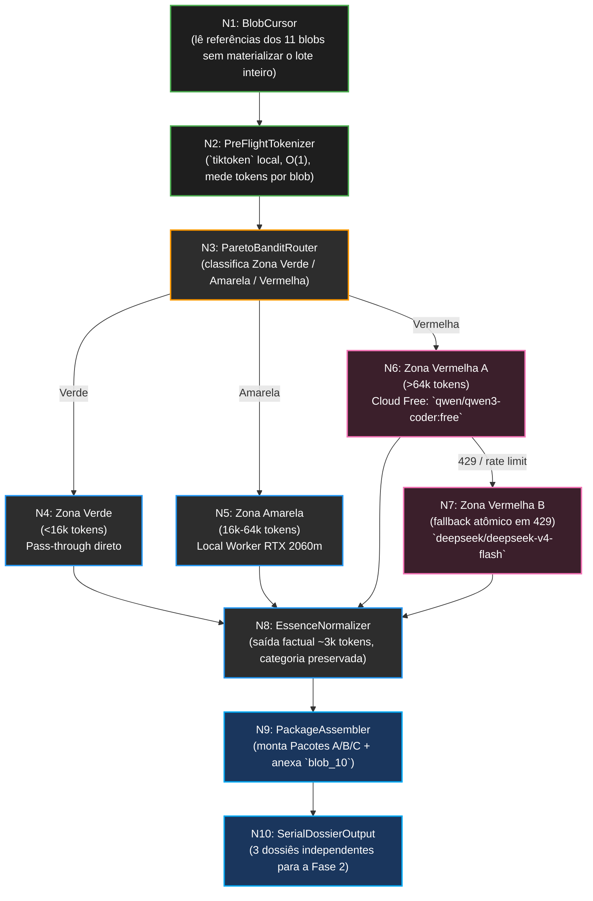

# SODA Harvester — Design Arquitetural (Fase 1.5)

> **Versão:** 0.1.0
> **Território:** PRODUTO (Daemon SODA — Rust/Tokio, arquitetura apenas)
> **Escopo:** Fase 0 + Fase A
> **Status:** SDD inicial. Nenhum código Rust deve nascer antes da aprovação humana.

---

## 1. Manifesto

A Fase 1.5 existe para impedir desperdício de contexto, RAM e dinheiro antes da
Fase 2. O Harvester já entrega 11 blobs determinísticos; agora precisamos de um
**porteiro FinOps** capaz de medir, roteá-los e destilá-los sem dissolver suas
categorias semânticas.

O produto final da Fase 1.5 não é um blob monolítico. Ele é uma linha de montagem
que transforma `_blob_XX` em `_essence_XX` de forma elástica, preservando o
significado de cada família e emitindo **3 dossiês serializáveis** para a Fase 2.

---

## 2. Fase 0 — Advogado do Diabo

### 2.1. Abordagens SLOP e Proibições

| SLOP | Risco letal | Proibição |
|---|---|---|
| Enviar blobs inteiros e cegamente para API paga | Queima de orçamento e vazamento de contexto bruto sem triagem | **PROIBIDO** enviar blobs com mais de `64k tokens` para qualquer API paga sem pré-flight local |
| Carregar os 11 blobs na RAM ao mesmo tempo | Pico de memória e risco de OOM em lotes densos | **PROIBIDO** materializar todos os blobs simultaneamente; o fluxo deve operar blob a blob |
| Fundir essências de naturezas distintas | Colapso semântico entre produto, arquitetura e auditoria | **PROIBIDO** misturar `_essence_` de categorias diferentes |

### 2.2. Invariantes da Fase 1.5

| Invariante | Regra dura |
|---|---|
| Token gate local-first | Todo blob passa por contagem local via `tiktoken` antes de qualquer roteamento |
| Memória controlada | O pipeline consome referências e processa um blob por vez |
| Sufixo estável | `blob_01` gera `essence_01`, `blob_03` gera `essence_03` e assim por diante |
| Categoria preservada | Produto, Arquitetura e Ops/Auditoria nunca são fundidos |
| Canon fixo | `blob_10_soda_canon_context` não é destilado; ele é anexado a todos os pacotes |

---

## 3. Fase A — DAG e Engenharia

### 3.1. Diagrama Mermaid

### 3.2. Nós do DAG

| Nó | Componente | Entrada | Saída | Regra |
|---|---|---|---|---|
| N1 | `BlobCursor` | Referências dos 11 blobs da Fase 1 | Um blob por iteração | Nunca carrega o lote completo |
| N2 | `PreFlightTokenizer` | `_blob_XX` | Medida de tokens | Usa `tiktoken` local, sem API |
| N3 | `ParetoBanditRouter` | Blob + token_count | Rota verde/amarela/vermelha | Decide custo antes da execução |
| N4 | `GreenPassThrough` | Blob `<16k` | `_essence_XX` verbatim | Não resume; apenas promove o blob para essência |
| N5 | `LocalDistiller` | Blob `16k-64k` | `_essence_XX` factual | Usa o worker local e KV cache |
| N6 | `CloudFreeCascade` | Blob `>64k` | `_essence_XX` factual | Primeiro salto obrigatório na camada free |
| N7 | `CloudPaidFallback` | Falha 429 da camada free | `_essence_XX` factual | Fallback atômico e barato |
| N8 | `EssenceNormalizer` | Saídas de N4/N5/N6/N7 | Essência final ~3k tokens | Mantém categoria, elimina verborragia |
| N9 | `PackageAssembler` | `_essence_XX` + `blob_10` | Pacotes A/B/C | Segmenta por papel operacional |
| N10 | `SerialDossierOutput` | Pacotes montados | 3 dossiês consumíveis | Fase 2 lê em série, sem dependência cruzada |

### 3.3. Roteamento Elástico (ParetoBandit)

| Zona | Faixa de tokens | Roteamento | Regra operacional |
|---|---|---|---|
| Verde | `<16k` | Pass-through | O blob vira `_essence_XX` sem reescrita |
| Amarela | `16k-64k` | Local Worker | Destilação local usando `Qwen3.5-4B-Q4_K_M.gguf` |
| Vermelha | `>64k` | Cloud Cascade | Tenta camada free, cai para paid ultra-barato apenas em `429` |

**Modelo local obrigatório (Zona Amarela):**
`C:\Users\rosas\.lmstudio\models\lmstudio-community\Qwen3.5-4B-GGUF\Qwen3.5-4B-Q4_K_M.gguf`

**Cascata FinOps obrigatória (Zona Vermelha):**
1. `qwen/qwen3-coder:free` via OpenRouter
2. `deepseek/deepseek-v4-flash` somente em `Rate Limit / 429`

### 3.4. Contrato de Destilação

| Entrada | Saída | Regra |
|---|---|---|
| `_blob_XX` | `_essence_XX` | Mantém o mesmo índice numérico |
| Texto denso | Resumo factual de ~3.000 tokens | Sem opinião, sem fusão entre categorias |
| `blob_10_soda_canon_context` | `blob_10_soda_canon_context` | Nunca é destilado; é anexado intacto |

---

## 4. Montagem dos Pacotes

### 4.1. Dossiês de Saída

| Pacote | Conteúdo principal | Anexo obrigatório |
|---|---|---|
| Pacote A — Produto | `_essence_01`, `_essence_03`, `_essence_11` | `blob_10_soda_canon_context` |
| Pacote B — Arquiteto | `_essence_04`, `_essence_05` | `blob_10_soda_canon_context` |
| Pacote C — Ops/Auditor | `_essence_02`, `_essence_06`, `_essence_07`, `_essence_08`, `_essence_09` | `blob_10_soda_canon_context` |

### 4.2. Invariantes de Empacotamento

| Regra | Efeito |
|---|---|
| Pacotes são independentes | A Fase 2 pode ler um dossiê por vez |
| `blob_10` sempre acompanha os três | O canon do SODA ancora todo raciocínio posterior |
| Não existe super-dossiê único | Evita contexto gordo e vazamento de categorias |

---

## 5. Definition of Done Arquitetural

| Item | Critério |
|---|---|
| Pre-flight local | Existe uma etapa explícita de contagem via `tiktoken` |
| Roteamento FinOps | As três zonas estão formalizadas com limites rígidos |
| Fallback em cascata | `429` da camada free aciona fallback pago de forma atômica |
| Destilação controlada | Apenas blobs densos viram resumos; verdes passam direto |
| Segmentação final | Os pacotes A/B/C estão fechados e serializáveis |
| Limite de escopo | Nenhum código Rust é escrito nesta fase documental |

---

## 6. Linha Vermelha

1. Não enviar blobs inteiros `>64k tokens` diretamente para API paga.
2. Não carregar os 11 blobs simultaneamente na RAM.
3. Não fundir `_essence_` de categorias distintas.
4. Não destilar `blob_10_soda_canon_context`.
5. Não iniciar implementação antes da aprovação arquitetural humana.
