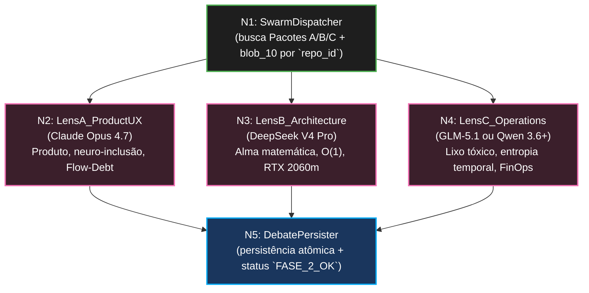

# SODA Harvester — Design Arquitetural (Fase 2)

> **Versão:** 0.1.0
> **Território:** PRODUTO (Daemon SODA — Rust/Tokio, arquitetura apenas)
> **Escopo:** Fase 0 + Fase A
> **Status:** Blueprint autorizado. Nenhum código Rust nasce nesta etapa.

---

## 1. Manifesto

A Fase 2 é o **Cérebro** do ETL Cognitivo. A Fase 1.5 já destilou o ruído e
entregou três dossiês operacionais serializáveis; agora o orquestrador precisa
submeter estes pacotes a um debate anti-consenso, distribuindo-os em paralelo
para três lentes especializadas do **Cloud Brain**.

O objetivo não é obter uma média morna entre IAs. O objetivo é provocar tensão
estrutural entre perspectivas contraditórias, cada uma operando com mandato
próprio e sem contaminação cruzada. A Fase 2 formaliza o padrão
**Free-MAD (Consensus-Free Diverse Multi-Agent Debate)** para transformar os
Pacotes A, B e C em três pareceres curtos, densos e auditáveis.

### 1.1. Princípio Operacional

- O orquestrador distribui os Pacotes A, B e C em paralelo para três Lentes.
- Cada Lente recebe seu dossiê já anexado ao `blob_10_soda_canon_context`.
- Cada Lente produz um mini-JSON factual, curto e comparável.
- O sistema persiste os três pareceres como artefatos atômicos da Fase 2.

### 1.2. Papel Sistêmico da Fase 2

| Item | Função |
|---|---|
| Entrada | Pacote A, Pacote B, Pacote C, todos aterrados por `blob_10_soda_canon_context` |
| Processo | Debate paralelo e isolado entre Lentes especializadas |
| Saída | 3 mini-JSONs com bullets curtos e acionáveis |
| Próximo estado | Repositório marcado como `FASE_2_OK` |

---

## 2. Fase 0 — Advogado do Diabo e Proibições (Red Lines)

### 2.1. Tabela SLOP vs Lei Dura SODA

| SLOP (Mercado) | Risco letal | Lei Dura SODA |
|---|---|---|
| Câmara de Eco: IAs concordando entre si | Colapso crítico da diversidade analítica e falso consenso | **Isolamento Absoluto (Free-MAD):** as Lentes NUNCA se comunicam durante a Fase 2 |
| Execução sequencial: Lente A, depois B, depois C | Latência desnecessária, madrugada travada e throughput baixo | **Paralelismo Obrigatório:** o Rust DEVE usar `tokio::join!` ou `JoinSet` para disparar as chamadas de rede simultaneamente |
| Verborragia: relatórios longos e opinativos | Queima de tokens, persistência gorda e comparação difícil | **Saída Estruturada Interna:** cada Lente devolve mini-JSON com 3 a 5 bullets, limite alvo de ~250 tokens |
| Cegueira doutrinária: cada IA julga sem canon | Recomendações desalinhadas com a Constituição do produto | **Aterramento Canônico:** toda Lente deve avaliar a solução com base no `blob_10_soda_canon_context` anexado |

### 2.2. Invariantes da Fase 2

| Invariante | Regra dura |
|---|---|
| Isolamento entre Lentes | Não existe troca de contexto entre N2, N3 e N4 |
| Paralelismo real | As três chamadas remotas nascem juntas, não em cascata |
| Saída mínima | Resposta curta, bulletizada e serializável |
| Canon obrigatório | `blob_10_soda_canon_context` acompanha todos os prompts |
| Persistência única | Os três pareceres são gravados atomicamente por `repo_id` |
| Escopo fechado | A Fase 2 não preenche Google Sheets e não produz PRD final |

### 2.3. Contrato Interno da Resposta das Lentes

Cada Lente deve responder em mini-JSON com contrato equivalente ao modelo abaixo:

```json
{
  "lens_id": "LensA_ProductUX",
  "repo_id": "string",
  "bullets": [
    "3 a 5 bullets curtos e factuais"
  ],
  "risk_level": "low|medium|high",
  "recommendation": "keep|refine|reject"
}
```

**Leis do contrato:**

- `bullets` deve conter entre 3 e 5 itens.
- A resposta inteira deve permanecer no alvo de ~250 tokens.
- Não existe prosa livre fora do JSON.
- O payload deve ser suficientemente compacto para persistência direta em SQLite.

---

## 3. Fase A — O Grafo Acíclico Dirigido (DAG)

### 3.1. Diagrama Mermaid



### 3.2. Nós Atômicos

| Nó | Componente | Entrada | Saída | Mandato |
|---|---|---|---|---|
| N1 | `SwarmDispatcher` | `repo_id` | Pacote A, Pacote B, Pacote C, todos com `blob_10` anexado | Busca os dossiês no SQLite e prepara a fan-out paralela |
| N2 | `LensA_ProductUX` | Pacote A | Mini-JSON de produto | Envia para `Claude Opus 4.7` e audita neuro-inclusão, mitigação de Flow-Debt e valor de produto |
| N3 | `LensB_Architecture` | Pacote B | Mini-JSON de arquitetura | Envia para `DeepSeek V4 Pro` e audita alma matemática, extraibilidade O(1) e sobrevivência na RTX 2060m |
| N4 | `LensC_Operations` | Pacote C | Mini-JSON de operações | Envia para `GLM-5.1` ou `Qwen 3.6+` e audita lixo tóxico, entropia temporal e risco FinOps |
| N5 | `DebatePersister` | 3 mini-JSONs + `repo_id` | Persistência atômica em `debates_enxame` e status `FASE_2_OK` | Aguarda o fim das três threads e consolida a Fase 2 |

### 3.3. Dependências e Sincronização

| Regra | Efeito |
|---|---|
| N1 desbloqueia N2, N3 e N4 | O fan-out ocorre somente após a montagem dos três pacotes |
| N2, N3 e N4 são irmãos concorrentes | Nenhuma Lente aguarda a outra para começar |
| N5 depende de N2 + N3 + N4 | Persistência só acontece quando os três resultados terminarem ou falharem |
| Falha em qualquer Lente encerra a Fase 2 do repositório | O lote continua para o próximo `repo_id`, sem travar a madrugada |

### 3.4. Contrato Semântico das Lentes

| Lente | Modelo-alvo | Foco semântico | Anti-padrão proibido |
|---|---|---|---|
| `LensA_ProductUX` | `Claude Opus 4.7` | Neuro-inclusão, redução de Flow-Debt, clareza de valor | Reescrever arquitetura bare-metal como se fosse problema secundário |
| `LensB_Architecture` | `DeepSeek V4 Pro` | Extraibilidade O(1), topologia estrutural, sobrevivência no hardware mínimo | Aceitar abstrações gordas, runtimes pesados ou tolerância a lixo estrutural |
| `LensC_Operations` | `GLM-5.1` ou `Qwen 3.6+` | Toxicidade operacional, entropia temporal, FinOps e resíduos de Node/Electron | Ignorar custo, ignorar drift temporal ou normalizar stack proibida |

---

## 4. Contratos de Resiliência (I/O)

### 4.1. Protocolo Fail-Fast

| Evento | Comportamento obrigatório |
|---|---|
| Timeout ou erro transitório de rede | A biblioteca de rede, como `reqwest`, tenta reconectar no máximo 2 vezes |
| Terceira falha consecutiva | O Nó morre imediatamente |
| `429 Too Many Requests` persistente | Conta como falha válida dentro do teto de 3 tentativas |
| Falha terminal de uma Lente | O `repo_id` recebe status `ERRO_FASE_2` |
| Falha terminal do repositório | A esteira avança para o próximo repositório, sem travar a madrugada |

### 4.2. Contrato de Entrada e Saída

| Nó | Entrada formal | Saída formal | Observação |
|---|---|---|---|
| N1 | `repo_id` | `DebateInput { pacote_a, pacote_b, pacote_c, blob_10 }` | Busca em SQLite os artefatos já produzidos pela Fase 1.5 |
| N2 | `Pacote A + blob_10` | `LensDebateJson` | Foco em produto e UX |
| N3 | `Pacote B + blob_10` | `LensDebateJson` | Foco em arquitetura e bare-metal |
| N4 | `Pacote C + blob_10` | `LensDebateJson` | Foco em operações e FinOps |
| N5 | `repo_id + [LensDebateJson; 3]` | Persistência em `debates_enxame` + atualização de status | Escrita atômica, um commit lógico por repositório |

### 4.3. Persistência e Escopo

| Item | Regra |
|---|---|
| Tabela alvo | `debates_enxame` |
| Unidade de consistência | Um registro lógico por `repo_id`, contendo os 3 mini-JSONs |
| Estado de sucesso | `FASE_2_OK` |
| Estado de falha | `ERRO_FASE_2` |
| Integração externa | A Fase 2 **NÃO** preenche Google Sheets |

### 4.4. Invariantes de Resiliência

1. Nenhuma Lente pode bloquear indefinidamente o pipeline noturno.
2. O teto de tentativa é rígido: tentativa inicial + 2 retries.
3. O sistema falha por repositório, não por lote inteiro.
4. Persistência parcial é proibida: ou os 3 pareceres são gravados juntos, ou o `repo_id` entra em erro.

---

## 5. Definition of Done Arquitetural

| Item | Critério |
|---|---|
| Debate paralelo definido | N2, N3 e N4 estão formalizados como nós concorrentes |
| Anti-consenso protegido | As Lentes operam sem comunicação entre si |
| Canon obrigatório | `blob_10_soda_canon_context` acompanha todas as análises |
| Payload compacto | O mini-JSON está limitado a 3-5 bullets e ~250 tokens |
| Resiliência explícita | O protocolo fail-fast com 2 retries está documentado |
| Persistência atômica | `debates_enxame` e `FASE_2_OK` estão definidos como saída oficial |
| Limite de escopo | Google Sheets e implementação Rust ficam fora desta etapa |

---

## 6. Linha Vermelha

1. Não permitir comunicação lateral entre Lentes durante a Fase 2.
2. Não executar N2, N3 e N4 em sequência.
3. Não aceitar resposta longa, opinativa ou fora do mini-JSON.
4. Não remover o `blob_10_soda_canon_context` do contexto das Lentes.
5. Não persistir resultado parcial em `debates_enxame`.
6. Não travar a madrugada por falha de rede em um único repositório.
7. Não preencher Google Sheets na Fase 2.
