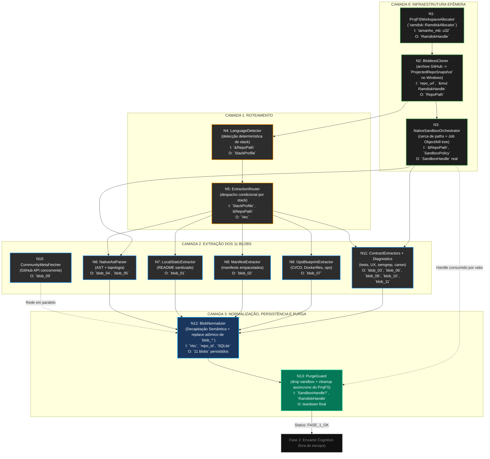

# SODA Harvester — Design Arquitetural (Fase 1)

> **Versão:** 1.1.0
> **Território:** PRODUTO (Daemon SODA — Rust/Tokio)
> **Regente:** Anti-SLOP Framework V3 + SDD Phase B
> **Aprovação Humana:** 2026-05-19 — ProjFS reconciliado, Sandbox nativo documentado

---

## 1. Manifesto

O Harvester é a engrenagem mecânica, **100% determinística e Zero-AI**, que precede
e viabiliza toda a inteligência analítica do SODA ETL Cognitivo.

Ele transforma gigabytes de código-fonte caótico em kilobytes de metadados puros —
extraindo o "Sinal" e incinerando o "Ruído" — sem invocar nenhum LLM, sem
materializar o checkout do repositório no SSD NVMe e sem bloquear o Event Loop do Tokio.

### 1.1. Regra do "Zero AI" na Fase 1

Na Fase 1, **não existem** Agentes de IA, inferência semântica ou LLMs.
O processo é 100% algorítmico e mecânico. A máquina não "entende" o código; ela o disseca.

### 1.2. Padrão Orchestrator-Worker

Todos os nós do Harvester operam como `target: local_slm` (custo FinOps **ZERO**).
O Cloud Brain não é acionado em nenhum ponto desta fase.

---

## 2. Proibições Tóxicas (Fase 0 — Advogado do Diabo)

Estas três leis são **inegociáveis** e devem ser injetadas em todos os PRDs da Fase 1.

### PT-1: PROIBIDO MATERIALIZAR O REPOSITÓRIO NO HOST

| Abordagem SLOP | Risco Letal |
|---|---|
| `git clone <url> ./temp/<repo>` no disco | Milhões de escritas aleatórias para 370+ repos → corrói TBW finito do NVMe |

**Lei Dura:** No Windows, a Fase 1 não usa mais VHDX nem `TempDir` como estratégia principal.
O `ramdisk::RamdiskAllocator` cria uma raiz efêmera em `projfs_workspaces`, o
`git::BloblessCloner` baixa o arquivo compactado do repositório, monta um
`ProjectedRepoSnapshot` em memória e expõe o checkout por **ProjFS (Projected File
System)**. O teardown explícito delega a remoção para processo externo
não-bloqueante (`spawn_detached_delete_process`), preservando o runtime do Tokio.
Zero escrita estrutural do checkout toca o SSD do host.

### PT-2: PROIBIDO GERAR ARQUIVOS INTERMEDIÁRIOS NO HOST

| Abordagem SLOP | Risco Letal |
|---|---|
| `native-ast-parser > raw_logic.txt` gerando arquivos temporários | 3.330+ arquivos-lixo, vetores de SDC (Silent Data Corruption) |

**Lei Dura:** O output de todos os Sidecars Efêmeros DEVE trafegar via **IPC Zero-Copy**
(captura de `stdout` via `tokio::process::Command`). Dados transitam como `Vec<u8>` na RAM
e são injetados diretamente como blobs no `soda_heuristic_vault.db` (SQLite).
A pasta `_RAW_DATA` está **morta**.

### PT-3: PROIBIDO BLOQUEAR O EVENT LOOP DO TOKIO

| Abordagem SLOP | Risco Letal |
|---|---|
| `std::process::Command::output()` síncrono | Congela a thread do Tokio Runtime inteira durante extração |
| SQLite via `rusqlite` síncrono na thread principal | I/O de disco travando o Event Loop |

**Lei Dura:** Toda invocação de Sidecar DEVE usar `tokio::process::Command` com captura
assíncrona. Toda operação SQLite DEVE rodar em `tokio::task::spawn_blocking` ou pool
de threads dedicado. O Event Loop do Tokio é **sagrado**.

---

## 3. Estratégia de Sandboxing (Isolamento Nativo Real)

O Harvester não usa mais um marcador documental do tipo `is_mock=false`.
Em produção, `SandboxOrchestrator::create()` sempre devolve um `SandboxHandle`
real com cerca de caminhos absolutos, roots explícitas de escrita e aniquilação
de processos órfãos via RAII.

| Camada | Implementação no código | Garantia efetiva |
|---|---|---|
| Cerca de paths | `enforce_host_path_policy()` recusa qualquer caminho absoluto fora do repositório ou das roots permitidas | Sidecars não escapam para o host |
| Spawn assíncrono | `tokio::process::Command` com `kill_on_drop(true)` | Nenhum sidecar bloqueia o Tokio |
| Escrita mínima | `build_host_write_roots()` libera somente `.native_ast_cache`, `.soda_sandbox` e suporte do semgrep | Escrita host é restrita e auditável |
| Extermínio Windows | `CreateJobObjectW` + `JOB_OBJECT_LIMIT_KILL_ON_JOB_CLOSE` | Toda árvore do processo morre ao fechar o handle |
| Extermínio em timeout | `child.kill()` + `kill_process_tree_by_pid()` + limpeza de órfãos | Timeout vira guilhotina, não zombie |

**Realidade operacional:** o sandbox atual é isolamento nativo orientado a processo.
Ele não depende de WSB, LPAC ou `winreg` para existir. A proteção vem do cercado
de paths, do runtime assíncrono e do teardown compulsório dos PIDs ativos.

---

## 4. Grafo DAG de Dependências (Fase A — Reconciliado com o código)

> A Fase 1 real gera **EXATAMENTE 11 blobs**. O antigo `blob_03_domain_mechanics`
> foi descontinuado do pipeline e sobrevive apenas como caso de regressão em teste
> para provar o expurgo de artefatos legados.

**Nota de verdade operacional sobre N12:** a decapitação semântica começa antes do
UPSERT final. Os sidecars sanitizam caminhos absolutos e diretórios efêmeros do host
(`sanitize_host_paths_in_text`, `sanitize_repo_relative_path`) para impedir que o RAG
futuro herde lixo do ambiente local, e o `BlobNormalizer` consolida esse pacote
canônico no SQLite removendo `blob_*` obsoletos do mesmo `repo_id`.

---

## 5. Tabela de Módulos e Contratos I/O

| Nó | Módulo Rust | Entrada | Saída | Proibições Aplicáveis |
|---|---|---|---|---|
| N1 | `ramdisk::RamdiskAllocator` | `tamanho_mb: u32` | `Result<RamdiskHandle, RamdiskError>` | PT-1 |
| N2 | `git::BloblessCloner` | `repo_url: &Url`, `&mut RamdiskHandle` | `Result<RepoPath, CloneError>` | PT-1, PT-3 |
| N3 | `sandbox::SandboxOrchestrator` | `&RepoPath`, `SandboxPolicy::ReadWrite` | `Result<SandboxHandle, SandboxError>` | PT-2, PT-3 |
| N4 | `detect::LanguageDetector` | `&RepoPath` | `StackProfile` | — |
| N5 | `router::ExtractionRouter` | `ExtractionInput` | `Vec<ExtractionTask>` | — |
| N6 | `sidecar::NativeAstParser` | `NativeAstInput` | `NativeAstArtifacts` (`blob_04`, `blob_05`) | PT-2, PT-3 |
| N7 | `extract::LocalStaticExtractor` | `&RepoPath` | `Vec<ArtifactBlob>` (`blob_01`) | PT-2 |
| N8 | `extract::ManifestExtractor` | `ManifestInput` | `ArtifactBlob` (`blob_02`) | PT-2 |
| N9 | `extract::OpsBlueprintExtractor` | `OpsInput` | `ArtifactBlob` (`blob_07`) | PT-2 |
| N10 | `community::CommunityMetaFetcher` | `repo_url: &Url`, `&RateLimiter` | `Vec<u8>` truncado (`blob_09`) | PT-3 |
| N11 | `extract::{TestIntentExtractor, UxContractsExtractor}` + `sidecar::SemgrepSidecar` + `canon::SodaCanonExtractor` | `RepoPath`, `SandboxHandle`, `StackProfile`, `SQLite` | `ArtifactBlob`s (`blob_03`, `blob_06`, `blob_08`, `blob_10`, `blob_11`) | PT-2, PT-3 |
| N12 | `sidecar::{sanitize_host_paths_in_text, sanitize_repo_relative_path}` + `persist::BlobNormalizer` | `Vec<ArtifactBlob>`, `repo_id: String`, `Arc<Mutex<Connection>>` | `Result<(), HarvesterError>` | PT-2, PT-3 |
| N13 | `guard::PurgeGuard` | `SandboxHandle`, `RamdiskHandle` | `Result<(), String>` | PT-1, PT-3 |

### 5.1. Contrato Formal dos 11 Blobs

| Ordem | artifact_type | Produtor | Contrato funcional |
|---|---|---|---|
| 1 | `blob_01_promessa_readme` | `LocalStaticExtractor` | Promessa explícita do produto a partir do README, com sanitização do conteúdo visual supérfluo |
| 2 | `blob_02_dependency_manifest` | `ManifestExtractor` | Dependências e dev-dependencies empacotadas em texto compacto |
| 3 | `blob_03_test_intent` | `TestIntentExtractor` | Intenção de testes, prioridades e trilhas de validação. Fica formalmente separado dos contratos de UX |
| 4 | `blob_04_repo_outline` | `NativeAstParser` | Outline estrutural do repositório |
| 5 | `blob_05_architecture_map` | `NativeAstParser` | Mapa topológico sanitizado das relações internas |
| 6 | `blob_06_unsafe_hotspots` | `SemgrepSidecar` | Hotspots estáticos de segurança e unsafe |
| 7 | `blob_07_ops_blueprint` | `OpsBlueprintExtractor` | Blueprint operacional: CI/CD, Dockerfiles e pegadas de operação |
| 8 | `blob_08_health_report` | `SemgrepSidecar` | Saúde estática e dívida técnica resumida |
| 9 | `blob_09_community_meta` | `CommunityMetaFetcher` | Metadados comunitários truncados da API do GitHub |
| 10 | `blob_10_soda_canon_context` | `SodaCanonExtractor` | Contexto canônico global do SODA, com cache em SQLite |
| 11 | `blob_11_ux_contracts` | `UxContractsExtractor` | Contratos de UX do frontend. Fica formalmente separado da intenção de testes |

**Invariante:** a Fase 1 persistida contém **EXATAMENTE 11 blobs** por `repo_id`.
O artefato `blob_03_domain_mechanics` não integra mais a saída oficial; ele aparece
somente em teste de regressão para comprovar que o `BlobNormalizer` remove contratos
legados durante a substituição atômica do pacote `blob_*`.

---

## 6. Sequência de PRDs (Roadmap de Implementação)

| Ordem | PRD | Nó DAG | Dependência |
|---|---|---|---|
| 1 | PRD-001: ProjFSWorkspaceAllocator (`ramdisk::RamdiskAllocator`) | N1 | Nenhuma (raiz) |
| 2 | PRD-002: BloblessCloner + ProjFS Snapshot Mount | N2 | PRD-001 |
| 3 | PRD-003: NativeSandboxOrchestrator | N3 | PRD-002 |
| 4 | PRD-004: LanguageDetector | N4 | PRD-002 |
| 5 | PRD-005: ExtractionRouter | N5 | PRD-004 |
| 6 | PRD-006: NativeAstParser | N6 | PRD-003, PRD-005 |
| 7 | PRD-007: LocalStaticExtractor | N7 | PRD-005 |
| 8 | PRD-008: ManifestExtractor | N8 | PRD-005 |
| 9 | PRD-009: OpsBlueprintExtractor | N9 | PRD-005 |
| 10 | PRD-010: CommunityMetaFetcher | N10 | Nenhuma (paralelo) |
| 11 | PRD-011: ContractExtractors + Diagnostics | N11 | PRD-003, PRD-005 |
| 12 | PRD-012: BlobNormalizer + Decapitação Semântica | N12 | PRD-006..011 |
| 13 | PRD-013: PurgeGuard + Async Teardown | N13 | PRD-001, PRD-003 |
