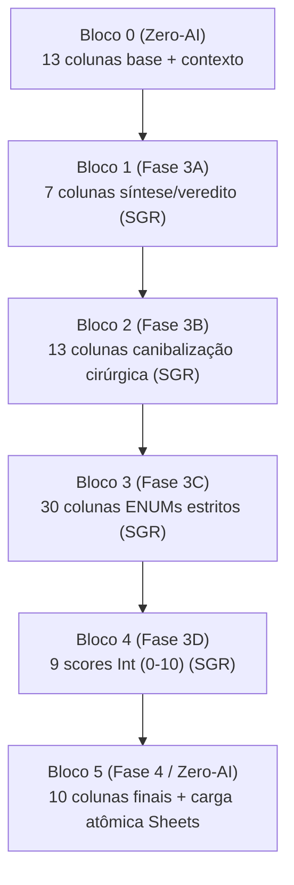

# SODA Harvester — Blueprint Oficial (Fases 3 e 4)

> **Versão:** 0.1.0  
> **Território:** PRODUTO (Daemon SODA — Rust/Tokio, arquitetura apenas)  
> **Escopo:** Fase 3 (Síntese SGR) + Fase 4 (Carga Atômica 82 colunas)  
> **Status:** Blueprint em redação final. Nenhum código Rust nasce nesta etapa.  

---

## 1. Manifesto

As Fases 3 e 4 transformam o resultado consolidado da Fase 2 em um registro final de **82 colunas** na aba **`MASTER_SOLUTIONS`** (sem sufixo `_v3`).  

O sistema abandona envios fragmentados e evita colapso de contexto fatiando a Fase 3 em um **DAG de 6 Blocos Estritos**, onde:

- Blocos 0 e 5 são **Zero-AI** (processamento local em Rust).
- Blocos 1–4 são gerados pelo **Sintetizador** com **Decodificação Restrita / Schema-Guided Reasoning (SGR)**.
- A saída final do Sintetizador registra obrigatoriamente **`"model_used": "anthropic/claude-sonnet-4.6"`**.
- A Fase 4 executa uma **carga destrutiva e coerente** das 82 colunas via `write_values` em micro-lotes, minimizando chamadas sem colapsar o stdio do MCP.

---

## 2. O Sintetizador e a Variável de Modelo

### 2.1. Modelo Oficial (Formatador)

- Variável oficial: **`OPENROUTER_FORMATTER_MODEL="anthropic/claude-sonnet-4.6"`**.
- Registro obrigatório no JSON final consolidado da Fase 3:

```json
{
  "model_used": "anthropic/claude-sonnet-4.6"
}
```

### 2.2. Regra Dura: SGR + Decodificação Restrita

Toda a Fase 3 roda em modo **SGR**:

- A IA é forçada a produzir **justificativas textuais curtas** antes de emitir scores e ENUMs.
- As respostas não podem conter prosa livre fora do JSON.
- O orquestrador valida o JSON com parser estrito e falha por repositório (ver seção 6).

### 2.3. Quatro Sub-chamadas com Prompt Caching

O Sintetizador executa 4 sub-chamadas (cascata controlada), explorando cache de prompt para reduzir custo:

1. **Sub-chamada 1 → Bloco 1** (Síntese e Veredito): lê Bloco 0 e produz texto curto + veredito.
2. **Sub-chamada 2 → Bloco 2** (Canibalização Cirúrgica): lê Blocos 0–1 e produz dissecação técnica.
3. **Sub-chamada 3 → Bloco 3** (Taxonomia e ENUMs): lê Blocos 0–2 e seleciona 30 ENUMs estritos.
4. **Sub-chamada 4 → Bloco 4** (Matemática Punitiva): lê Blocos 0–3 e emite 9 scores Int (0–10).

Regra de consistência:

- Cada sub-chamada só enxerga os blocos necessários para sua decisão.
- A saída de uma sub-chamada é persistida/validada antes de liberar a próxima.
- O JSON consolidado final da Fase 3 agrega Blocos 1–4 e injeta `model_used`.

---

## 3. DAG das 82 Colunas (Máquina de Estados)

### 3.1. Diagrama Mermaid (Cascata Bloco 0 → 5)



### 3.2. Unidade de Consistência

- Unidade atômica de computação: **1 repositório** (1 linha na planilha).
- Unidade atômica de escrita lógica na planilha: **1 linha** despachada em micro-lotes sequenciais de `write_values`, preservando coerência por ranges.

---

## 4. Blocos Estritos e Colunas

### 4.1. Bloco 0 — A Fundação (Zero-AI) — 13 colunas

Mandato: o Rust organiza e injeta estas 13 colunas como contexto de baixa entropia para a Fase 3.

Colunas (13):

1. `project_name`
2. `repo_url`
3. `repo_version`
4. `ultima_versao_online`
5. `lote_id`
6. `data_ultima_analise`
7. `analise_origem`
8. `licenca`
9. `stack_base`
10. `declared_description`
11. `lente_a_sentido_prod_ux`
12. `lente_b_estrutura_arq`
13. `lente_c_realidade_ops`

Invariantes:

- Zero-AI: nenhum modelo é chamado para produzir/alterar essas colunas.
- Essas colunas são usadas como âncora para todas as sub-chamadas.

### 4.2. Bloco 1 — Síntese e Veredito (Fase 3A) — 7 colunas

Mandato: o Claude avalia Bloco 0 e redige textos curtos e auditáveis.

Colunas (7):

1. `proposta_original_resumo`
2. `visao_do_enxame`
3. `justificativa_decisao`
4. `executive_verdict` (Tese, Antítese, Síntese)
5. `risco_principal`
6. `risco_linha_vermelha`
7. `observacoes`

Regras de forma:

- Textos curtos, densos, sem verborragia.
- `executive_verdict` deve conter explicitamente os três campos: Tese/Antítese/Síntese.

### 4.3. Bloco 2 — Canibalização Cirúrgica (Fase 3B) — 13 colunas

Mandato: dissecação técnica e limites de absorção.

Colunas (13):

1. `ouro_a_extrair`
2. `deep_pattern`
3. `transplantable_core`
4. `logic_math_heuristic`
5. `real_structural_problem`
6. `categoria_nuance_tecnica`
7. `integracao_papel_exato`
8. `must_components_prod_ux`
9. `must_components_arq`
10. `must_components_ops`
11. `detected_toxic_deps`
12. `do_not_absorb`
13. `where_ai_should_not_enter`

Regras de forma:

- `detected_toxic_deps` e `do_not_absorb` devem ser concretos e verificáveis (nomes, padrões, classes de risco).
- `where_ai_should_not_enter` explicita fronteiras: o que é proibido automatizar na absorção.

### 4.4. Bloco 3 — Taxonomia e ENUMs (Fase 3C) — 30 colunas

Mandato: seleção rápida e estrita, mapeada do SODA Canon (sem valores fora do conjunto permitido).

Colunas (30):

1. `classificacao_terminal`
2. `acao_de_canibalizacao`
3. `categoria_arquitetural`
4. `horizonte_extracao`
5. `tipo_integracao`
6. `capability_nature_primary`
7. `architectural_topology`
8. `temporal_stability`
9. `bare_metal_fit`
10. `extractability_level`
11. `runtime_sovereignty_fit`
12. `local_first_fit`
13. `adoptability_level`
14. `longitudinal_sustainability`
15. `maintenance_burden`
16. `onboarding_friction`
17. `observability_operational`
18. `recoverability_level`
19. `degradation_behavior`
20. `curation_burden`
21. `evolution_cost`
22. `operability_level`
23. `abandonment_risk`
24. `time_to_first_clear_value`
25. `imperfection_tolerance`
26. `entropy_risk`
27. `design_misuse_risk`
28. `intrinsic_ethics_risk`
29. `discipline_dependency`
30. `regulatory_risk`

Regras de forma:

- Cada campo deve aceitar somente valores do catálogo/ENUM definido no Canon.
- Em SGR, cada escolha deve carregar justificativa curta (ver contrato na seção 5).

### 4.5. Bloco 4 — Matemática Punitiva (Fase 3D) — 9 colunas

Mandato: converter decisões e riscos em notas Int (0–10).

Colunas (9):

1. `score_philosophical_fit`
2. `score_bare_metal_fit`
3. `score_architectural_extractability`
4. `score_operability`
5. `score_creep_risk`
6. `score_runtime_sovereignty`
7. `score_model_logic_value`
8. `score_ethics_safety`
9. `score_intrinsic_risk`

Regras de forma:

- Cada score é Int no intervalo fechado [0, 10].
- Scores de risco usam semântica punitiva (risco alto → nota alta no campo de risco, sem inversões implícitas).

### 4.6. Bloco 5 — Fechamento e Carga Atômica (Zero-AI / Fase 4) — 10 colunas

Mandato: cálculo local de floats finais, injeção de validade e carga atômica.

Colunas (10):

**A) Floats finais (7):**

1. `score_final`
2. `score_fit_geral_soda`
3. `score_architectural_priority`
4. `score_human_product_priority`
5. `score_absorption_readiness`
6. `score_operational_priority`
7. `score_sustainability_adjusted_fit`

**B) Validade e governança (3):**

8. `valid_from`
9. `valid_to`
10. `embargo_status`

Execução:

- O Rust executa `write_values` enviando **as 82 colunas** para a aba `MASTER_SOLUTIONS` em escrita destrutiva e coerente, fatiada por ranges.
- O range por linha deve cobrir exatamente 82 colunas: **A → CD**.

---

## 5. Contrato de Saída da Fase 3 (JSON Consolidado)

O orquestrador consolida os Blocos 1–4 em um único JSON validável.

Regras:

- Proibido texto fora do JSON.
- `model_used` é obrigatório e deve refletir exatamente o valor do modelo formatador.
- Cada bloco inclui:
  - `fields`: pares chave/valor das colunas do bloco.
  - `justifications`: mapa com justificativas curtas por campo (SGR).

Formato conceitual:

```json
{
  "model_used": "anthropic/claude-sonnet-4.6",
  "block_1": {
    "fields": { "proposta_original_resumo": "..." },
    "justifications": { "executive_verdict": "..." }
  },
  "block_2": {
    "fields": { "ouro_a_extrair": "..." },
    "justifications": { "do_not_absorb": "..." }
  },
  "block_3": {
    "fields": { "acao_de_canibalizacao": "..." },
    "justifications": { "acao_de_canibalizacao": "..." }
  },
  "block_4": {
    "fields": { "score_bare_metal_fit": 7 },
    "justifications": { "score_bare_metal_fit": "..." }
  }
}
```

---

## 6. Fail-Closed (Parser de Schema JSON da Fase 3)

### 6.1. Definição de Falha

Uma sub-chamada da Fase 3 falha se ocorrer qualquer um dos eventos:

- JSON inválido (parse falha).
- JSON válido, mas schema inválido (chave ausente, tipo incorreto, campo fora do conjunto permitido).
- Campo numérico fora do intervalo (ex.: score fora de [0,10]).
- ENUM fora do catálogo aceito.

### 6.2. Estratégia de Retry com Injeção do Erro

Fail-Closed por bloco:

1. O orquestrador captura a mensagem do parser/schema (incluindo o path do campo).
2. Reexecuta a mesma sub-chamada, injetando:
   - O erro do parser/schema (texto curto).
   - Um recorte do JSON rejeitado (apenas o trecho relevante do erro).
   - A exigência explícita: “corrija somente o JSON; não altere a intenção do conteúdo”.
3. Se o parser falhar novamente, repete uma última vez (teto rígido de 3 tentativas: 1 + 2 retries).
4. Na terceira falha, o repositório entra em estado terminal **`ERRO_FASE_3_SCHEMA`** e o lote segue para o próximo item.

Regra de isolamento:

- A falha de um repositório não pode bloquear o lote inteiro.

### 6.3. Persistência Parcial (Proibida)

- Se o Bloco 2 falha após o Bloco 1, a Fase 3 do repositório é considerada falha.
- Não existe “meia linha” na planilha: ou as 82 colunas são publicadas na Fase 4, ou nada é atualizado para aquele repositório.

---

## 7. Carga Atômica na `MASTER_SOLUTIONS` (Fase 4)

### 7.1. Estratégia Atômica

O Rust materializa uma linha completa (82 colunas) em memória e só então dispara a escrita.

Invariantes:

- A planilha recebe atualização em **um único request** por linha (ou em um único request agrupando múltiplas linhas), reduzindo RPM.
- A escrita é destrutiva: sobrescreve a linha inteira no range **A:CD**.

### 7.2. Shape da Escrita (Sheets)

- Aba destino: `MASTER_SOLUTIONS`
- Range por linha: `MASTER_SOLUTIONS!A{row}:CD{row}`
- Payload: matriz 2D com 1 linha e 82 valores em ordem canônica (Bloco 0 → 5).

### 7.3. Ordem Canônica das 82 Colunas (Bloco 0 → 5)

Para evitar deriva de mapeamento, a ordem da carga é fixa:

**Bloco 0 (13):**  
`project_name`, `repo_url`, `repo_version`, `ultima_versao_online`, `lote_id`, `data_ultima_analise`, `analise_origem`, `licenca`, `stack_base`, `declared_description`, `lente_a_sentido_prod_ux`, `lente_b_estrutura_arq`, `lente_c_realidade_ops`

**Bloco 1 (7):**  
`proposta_original_resumo`, `visao_do_enxame`, `justificativa_decisao`, `executive_verdict`, `risco_principal`, `risco_linha_vermelha`, `observacoes`

**Bloco 2 (13):**  
`ouro_a_extrair`, `deep_pattern`, `transplantable_core`, `logic_math_heuristic`, `real_structural_problem`, `categoria_nuance_tecnica`, `integracao_papel_exato`, `must_components_prod_ux`, `must_components_arq`, `must_components_ops`, `detected_toxic_deps`, `do_not_absorb`, `where_ai_should_not_enter`

**Bloco 3 (30):**  
`classificacao_terminal`, `acao_de_canibalizacao`, `categoria_arquitetural`, `horizonte_extracao`, `tipo_integracao`, `capability_nature_primary`, `architectural_topology`, `temporal_stability`, `bare_metal_fit`, `extractability_level`, `runtime_sovereignty_fit`, `local_first_fit`, `adoptability_level`, `longitudinal_sustainability`, `maintenance_burden`, `onboarding_friction`, `observability_operational`, `recoverability_level`, `degradation_behavior`, `curation_burden`, `evolution_cost`, `operability_level`, `abandonment_risk`, `time_to_first_clear_value`, `imperfection_tolerance`, `entropy_risk`, `design_misuse_risk`, `intrinsic_ethics_risk`, `discipline_dependency`, `regulatory_risk`

**Bloco 4 (9):**  
`score_philosophical_fit`, `score_bare_metal_fit`, `score_architectural_extractability`, `score_operability`, `score_creep_risk`, `score_runtime_sovereignty`, `score_model_logic_value`, `score_ethics_safety`, `score_intrinsic_risk`

**Bloco 5 (10):**  
`score_final`, `score_fit_geral_soda`, `score_architectural_priority`, `score_human_product_priority`, `score_absorption_readiness`, `score_operational_priority`, `score_sustainability_adjusted_fit`, `valid_from`, `valid_to`, `embargo_status`

---

## 8. Definition of Done (Blueprint)

- O modelo oficial e o campo `model_used` estão definidos e imutáveis.
- O DAG em 6 Blocos Estritos está explicitado com contagens e listas completas.
- A estratégia SGR (justificativas antes de scores/ENUMs) está contratada.
- O Fail-Closed do parser/schema foi definido (retry com injeção do erro; teto rígido).
- A carga Sheets é destrutiva e atômica no range A:CD, com ordem canônica fixa.

---

## 9. Próximo Passo

Arquiteto: este Blueprint está pronto para auditoria. Estou aguardando sua aprovação explícita para iniciarmos o TDD atômico (scaffold + testes falhando) da implementação Rust das Fases 3 e 4.

