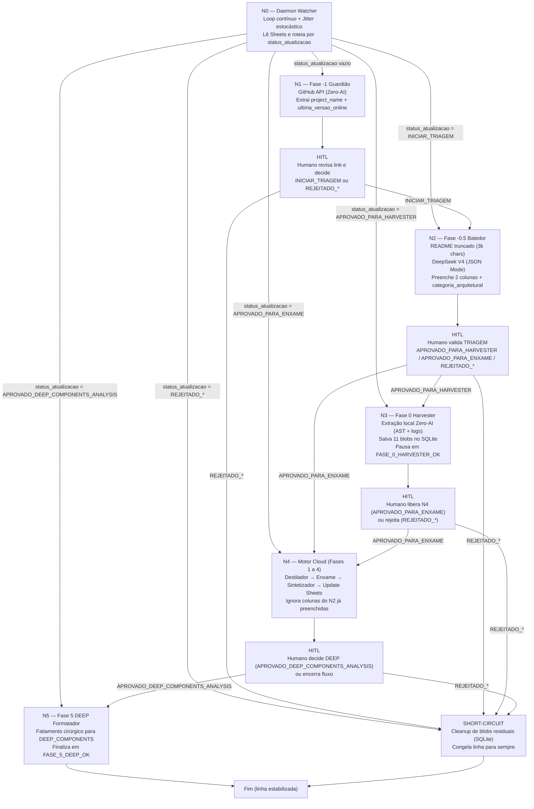

# SODA — Funil de Ingestão Contínua (DAG v5)

> **Versão:** 5.0  
> **Território:** CÂNONE (arquitetura e contratos; nenhum código nasce aqui)  
> **Escopo:** N0..N5 + HITL (separação Humano vs Máquina)  
> **Status:** Contrato físico para a refatoração do funil de ingestão

---

## 1. Premissas Inquebráveis

- O humano controla exclusivamente **`status_atualizacao`** (comandos e veredito HITL).
- A máquina escreve exclusivamente **`status_fase`** (rastro mecânico e idempotente).
- Rejeições humanas (`REJEITADO_*`) geram **`SHORT-CIRCUIT`**: limpeza de blobs residuais e congelamento definitivo da linha.
- O N2 (Batedor) preenche apenas 2 colunas (**`proposta_original_resumo`** e **`categoria_arquitetural`**) com custo mínimo e saída estritamente estruturada.
- O Motor Cloud (Fases 1 a 4) deve ignorar colunas já preenchidas pelo N2, preservando-as e reduzindo tokens.

---

## 2. Catálogos Canônicos (ENUMs)

### 2.1. `status_atualizacao` (controle humano)

- (vazio)  
- `NOVO_LINK_OK`
- `INICIAR_TRIAGEM`
- `TRIAGEM_CONCLUIDA`
- `APROVADO_PARA_HARVESTER`
- `APROVADO_PARA_ENXAME`
- `APROVADO_DEEP_COMPONENTS_ANALYSIS`
- `REJEITADO_LIXO_TOXICO`
- `REJEITADO_NO_MOMENTO`
- `REJEITADO_REDUNDANTE`
- `REJEITADO_OVERENGINEERING`

### 2.2. `status_fase` (rastro da máquina)

- `FASE_-1_GUARDIÃO_OK`
- `FASE_-0.5_BATEDOR_OK`
- `FASE_0_HARVESTER_OK`
- `FASE_1_DESTILADOR_OK`
- `FASE_2_ENXAME_OK`
- `FASE_3_SINTETIZADOR_OK`
- `FASE_4_SHEETS_UPDATED`
- `FASE_5_DEEP_OK`
- `SHORT-CIRCUIT`

### 2.3. `categoria_arquitetural` (10 ENUMs)

- `CanvasUI`
- `UILibrary`
- `Memoria_RAG`
- `Roteamento_FinOps`
- `Orquestracao_Agentes`
- `Model_Serving`
- `Knowledge_Extraction`
- `Seguranca_Sandbox`
- `Infraestrutura_Core`
- `Tooling_Dev`

---

## 3. DAG (N0 → N5) com HITL e SHORT-CIRCUIT

---

## 4. Contratos de I/O por Nó (Gatilho → Ação → Saídas)

### 4.1. N0 — Daemon Watcher

| Input (Gatilho) | Ação (Mecânica/IA) | Output (Novo Status) |
|---|---|---|
| Leitura periódica do Sheets (linhas com `status_atualizacao` vazio ou com comandos HITL) | Mecânico: selecionar linhas elegíveis + aplicar jitter/backoff + despachar nó correspondente | Não altera `status_atualizacao`; apenas decide roteamento e registra telemetria |
| `status_atualizacao` começa com `REJEITADO_` | Mecânico: acionar rotina de cleanup e congelamento | `status_fase = SHORT-CIRCUIT` |

### 4.2. N1 — Fase -1 Guardião

| Input (Gatilho) | Ação (Mecânica/IA) | Output (Novo Status) |
|---|---|---|
| `status_atualizacao` vazio (linha recém-ingressa) | Mecânico (Zero-AI): GitHub API → extrair `project_name` e `ultima_versao_online` | `status_atualizacao = NOVO_LINK_OK` e `status_fase = FASE_-1_GUARDIÃO_OK` |

### 4.3. N2 — Fase -0.5 Batedor

| Input (Gatilho) | Ação (Mecânica/IA) | Output (Novo Status) |
|---|---|---|
| `status_atualizacao = INICIAR_TRIAGEM` | IA barata: README truncado (3k) + `blob_10_soda_canon_context` → DeepSeek V4 (JSON Mode) para extrair apenas `proposta_original_resumo` + `categoria_arquitetural` | `status_atualizacao = TRIAGEM_CONCLUIDA` e `status_fase = FASE_-0.5_BATEDOR_OK` |

### 4.4. N3 — Fase 0 Harvester

| Input (Gatilho) | Ação (Mecânica/IA) | Output (Novo Status) |
|---|---|---|
| `status_atualizacao = APROVADO_PARA_HARVESTER` | Mecânico (Zero-AI): extração local (AST, manifests, logs). Persistir 11 blobs no SQLite. | `status_fase = FASE_0_HARVESTER_OK` (não sobrescrever `status_atualizacao`) |

### 4.5. N4 — Motor Cloud (Fases 1 a 4)

| Input (Gatilho) | Ação (Mecânica/IA) | Output (Novo Status) |
|---|---|---|
| `status_atualizacao = APROVADO_PARA_ENXAME` | Fase 1: Destilador → Fase 2: Enxame → Fase 3: Sintetizador (saída estruturada) → Fase 4: `batch_update_cells` | Atualizações de conteúdo no Sheets + `status_fase = FASE_4_SHEETS_UPDATED` |

Regra FinOps: o Sintetizador deve tratar `proposta_original_resumo` e `categoria_arquitetural` como **read-only** quando já preenchidas pelo N2, evitando re-geração.

### 4.6. N5 — Fase 5 DEEP Formatador

| Input (Gatilho) | Ação (Mecânica/IA) | Output (Novo Status) |
|---|---|---|
| `status_atualizacao = APROVADO_DEEP_COMPONENTS_ANALYSIS` | Mecânico: fatiamento cirúrgico de arquitetura para a aba `DEEP_COMPONENTS` | `status_fase = FASE_5_DEEP_OK` |

---

## 5. Contrato de SHORT-CIRCUIT (HITL)

Quando o humano define `status_atualizacao` como `REJEITADO_*`:

- A máquina deve setar `status_fase = SHORT-CIRCUIT`.
- A máquina deve deletar blobs residuais do SQLite associados ao repositório (limpeza de disco).
- A linha é considerada congelada: o Daemon Watcher nunca mais deve roteá-la para N1..N5.

