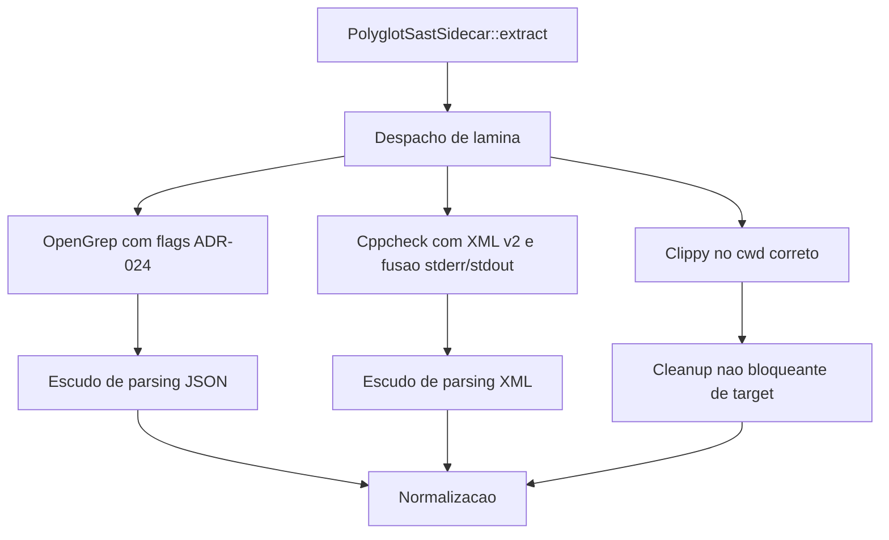

# ADR-024 Performance SAST

## Contexto

O Harvester F0 ja possui escudo de parsing, guilhotina inteligente e suporte a monorepos, mas a ADR-024 exige endurecimento adicional de performance e higiene operacional. O fluxo atual ainda precisa transformar o canone em codigo real para `opengrep`, `cppcheck` e `cargo clippy`.

## Objetivo

Aplicar as 3 mutacoes mandatarias da ADR-024 sem regredir as defesas recentes:
- Bisturi adaptativo e escudo de supply chain no `opengrep`
- Higiene de I/O com limpeza imediata de `target/` apos `cargo clippy`
- Cura do `cppcheck` para XML em `stderr` ou `stdout` sob o escudo de parsing

## Linhas Vermelhas

- Nao remover o escudo de parsing JSON/XML ja existente.
- Nao remover a guilhotina inteligente de timeouts adaptativos no sandbox.
- Nao amputar lockfiles e manifestos de supply chain com filtros agressivos.
- Nao quebrar o suporte a monorepos e `cwd` por subprojeto ja consolidado.

## Design

## Orchestrator-Worker

- Orchestrator: `run_sast_blade` e `execute_sidecar_in_dir`
- Workers: `run_opengrep_scan`, `cppcheck`, `cargo clippy`
- Governanca: manter semaforo Tokio e `cwd` por subprojeto ja introduzidos
- Teardown: limpeza de cache compilatorio apos `clippy`

## DoD

- Injeta `--allow-rule-timeout-control`, `--exclude-minified-files` e ignores de mocks/tests no `opengrep`.
- Preserva lockfiles e manifestos de supply chain fora das exclusoes.
- Garante `cppcheck` com `--xml` e `--xml-version=2` e tolera XML vindo de `stderr`.
- Limpa `target/` do subprojeto logo apos `cargo clippy`.
- Compila com `cargo check`.
- Passa em testes focados.
- Entrega diff claro das 3 protecoes cirurgicas.
