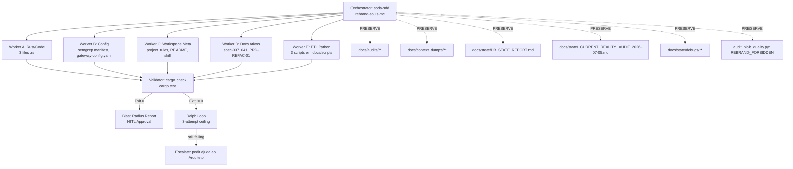

# SODA Rebrand Surgery — Genesis MC → Souls MC

## 1. Contexto

A pasta física do SO Agente foi renomeada no Windows para `Z:\souls_mc` e o remote Git já aponta para `origin/souls_mc` (commit `115cda2 chore: rebrand project to Souls MC`). A presente Fase 0/1 do rebrand anterior cobriu TOML/JSON/tauri.conf e os working trees de 3 arquivos Rust. O resíduo textual remanescente está documentado neste design e será extirpado cirurgicamente.

## 2. Linha Vermelha (Inviolável)

| # | Regra | Justificativa |
|---|-------|---------------|
| R1 | Preservar `docs/audits/**` intactos | Logs date-frozen. Reescrevê-los seria falsificar histórico. |
| R2 | Preservar `docs/context_dumps/**` intactos | Snapshots compilados. Próxima execução os regenera. |
| R3 | Preservar `docs/state/DB_STATE_REPORT.md` | Path `c:\Users\rosas\Dev_Projects\genesis_mc` documenta estado histórico do banco em 2026-05-25. |
| R4 | Preservar `docs/state/_CURRENT_REALITY_AUDIT_2026-07-05.md` | Audit com data no filename. |
| R5 | Preservar `docs/state/debugs/**` | Logs de debug são imutáveis. |
| R6 | Preservar `REBRAND_FORBIDDEN` em `docs/scripts/audit_blob_quality.py` | A lista é a *assinatura* do auditor de rebrand; trocá-la cega o auditor. |
| R7 | Não destruir histórico git | Trabalhamos em `feat/rebrand-souls-mc`; merge é HITL. |
| R8 | Agnosticismo de Hardware: o rebrand é puramente textual, sem dependência de plataforma (Windows/Linux/macOS) | Mantém o build reproduzível em qualquer host. |

## 3. Agnosticismo Hardware

O rebrand é uma transformação de strings ASCII. Não há:
- Codepaths dependentes de GPU (CUDA/Metal/Vulkan) — N/A.
- Codepaths dependentes de OS-specific path separators — validados nos 3 padrões de encoding do workspace: `Z:\\genesis_mc` (Windows duplo-backslash), `Z:/genesis_mc` (forward-slash YAML), `file:///Z:/genesis_mc` (URI).
- Dependências de byte order (UTF-8 only).

Garantia de Agnosticismo: o padrão `genesis_mc` → `souls_mc` é puramente lexical e produz o mesmo resultado em qualquer plataforma de execução. A RTX 2060m permanece como "treino de gravidade" — não impactada pelo rebrand.

## 4. Padrão Orchestrator-Worker

## 5. Matriz de Substituição por Camada

| Camada | Arquivo | Padrão | Ação | Justificativa |
|--------|---------|--------|------|---------------|
| **L1: Code** | `src-tauri/src/bin/f1_distiller_cli.rs:380` | `SODA (Genesis MC)` | REPLACE → `SODA (Souls MC)` | Prompt string em produção |
| **L1: Code** | `src-tauri/src/harvester/canon.rs:17` | `SODA / Genesis MC:` | REPLACE → `SODA / Souls MC:` | Header canônico ativo |
| **L1: Code** | `src-tauri/src/persist/ssot_injector.rs:1337` | `genesis-mc-sheets/1.0` | REPLACE → `souls-mc-sheets/1.0` | User-Agent HTTP ativo |
| **L2: Config** | `src-tauri/semgrep/rules/_manifest.json:3` | `Z:\\genesis_mc` | REPLACE → `Z:\\souls_mc` | workspace_root ativo |
| **L2: Config** | `gateway-config.yaml:41` | `Z:/genesis_mc/.soda_data/soda_state.db` | REPLACE → `Z:/souls_mc/.soda_data/soda_state.db` | DB path runtime |
| **L3: Meta** | `.trae/rules/project_rules.md:5` | `Genesis MC Core Context` | REPLACE → `Souls MC Core Context` | Título workspace rules |
| **L3: Meta** | `README.md:18` | `O Genesis MC repudia` | REPLACE → `O Souls MC repudia` | Filosofia ativa do projeto |
| **L3: Meta** | `README.md:62` | `rodando no Genesis MC` | REPLACE → `rodando no Souls MC` | Regra de governança ativa |
| **L3: Meta** | `.agents/skills/soda-frontend-expert/SKILL.md` | `SODA (Genesis MC)` | REPLACE → `SODA (Souls MC)` | Role definition ativa |
| **L4: Docs Ativos** | `docs/specs/spec-037..041` (30 hits) | `file:///Z:/genesis_mc/...` | REPLACE → `file:///Z:/souls_mc/...` | Links para código ativo |
| **L4: Docs Ativos** | `docs/prds/PRD_REFAC_01_StateMachine.md` (3 hits) | `file:///c:/Users/.../genesis_mc/...` | REPLACE apenas o segmento `genesis_mc` → `souls_mc` | Links para DAGs ativas |
| **L5: ETL Python** | `docs/scripts/extract_audit_blobs.py:33` | `parents[2]=genesis_mc` | REPLACE → `parents[2]=souls_mc` | Path raiz de input |
| **L5: ETL Python** | `docs/scripts/soda_adr_compiler.py:6,7` | `Z:\genesis_mc\...` | REPLACE → `Z:\souls_mc\...` | Paths de input/output |
| **L5: ETL Python** | `docs/scripts/soda_context_dumps_compiler.py` (15 hits) | `Z:\genesis_mc\...` | REPLACE → `Z:\souls_mc\...` | Paths de input/output |
| **P1: PRESERVE** | `docs/audits/**` | `genesis_mc` (múltiplos) | **PRESERVAR** | R1 — log date-frozen |
| **P2: PRESERVE** | `docs/context_dumps/**` | `genesis_mc` (múltiplos) | **PRESERVAR** | R2 — snapshot compilado |
| **P3: PRESERVE** | `docs/state/DB_STATE_REPORT.md` | `c:\Users\rosas\Dev_Projects\genesis_mc\...` | **PRESERVAR** | R3 — relatório dated |
| **P4: PRESERVE** | `docs/state/_CURRENT_REALITY_AUDIT_2026-07-05.md` | `genesis_mc` | **PRESERVAR** | R4 — audit date-frozen |
| **P5: PRESERVE** | `docs/state/debugs/**` | `genesis_mc` | **PRESERVAR** | R5 — debug log |
| **P6: PRESERVE** | `docs/scripts/audit_blob_quality.py:106-110` | `REBRAND_FORBIDDEN` list | **PRESERVAR** | R6 — assinatura do auditor |

## 6. Critério de Aceitação (DoD Global)

- `cargo check` retorna `Exit Code 0` com zero warnings
- `cargo test` retorna `Exit Code 0` (todos os testes existentes permanecem verdes; nenhum teste novo é introduzido)
- `git grep -E 'genesis[ _-]?mc' -- 'src-tauri/'` retorna **0 ocorrências** no código
- `git grep -E 'genesis[ _-]?mc' -- 'gateway-config.yaml' 'README.md' '.trae/rules/project_rules.md' '.agents/skills/'` retorna **0 ocorrências** no meta/config ativo
- Pastas `docs/audits/`, `docs/context_dumps/`, `docs/state/DB_STATE_REPORT.md`, `docs/state/_CURRENT_REALITY_AUDIT_2026-07-05.md`, `docs/state/debugs/` permanecem **byte-idênticas** ao estado pré-cirurgia
- Working tree não contém modificações não relacionadas (os 3 arquivos já migrados pelo usuário em TRAE-IDE permanecem como estão)

## 7. Pedido de Aprovação

**Arquiteto, o design e o roteamento agnóstico estão aprovados?**

- [ ] Aprovado para Fase 3 (criar `tasks.md` com DoD atômico por worker)
- [ ] Aprovado com ajustes (especificar)
- [ ] Rejeitado (justificar)
