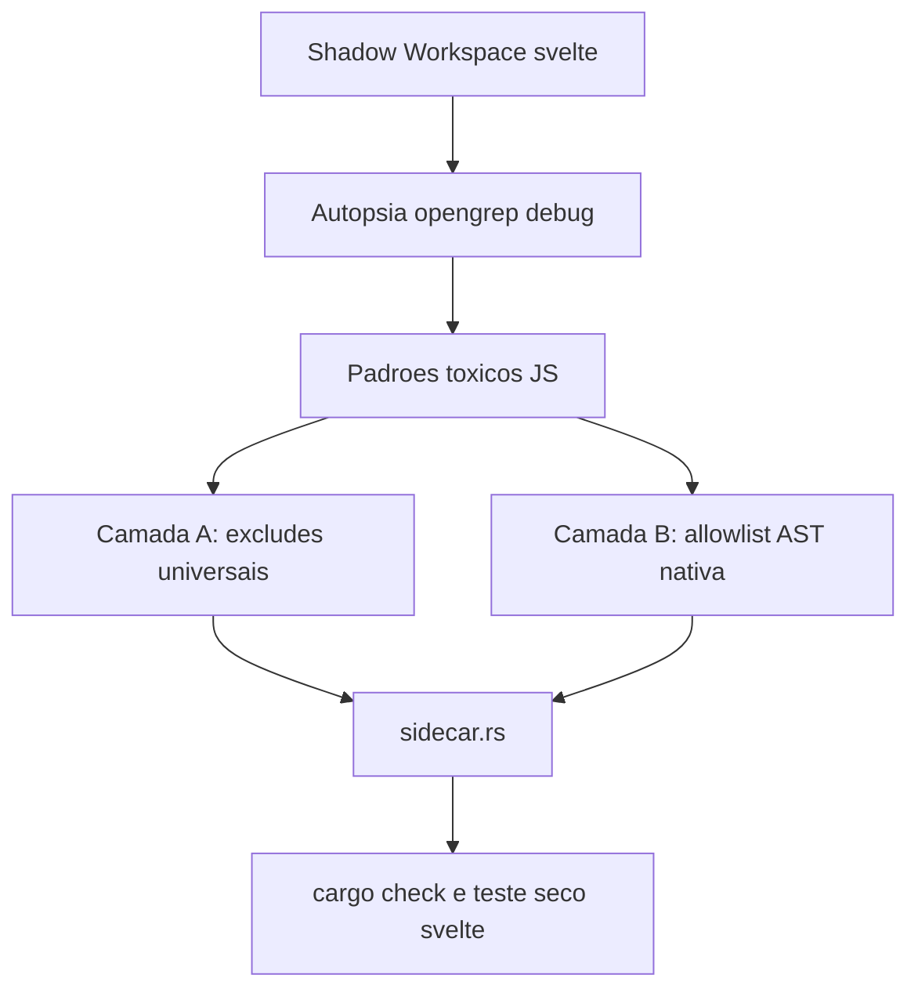

# Resolucao Organica Do Timeout Do Opengrep

## Contexto

O `opengrep` esta morrendo por `idle timeout` em monorepos JS grandes, com destaque para `sveltejs/svelte` e `mendableai/firecrawl`. A autopsia no `svelte` mostrou que o custo nao vem de um unico `node_modules`, mas de leitura cega demais sobre uma arvore heterogenea: muita periferia de testes e amostras, somada a subarvores estruturais densas como `packages/svelte/src/compiler`.

## Objetivo

Construir uma vacina universal em profundidade para o invocador do `opengrep`, combinando exclusoes organicas de lixo estrutural e scoping dinamico nativo baseado no AST, de modo que o scan do `svelte` feche com `exit code 0` sem hardcodes por repo.

## Linhas Vermelhas

- Nao introduzir hardcode por repositorio (`if repo == svelte`).
- Nao mandar o `opengrep` continuar lendo `.` de forma cega quando o Rust ja consegue derivar escopo.
- Nao amputar manifestos e lockfiles.
- Nao degradar a qualidade de achados do `opengrep` ao ponto de varrer apenas arquivos triviais.

## Design

## Orchestrator-Worker

- Orchestrator: `PolyglotSastSidecar::extract(...)`
- Worker de autopsia: `opengrep scan --debug` em shadow workspace local
- Worker estrutural: `ast_parser::extract_repository_outline_native(...)` como base para inferir raizes uteis
- Worker de sandbox: `SandboxHandle::execute_in_dir(...)` com `idle timeout` profundo para `opengrep`

## Diagnostico Atual

- O `svelte` dispara `opengrep` sobre uma arvore com cerca de `8941` arquivos e `829` regras no bundle local.
- A periferia de `packages/svelte/tests/**` e `samples/**` domina o volume do repo, com milhares de arquivos de fixture.
- O gargalo estrutural mais caro no codigo util apareceu em `packages/svelte/src/compiler`, especialmente quando a arvore inteira e passada como um unico alvo cego.
- Subarvores menores como `packages/svelte/src/internal`, `reactivity` e `store` fecham; o problema piora quando o escopo mistura codigo util profundo com massa periferica de monorepo.

## Estrategia

- Camada A: ampliar os `--exclude` para padroes toxicos recorrentes em monorepos JS, como `__tests__`, `__mocks__`, `__fixtures__`, `samples`, `snapshots`, `playground`, `benchmarking`, `generated` e artefatos como `output.json`.
- Camada B: substituir o alvo cego `.` por uma lista de raizes uteis derivadas nativamente do AST/caminhos-fonte, priorizando ancoras como `src`, `lib`, `app`, `packages/*/src` e equivalentes.
- Refinamento: quando uma raiz ancorada for larga demais, quebrar em sub-raizes organicas do proximo nivel para reduzir a janela de silencio do processo.
- Segunda cura: quando uma ancora tiver arquivos diretos e subpastas pesadas, nao reabrir o pai inteiro; o Rust deve separar subarvores e, para os arquivos diretos, disparar `opengrep` com alvos explicitos em lote pequeno.
- Blindagem de build: `cargo clippy` e demais invocacoes `cargo` nao devem materializar `target/` dentro do repo efemero ProjFS; o cache precisa viver em `.soda_sandbox` para evitar `os error 5` e lock churn.
- Terceira cura: `biome` e `oxlint` devem herdar o mesmo planner AST do `opengrep`, incluindo fatiamento recursivo, lotes `::files-*` e respeito as fronteiras de subpackages `package.json` para evitar reabrir o root do monorepo.
- Quarta cura: `cargo clippy` deve receber perfil de timeout ocioso profundo quando invocado como `cargo clippy`, porque subcrates Rust grandes podem passar mais de 45s sem emitir JSON antes do primeiro lote de compilacao.
- Quinta cura: `blob_09_community_meta` deve normalizar o `full_name` canonico retornado pelo GitHub antes de consultar `search/issues`, evitando falha 422 quando o repositório foi renomeado ou transferido.
- Operacao de reparo: expor uma CLI cirurgica para recapturar apenas `blob_09_community_meta`, sem rerodar os 11 blobs do repo.
- Diagnostico condicional de I/O/Sandbox: a cerca atual do sandbox ja aceita `cwd` fatiado dentro do repo, e o `--config` do OpenGrep ja entra absoluto. O furo remanescente e concorrencial: `ensure_semgrep_rule_bundle()` ainda materializa a arvore YAML sem trava por repositorio/ruleset, deixando uma janela TOCTOU entre `target.exists()` e `copy`.
- Cura condicional de I/O/Sandbox: serializar a materializacao do bundle YAML por chave estrutural (`repo_path + rule_set`) e tornar a copia idempotente sob corrida, sem relaxar a politica de host path nem reabrir caminho relativo no `--config`.

## DoD

- O codigo Rust compila com `cargo check`.
- O algoritmo nao volta a criar um scope pai toxico como `apps/api/src` quando os filhos ja foram fatiados.
- Os arquivos diretos de uma ancora continuam cobertos via alvos explicitos do `opengrep`.
- `cargo clippy` nao tenta mais criar `target/` dentro do repo efemero.
- `cargo clippy` deixa de morrer por `idle timeout=45s` em subcrates Rust do `firecrawl` apenas por silencio inicial de compilacao.
- `biome` e `oxlint` nao recebem mais `.` cego por manifesto quando o pacote possui subarvores AST mais precisas.
- O root com subpackages nao reabre as subarvores filhas ja cobertas por manifestos aninhados.
- O invocador do `opengrep` passa a usar dupla defesa sem hardcode por repo.
- O teste seco contra `sveltejs/svelte` fecha com `exit code 0` e sem `idle timeout`.
- O fetcher de `blob_09_community_meta` sobrevive a rename/transfer de repo usando o owner/repo canonico retornado pelo proprio GitHub.
- Existe caminho operacional para refresh isolado de `blob_09_community_meta` no SQLite.
- O bundle YAML do OpenGrep/Semgrep deixa de sofrer corrida entre workers concorrentes do Tokio ao preparar `.soda_semgrep/<repo>/<ruleset>`.
- O relatorio final identifica o padrao toxico real e mostra o diff da protecao no Rust.
