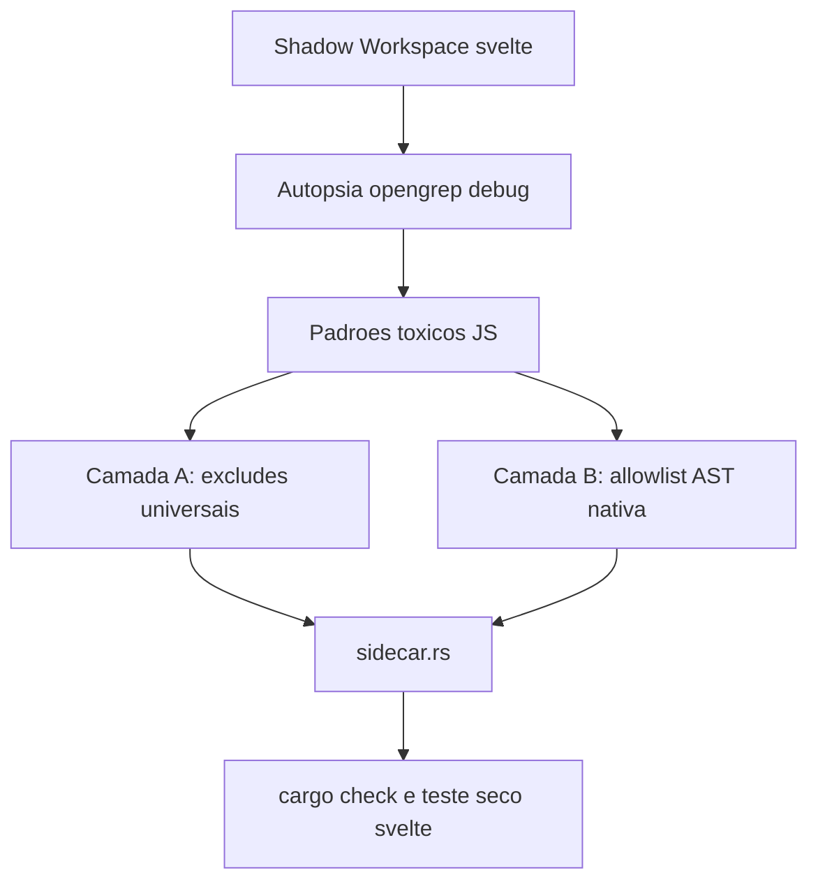

# Resolucao Organica Do Timeout Do Opengrep

## Contexto

O `opengrep` esta morrendo por `idle timeout` em monorepos JS grandes, com destaque para `sveltejs/svelte` e `mendableai/firecrawl`. A autopsia no `svelte` mostrou que o custo nao vem de um unico `node_modules`, mas de leitura cega demais sobre uma arvore heterogenea: muita periferia de testes e amostras, somada a subarvores estruturais densas como `packages/svelte/src/compiler`.

## Objetivo

Construir uma vacina universal em profundidade para o invocador do `opengrep`, combinando exclusoes organicas de lixo estrutural e scoping dinamico nativo baseado no AST, de modo que o scan do `svelte` feche com `exit code 0` sem hardcodes por repo.

## Linhas Vermelhas

- Nao introduzir hardcode por repositorio (`if repo == svelte`).
- Nao mandar o `opengrep` continuar lendo `.` de forma cega quando o Rust ja consegue derivar escopo.
- Nao amputar manifestos e lockfiles.
- Nao degradar a qualidade de achados do `opengrep` ao ponto de varrer apenas arquivos triviais.

## Design

## Orchestrator-Worker

- Orchestrator: `PolyglotSastSidecar::extract(...)`
- Worker de autopsia: `opengrep scan --debug` em shadow workspace local
- Worker estrutural: `ast_parser::extract_repository_outline_native(...)` como base para inferir raizes uteis
- Worker de sandbox: `SandboxHandle::execute_in_dir(...)` com `idle timeout` profundo para `opengrep`

## Diagnostico Atual

- O `svelte` dispara `opengrep` sobre uma arvore com cerca de `8941` arquivos e `829` regras no bundle local.
- A periferia de `packages/svelte/tests/**` e `samples/**` domina o volume do repo, com milhares de arquivos de fixture.
- O gargalo estrutural mais caro no codigo util apareceu em `packages/svelte/src/compiler`, especialmente quando a arvore inteira e passada como um unico alvo cego.
- Subarvores menores como `packages/svelte/src/internal`, `reactivity` e `store` fecham; o problema piora quando o escopo mistura codigo util profundo com massa periferica de monorepo.

## Estrategia

- Camada A: ampliar os `--exclude` para padroes toxicos recorrentes em monorepos JS, como `__tests__`, `__mocks__`, `__fixtures__`, `samples`, `snapshots`, `playground`, `benchmarking`, `generated` e artefatos como `output.json`.
- Camada B: substituir o alvo cego `.` por uma lista de raizes uteis derivadas nativamente do AST/caminhos-fonte, priorizando ancoras como `src`, `lib`, `app`, `packages/*/src` e equivalentes.
- Refinamento: quando uma raiz ancorada for larga demais, quebrar em sub-raizes organicas do proximo nivel para reduzir a janela de silencio do processo.
- Segunda cura: quando uma ancora tiver arquivos diretos e subpastas pesadas, nao reabrir o pai inteiro; o Rust deve separar subarvores e, para os arquivos diretos, disparar `opengrep` com alvos explicitos em lote pequeno.
- Blindagem de build: `cargo clippy` e demais invocacoes `cargo` nao devem materializar `target/` dentro do repo efemero ProjFS; o cache precisa viver em `.soda_sandbox` para evitar `os error 5` e lock churn.
- Terceira cura: `biome` e `oxlint` devem herdar o mesmo planner AST do `opengrep`, incluindo fatiamento recursivo, lotes `::files-*` e respeito as fronteiras de subpackages `package.json` para evitar reabrir o root do monorepo.
- Quarta cura: `cargo clippy` deve receber perfil de timeout ocioso profundo quando invocado como `cargo clippy`, porque subcrates Rust grandes podem passar mais de 45s sem emitir JSON antes do primeiro lote de compilacao.
- Quinta cura: `blob_09_community_meta` deve normalizar o `full_name` canonico retornado pelo GitHub antes de consultar `search/issues`, evitando falha 422 quando o repositório foi renomeado ou transferido.
- Operacao de reparo: expor uma CLI cirurgica para recapturar apenas `blob_09_community_meta`, sem rerodar os 11 blobs do repo.
- Diagnostico condicional de I/O/Sandbox: a cerca atual do sandbox ja aceita `cwd` fatiado dentro do repo, e o `--config` do OpenGrep ja entra absoluto. O furo remanescente e concorrencial: `ensure_semgrep_rule_bundle()` ainda materializa a arvore YAML sem trava por repositorio/ruleset, deixando uma janela TOCTOU entre `target.exists()` e `copy`.
- Cura condicional de I/O/Sandbox: serializar a materializacao do bundle YAML por chave estrutural (`repo_path + rule_set`) e tornar a copia idempotente sob corrida, sem relaxar a politica de host path nem reabrir caminho relativo no `--config`.
- Higiene da alma matematica no Blob 04: `collect_source_files()` ainda delega demais ao `detect_language()` e por isso deixa entrar arquivos utilitarios nao-fonte como `yaml/yml` e `sh`. A cirurgia deve separar "linguagem suportada" de "extensao elegivel para AST", impondo uma allowlist estrita de codigo-fonte real antes de qualquer parse.
- Allowlist rigida do AST: aceitar apenas extensoes primarias de codigo real para stacks de mercado ja cobertas pelo motor (`rs`, `js/jsx/mjs/cjs`, `ts/tsx`, `py`, `go`, `java`, `kt/kts`, `c/h`, `cc/cpp/cxx`, `hpp/hh/hxx`, `swift`, `cs`, `rb`, `php`, `scala`, `dart`, `lua`, `ex/exs`, `zig`, `sol`). Bloquear explicitamente `yaml`, `yml`, `json`, `lock`, `md`, `txt`, `sh`, `bash`, `zsh` e qualquer arquivo sem extensao.
- Cura da cegueira poliglota no Blob 02: o `ManifestExtractor` do blob ainda reconhece poucos manifestos canônicos e corta dependencias diretas cedo demais. A cirurgia deve centralizar um classificador poliglota de manifestos primarios, bloquear lockfiles de forma explicita e mover o blob para payload elastico sem amputacao prematura.
- Escopo universal de manifestos: incluir `mix.exs`, `Gemfile`, `composer.json`, `pom.xml`, `build.gradle`, `build.gradle.kts`, `*.csproj`, `CMakeLists.txt`, `conanfile.txt`, `build.zig.zon` e `Pipfile`, alem dos manifestos ja suportados. Lockfiles como `package-lock.json`, `yarn.lock`, `pnpm-lock.yaml`, `Cargo.lock`, `poetry.lock`, `Pipfile.lock`, `composer.lock`, `mix.lock` e equivalentes devem ser sumariamente ignorados.
- Ressurreicao poliglota do Blob 03: o `TestIntentExtractor` nao deve depender de pastas fixas. A cura deve manter a BFS rasa e barata, mas trocar o classificador de arquivos e a leitura de assinaturas por um perito em ecossistemas capaz de capturar apenas nomes/descricoes de testes em Rust, Go, JS/TS, Python e Elixir.
- Ouro vs obesidade no Blob 03: extrair somente intencao declarativa (`#[test] fn`, `func TestXxx`, `describe/it/test("...")`, `def test_...`, `test "..." do`, `describe "..." do`) e ignorar corpos, fixtures, mocks e payloads grandes. A janela de leitura continua pequena (`STATIC_TEST_DISCOVERY_READ_BYTES`) para blindar FinOps e VRAM.
- Evolucao do Blob 05: o `architecture_map` nao pode mais depender do mesmo funil do AST nem de um teto rigido de caracteres. A cura deve separar "arquivos parseaveis para simbolos" de "arquivos arquiteturalmente relevantes para topologia", preservando a arvore completa dos arquivos uteis mesmo quando o parser nativo nao conhece a linguagem.
- Poda inteligente do Blob 05: aplicar exclusao severa sobre build/cache/dependencias/editor lixo (`.git`, `.hg`, `.idea`, `.vscode`, `.vs`, `node_modules`, `.pnpm-store`, `.yarn`, `.turbo`, `target`, `dist`, `build`, `out`, `vendor`, `venv`, `.venv`, `__pycache__`, `.pytest_cache`, `.mypy_cache`, `.ruff_cache`, `.tox`, `.gradle`, `.dart_tool`, `.swiftpm`, `.build`, `.zig-cache`, `zig-out`, `CMakeFiles`, `cmake-build-*`, `Pods`, `DerivedData` e equivalentes). A lista deve podar massa toxica sem amputar codigo e manifestos canonicos.
- Suporte poliglota do Blob 05: a allowlist arquitetural deve aceitar extensoes-fonte e arquivos canonicos de projeto para Rust, Go, C, C++, C#, Java, Kotlin, Python, Elixir, Ruby, PHP, Zig, Swift, TS/JS/Svelte e correlatos, incluindo entradas como `Cargo.toml`, `package.json`, `tsconfig.json`, `svelte.config.*`, `vite.config.*`, `go.mod`, `mix.exs`, `Gemfile`, `composer.json`, `pom.xml`, `build.gradle`, `build.gradle.kts`, `settings.gradle`, `CMakeLists.txt`, `conanfile.txt`, `build.zig`, `build.zig.zon`, `Package.swift`, `*.csproj`, `*.sln` e similares.
- Ruptura dos gemeos toxicos 06/08: o `blob_06_unsafe_hotspots` nao pode mais ser um subconjunto oportunista do relatorio de saude. A cura deve introduzir classificacao semantica de risco grave por issue e renderizacao propria para o Blob 06, enquanto o Blob 08 continua como canal de saude/fragilidade/divida.
- Heuristica de risco grave do Blob 06: aceitar apenas CVE/OSV/vulnerability advisories, hardcoded secrets, execucao dinamica (`eval`, `exec`), command injection, SQL injection, code injection, path traversal, insecure deserialization, blocos `unsafe`/raw pointers e findings equivalentes de ferramentas como `govulncheck`, `bandit`, `sobelow`, `opengrep` e `cppcheck`. Complexidade, estilo, `nested-ternary`, `console.log`, `TODO/FIXME`, `unwrap/expect`, boolean chains e ruido de fragilidade operacional devem permanecer no Blob 08.
- Formato do Blob 06: abandonar o envelope JSON (`schema`, `router`, `tool_results`) e emitir uma lista textual densa, crua e completa das ameacas classificadas, sem teto fixo de 2.000 caracteres e sem truncamento por `PHASE1_HEAVY_BLOB_MAX_CHARS`.
- Evolucao do Blob 07 para perito de infraestrutura: o `OpsBlueprintExtractor` nao pode mais enxergar apenas `Dockerfile`, `docker-compose` e `.github/workflows`. A allowlist deve cobrir arquivos canonicos de build, CI/CD, containerizacao, IaC e orquestracao do mercado, incluindo `compose.yaml`, `Makefile`, `Justfile`, `Taskfile`, `Jenkinsfile`, `.gitlab-ci.yml`, `.circleci/config.yml`, `.buildkite/pipeline.yml`, `azure-pipelines*.yml`, `CMakeLists.txt`, `build.zig`, `Earthfile`, `Vagrantfile`, `Tiltfile`, `skaffold.yaml`, `terragrunt.hcl`, `*.tf`, `*.tfvars`, `Pulumi.yaml`, `Chart.yaml`, `values*.yaml`, `kustomization.yaml`, manifests de `k8s/` e playbooks/configs de `ansible/`.
- Fim da guilhotina burra do Blob 07: a extração do payload final nao pode mais usar `truncate_utf8`, e os arquivos de infraestrutura detectados nao devem herdar o teto de `MAX_MANIFEST_SIZE`. A Fase 0 precisa da fotografia operacional integral para destilacao posterior na Fase 1.5.
- Purificacao do Blob 08: apos a ruptura com o Blob 06, o `blob_08_health_report` deve abandonar o envelope JSON `soda.health.v1` e virar um radar textual cru de entropia, sem `schema`, `router`, `tool_results` ou `issues` serializados. O payload precisa ser denso, legivel e integral para a Fase 1.5 destilar depois.
- Heuristica de flow-debt poliglota do Blob 08: aceitar apenas code smells e divida tecnica, com foco em `TODO/FIXME/HACK`, ternarios aninhados, cadeias booleanas/comple xidade, `unwrap/expect/panic` em Rust, `console.log/error/warn` esquecidos, variaveis nao usadas, funcoes monoliticas e fragilidade estrutural equivalente. O recorte se ancora nas familias de lint mais canonicas de Clippy, Biome/Oxc, Ruff e regras Semgrep focadas em maintainability, nunca em seguranca grave.
- Fim da guilhotina do Blob 08: tanto o renderer do SAST quanto o health emitido pelo parser nativo devem abandonar `BLOB_08_HEALTH_REPORT_MAX_CHARS` e qualquer `truncate_utf8/truncate_chars` associado. A Fase 0 precisa da fotografia completa do apodrecimento, nao de amostras amputadas.
- Evolucao do Blob 09 para radar de sobrevivencia: o `blob_09_community_meta` deixa de ser JSON truncado e vira um dossie textual denso (key-value/YAML-like), sem teto rigido de caracteres. A saida captura `extracted_at` e `last_commit_date` para estimar recencia, vanity metrics (stars/forks/open issues/open PRs) e sinais de dor (top 7 issues abertas por interacoes) e foco (ultimos 5 PRs com titulo e status).
- Query das 7 issues: usar `search/issues` com `sort:interactions-desc` para priorizar reacoes+comentarios em poucas chamadas, extraindo titulo e labels de cada issue.
- Auditoria holistica pos-Blob 10: o harvester nao deve mais carregar qualquer semantica de NotebookLM na Fase 0. A faxina precisa amputar rotas/configs zumbis (`gateway-config.yaml`, URLs sinteticas de `repositorios.repo_url`) e confirmar que o Blob 10 e tratado apenas como Markdown cru estatico vindo de `docs/SODA_CANON_MANIFEST.md`.
- Forja do Blob 11 como extrator absoluto de UX Contracts: a coleta deve mirar apenas fronteiras mecanicas de frontend (`src/components`, `src/views`, `src/routes`, `app`, `pages`, `ui`, `frontend`) e retornar props/contextos/estado/eventos/mutations/funcoes relevantes sem qualquer teto de caracteres. O HTML/CSS nao entra no blob; para `.svelte` e `.vue`, apenas `<script>` e scripts embutidos contam. Para `tsx/jsx`, o AST e regexes devem capturar apenas padroes de fluxo de dados e ignorar template/renderizacao.
- A heuristica poliglota do Blob 11 deve reconhecer entradas de dados (`props`, `defineProps`, `$props`, `useContext`, `getContext`, `useLoaderData`) e saidas (`defineEmits`, `createEventDispatcher`, `dispatch`, `emit`, `useMutation`, setters derivados de `useState/createSignal/useReducer`) mantendo o fail-soft de "Backend puro, sem interface UX" quando nenhum frontend relevante existir.

## Auditoria 360 Pos-Blobs 01-11

- Objetivo: fechar a sessao removendo debt residual no `harvester/` sem tocar no motor real nem reabrir mutacoes estruturais desnecessarias.
- Red line: nao executar `f0_harvester_cli`, nao gerar artefatos fisicos reais e nao reintroduzir envelopes JSON ou truncamentos cegos nos blobs ja purificados.
- Foco mecanico:
  1. amputar caps de texto ainda ativos em extratores da Fase 0 que contradigam a elasticidade ja estabelecida;
  2. remover structs/campos intermediarios mortos ligados a omissao/truncamento onde o valor ficou permanentemente `0`;
  3. trocar `unwrap/expect` de caminhos de producao por fallbacks ou propagacao graciosa;
  4. simplificar formatacao textual para reduzir debt de fluxo e alocacoes redundantes.
- Orchestrator: auditoria estatica em `extract.rs`, `sidecar.rs` e `ast_parser.rs`.
- Workers: `cargo clippy --lib -- -D warnings`, `cargo test harvester --lib` e diagnosticos da IDE.

## DoD

- O codigo Rust compila com `cargo check`.
- O algoritmo nao volta a criar um scope pai toxico como `apps/api/src` quando os filhos ja foram fatiados.
- Os arquivos diretos de uma ancora continuam cobertos via alvos explicitos do `opengrep`.
- `cargo clippy` nao tenta mais criar `target/` dentro do repo efemero.
- `cargo clippy` deixa de morrer por `idle timeout=45s` em subcrates Rust do `firecrawl` apenas por silencio inicial de compilacao.
- `biome` e `oxlint` nao recebem mais `.` cego por manifesto quando o pacote possui subarvores AST mais precisas.
- O root com subpackages nao reabre as subarvores filhas ja cobertas por manifestos aninhados.
- O invocador do `opengrep` passa a usar dupla defesa sem hardcode por repo.
- O teste seco contra `sveltejs/svelte` fecha com `exit code 0` e sem `idle timeout`.
- O fetcher de `blob_09_community_meta` sobrevive a rename/transfer de repo usando o owner/repo canonico retornado pelo proprio GitHub.
- Existe caminho operacional para refresh isolado de `blob_09_community_meta` no SQLite.
- O bundle YAML do OpenGrep/Semgrep deixa de sofrer corrida entre workers concorrentes do Tokio ao preparar `.soda_semgrep/<repo>/<ruleset>`.
- O relatorio final identifica o padrao toxico real e mostra o diff da protecao no Rust.
- O Blob 04 deixa de indexar lockfiles, workflows YAML, scripts shell e outros artefatos nao-fonte.
- `cargo clippy --lib -- -D warnings` e `cargo test harvester --lib` fecham com `exit code 0` apos a allowlist.
- O Blob 02 passa a listar 100% das dependencias declaradas nos manifestos primarios suportados, sem emitir `[N itens omitidos]` por truncamento local.
- `cargo clippy --lib -- -D warnings` e `cargo test harvester --lib` fecham com `exit code 0` apos a expansao poliglota do `ManifestExtractor`.
- O Blob 03 volta a emitir intencao de testes em repositorios Rust, Go, NodeJS/TS, Python e Elixir sem depender apenas de `tests/`.
- `cargo clippy --lib -- -D warnings` e `cargo test harvester --lib` fecham com `exit code 0` apos a cirurgia do `TestIntentExtractor`.
- O Blob 05 deixa de truncar a topologia no meio e passa a listar integralmente os arquivos arquiteturalmente relevantes.
- O Blob 05 ignora agressivamente build/cache/dependencias e cobre topologia util de stacks poliglotas, inclusive arquivos de projeto que nao entram no AST.
- `cargo clippy --lib -- -D warnings` e `cargo test harvester --lib` fecham com `exit code 0` apos a cirurgia do `architecture_map`.
- O Blob 06 passa a carregar apenas linhas vermelhas de seguranca em formato textual enxuto.
- O Blob 08 absorve sozinho ruido de saude, estilo, fragilidade e divida de fluxo, sem contaminar o Blob 06.
- `cargo clippy --lib -- -D warnings` e `cargo test harvester --lib` fecham com `exit code 0` apos a ruptura 06/08.
- O Blob 07 passa a listar integralmente os arquivos operacionais detectados sem truncamento do payload final.
- O Blob 07 cobre manifestos canonicos de CI/CD, containerizacao, build e IaC alem de `Dockerfile` e `.github/workflows/`.
- `cargo clippy --lib -- -D warnings` e `cargo test harvester --lib` fecham com `exit code 0` apos a cirurgia do `OpsBlueprintExtractor`.
- O Blob 08 passa a sair como texto cru integral, sem JSON e sem teto rigido de caracteres.
- O Blob 08 cobre exclusivamente entropia, flow-debt e code smells poliglotas, sem recontaminar o Blob 06 com seguranca grave.
- `cargo clippy --lib -- -D warnings` e `cargo test harvester --lib` fecham com `exit code 0` apos a cirurgia do Blob 08.
