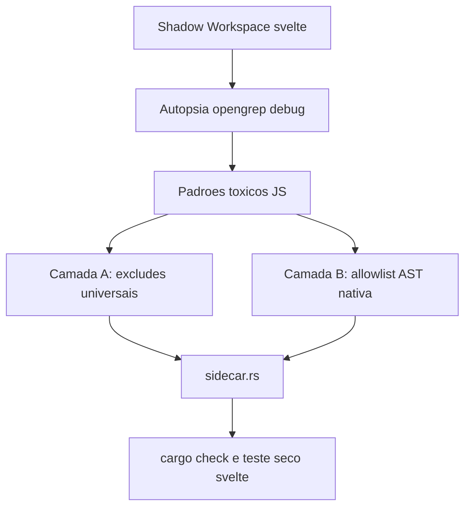

# Resolucao Organica Do Timeout Do Opengrep

## Contexto

O `opengrep` esta morrendo por `idle timeout` em monorepos JS grandes, com destaque para `sveltejs/svelte` e `mendableai/firecrawl`. A autopsia no `svelte` mostrou que o custo nao vem de um unico `node_modules`, mas de leitura cega demais sobre uma arvore heterogenea: muita periferia de testes e amostras, somada a subarvores estruturais densas como `packages/svelte/src/compiler`.

## Objetivo

Construir uma vacina universal em profundidade para o invocador do `opengrep`, combinando exclusoes organicas de lixo estrutural e scoping dinamico nativo baseado no AST, de modo que o scan do `svelte` feche com `exit code 0` sem hardcodes por repo.

## Linhas Vermelhas

- Nao introduzir hardcode por repositorio (`if repo == svelte`).
- Nao mandar o `opengrep` continuar lendo `.` de forma cega quando o Rust ja consegue derivar escopo.
- Nao amputar manifestos e lockfiles.
- Nao degradar a qualidade de achados do `opengrep` ao ponto de varrer apenas arquivos triviais.

## Design

## Orchestrator-Worker

- Orchestrator: `PolyglotSastSidecar::extract(...)`
- Worker de autopsia: `opengrep scan --debug` em shadow workspace local
- Worker estrutural: `ast_parser::extract_repository_outline_native(...)` como base para inferir raizes uteis
- Worker de sandbox: `SandboxHandle::execute_in_dir(...)` com `idle timeout` profundo para `opengrep`

## Diagnostico Atual

- O `svelte` dispara `opengrep` sobre uma arvore com cerca de `8941` arquivos e `829` regras no bundle local.
- A periferia de `packages/svelte/tests/**` e `samples/**` domina o volume do repo, com milhares de arquivos de fixture.
- O gargalo estrutural mais caro no codigo util apareceu em `packages/svelte/src/compiler`, especialmente quando a arvore inteira e passada como um unico alvo cego.
- Subarvores menores como `packages/svelte/src/internal`, `reactivity` e `store` fecham; o problema piora quando o escopo mistura codigo util profundo com massa periferica de monorepo.

## Estrategia

- Camada A: ampliar os `--exclude` para padroes toxicos recorrentes em monorepos JS, como `__tests__`, `__mocks__`, `__fixtures__`, `samples`, `snapshots`, `playground`, `benchmarking`, `generated` e artefatos como `output.json`.
- Camada B: substituir o alvo cego `.` por uma lista de raizes uteis derivadas nativamente do AST/caminhos-fonte, priorizando ancoras como `src`, `lib`, `app`, `packages/*/src` e equivalentes.
- Refinamento: quando uma raiz ancorada for larga demais, quebrar em sub-raizes organicas do proximo nivel para reduzir a janela de silencio do processo.

## DoD

- O codigo Rust compila com `cargo check`.
- O invocador do `opengrep` passa a usar dupla defesa sem hardcode por repo.
- O teste seco contra `sveltejs/svelte` fecha com `exit code 0` e sem `idle timeout`.
- O relatorio final identifica o padrao toxico real e mostra o diff da protecao no Rust.
