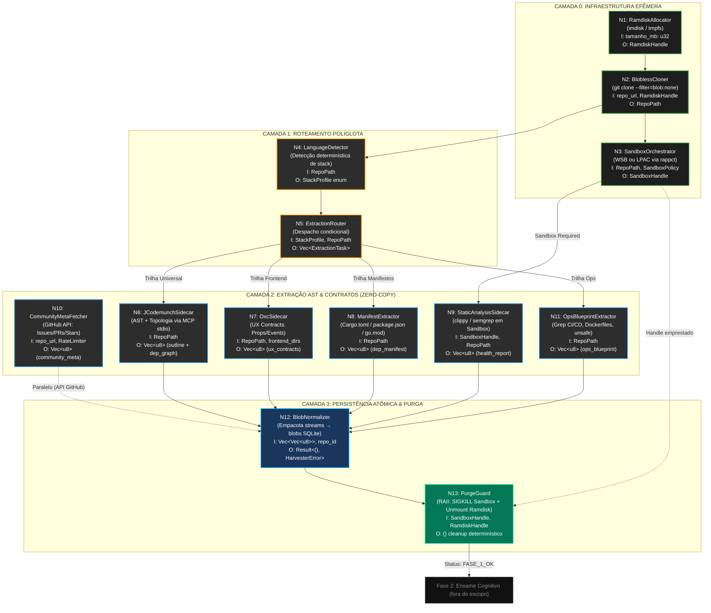

# SODA Harvester — Design Arquitetural (Fase 1)

> **Versão:** 1.0.0
> **Território:** PRODUTO (Daemon SODA — Rust/Tokio)
> **Regente:** Anti-SLOP Framework V3 + SDD Phase B
> **Aprovação Humana:** 2026-05-12 — Aider ELIMINADO, LPAC APROVADO

---

## 1. Manifesto

O Harvester é a engrenagem mecânica, **100% determinística e Zero-AI**, que precede
e viabiliza toda a inteligência analítica do SODA ETL Cognitivo.

Ele transforma gigabytes de código-fonte caótico em kilobytes de metadados puros —
extraindo o "Sinal" e incinerando o "Ruído" — sem invocar nenhum LLM, sem tocar
o SSD NVMe e sem bloquear o Event Loop do Tokio.

### 1.1. Regra do "Zero AI" na Fase 1

Na Fase 1, **não existem** Agentes de IA, inferência semântica ou LLMs.
O processo é 100% algorítmico e mecânico. A máquina não "entende" o código; ela o disseca.

### 1.2. Padrão Orchestrator-Worker

Todos os nós do Harvester operam como `target: local_slm` (custo FinOps **ZERO**).
O Cloud Brain não é acionado em nenhum ponto desta fase.

---

## 2. Proibições Tóxicas (Fase 0 — Advogado do Diabo)

Estas três leis são **inegociáveis** e devem ser injetadas em todos os PRDs da Fase 1.

### PT-1: PROIBIDO CLONAR NO SSD NVMe

| Abordagem SLOP | Risco Letal |
|---|---|
| `git clone <url> ./temp/<repo>` no disco | Milhões de escritas aleatórias para 370+ repos → corrói TBW finito do NVMe |

**Lei Dura:** Toda operação de `git clone` DEVE ocorrer em um **Ramdisk de 2GB**
alocado dinamicamente pelo Daemon Rust (`imdisk` no Windows / `tmpfs` no Linux).
O Ramdisk é desmontado atomicamente via `Drop trait` (RAII). Zero bytes tocam o NVMe.

### PT-2: PROIBIDO GERAR ARQUIVOS INTERMEDIÁRIOS NO HOST

| Abordagem SLOP | Risco Letal |
|---|---|
| `jcodemunch > raw_logic.txt` gerando arquivos temporários | 3.330+ arquivos-lixo, vetores de SDC (Silent Data Corruption) |

**Lei Dura:** O output de todos os Sidecars Efêmeros DEVE trafegar via **IPC Zero-Copy**
(captura de `stdout` via `tokio::process::Command`). Dados transitam como `Vec<u8>` na RAM
e são injetados diretamente como blobs no `soda_heuristic_vault.db` (SQLite).
A pasta `_RAW_DATA` está **morta**.

### PT-3: PROIBIDO BLOQUEAR O EVENT LOOP DO TOKIO

| Abordagem SLOP | Risco Letal |
|---|---|
| `std::process::Command::output()` síncrono | Congela a thread do Tokio Runtime inteira durante extração |
| SQLite via `rusqlite` síncrono na thread principal | I/O de disco travando o Event Loop |

**Lei Dura:** Toda invocação de Sidecar DEVE usar `tokio::process::Command` com captura
assíncrona. Toda operação SQLite DEVE rodar em `tokio::task::spawn_blocking` ou pool
de threads dedicado. O Event Loop do Tokio é **sagrado**.

---

## 3. Estratégia de Sandboxing (Isolamento Nativo)

O Harvester executa linters e ferramentas de terceiros em ambientes isolados para
prevenir Remote Code Execution (RCE) via `build.rs` maliciosos ou `postinstall` scripts.

| Edição Windows | Mecanismo de Sandboxing | Fallback |
|---|---|---|
| **Pro / Enterprise** | Windows Sandbox (WSB) via Hyper-V — VM efêmera, zero persistência | — |
| **Home** | LPAC (Low Privilege AppContainer) via crate `rappct` | Nível de isolamento menor, mas suficiente para linters estáticos |
| **Linux** | Landlock LSM | — |

**Detecção de Edição:** O Daemon Rust detecta a edição do Windows no boot via
`winreg` e seleciona automaticamente a estratégia de sandboxing.

---

## 4. Grafo DAG de Dependências (Fase A — Atualizado)

> Aider **ELIMINADO** do arsenal. Mapeamento topológico extraído nativamente via
> AST do jcodemunch (grafo de `import`/`use`/`require`).

---

## 5. Tabela de Módulos e Contratos I/O

| Nó | Módulo Rust | Entrada | Saída | Proibições Aplicáveis |
|---|---|---|---|---|
| N1 | `ramdisk::RamdiskAllocator` | `tamanho_mb: u32` | `Result<RamdiskHandle, RamdiskError>` | PT-1 |
| N2 | `git::BloblessCloner` | `repo_url: Url`, `&RamdiskHandle` | `Result<RepoPath, CloneError>` | PT-1, PT-3 |
| N3 | `sandbox::SandboxOrchestrator` | `&RepoPath`, `SandboxPolicy` | `Result<SandboxHandle, SandboxError>` | PT-3 |
| N4 | `detect::LanguageDetector` | `&RepoPath` | `StackProfile` enum | — |
| N5 | `router::ExtractionRouter` | `StackProfile`, `&RepoPath` | `Vec<ExtractionTask>` | — |
| N6 | `sidecar::JCodemunchSidecar` | `&RepoPath` | `Vec<u8>` (AST outline + topologia) | PT-2, PT-3 |
| N7 | `sidecar::OxcSidecar` | `&RepoPath`, `&[PathBuf]` | `Vec<u8>` (UX contracts) | PT-2, PT-3 |
| N8 | `extract::ManifestExtractor` | `&RepoPath` | `Vec<u8>` (dep manifest JSON) | PT-2 |
| N9 | `sidecar::StaticAnalysisSidecar` | `&SandboxHandle`, `&RepoPath` | `Vec<u8>` (health report) | PT-2, PT-3 |
| N10 | `api::CommunityMetaFetcher` | `repo_url: &Url`, `&RateLimiter` | `Vec<u8>` (community meta) | PT-3 |
| N11 | `extract::OpsBlueprintExtractor` | `&RepoPath` | `Vec<u8>` (ops blueprint) | PT-2 |
| N12 | `persist::BlobNormalizer` | `Vec<Vec<u8>>`, `repo_id: &str` | `Result<(), HarvesterError>` | PT-2, PT-3 |
| N13 | `guard::PurgeGuard` | `SandboxHandle`, `RamdiskHandle` | `()` | PT-1 |

---

## 6. Sequência de PRDs (Roadmap de Implementação)

| Ordem | PRD | Nó DAG | Dependência |
|---|---|---|---|
| 1 | PRD-001: RamdiskAllocator | N1 | Nenhuma (raiz) |
| 2 | PRD-002: BloblessCloner | N2 | PRD-001 |
| 3 | PRD-003: SandboxOrchestrator | N3 | PRD-002 |
| 4 | PRD-004: LanguageDetector | N4 | PRD-002 |
| 5 | PRD-005: ExtractionRouter | N5 | PRD-004 |
| 6 | PRD-006: JCodemunchSidecar | N6 | PRD-005 |
| 7 | PRD-007: OxcSidecar | N7 | PRD-005 |
| 8 | PRD-008: ManifestExtractor | N8 | PRD-005 |
| 9 | PRD-009: StaticAnalysisSidecar | N9 | PRD-003, PRD-005 |
| 10 | PRD-010: CommunityMetaFetcher | N10 | Nenhuma (paralelo) |
| 11 | PRD-011: OpsBlueprintExtractor | N11 | PRD-005 |
| 12 | PRD-012: BlobNormalizer | N12 | PRD-006..011 |
| 13 | PRD-013: PurgeGuard | N13 | PRD-001, PRD-003 |
