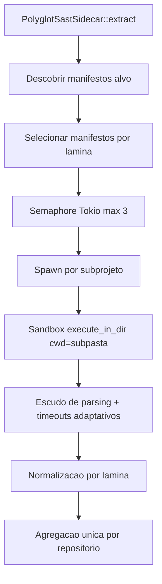

# Monorepo SAST Depth Shield

## Contexto

O Harvester F0 ja possui escudo de parsing e guilhotina inteligente, mas o roteador SAST ainda assume um unico `cwd` por repositorio. Em monorepos como `mendableai/firecrawl`, isso degrada ferramentas que dependem de manifesto local, como `cargo clippy`, `mix sobelow` e `govulncheck`.

## Objetivo

Adicionar suporte a descoberta de subprojetos por manifesto, executar as laminas aplicaveis no `cwd` correto e limitar a concorrencia fisica para evitar OOM e estrangulamento do Tokio.

## Linhas Vermelhas

- Nao remover o escudo de parsing JSON/XML ja existente.
- Nao remover a guilhotina inteligente de timeouts adaptativos no sandbox.
- Nao disparar todos os subprojetos em paralelo sem governanca.
- Nao mudar o contrato externo do `HarvesterOrchestrator`.

## Design

## Orchestrator-Worker

- Orchestrator: `PolyglotSastSidecar::extract`
- Worker: execucao de cada lamina por manifesto compativel
- Governanca: `tokio::sync::Semaphore::new(3)`
- Agregacao: uniao de `issues` e consolidacao de `tool_results`

## DoD

- Descobre `Cargo.toml`, `package.json`, `mix.exs` e `go.mod`, ignorando lixo pesado.
- Executa sub-sidecars no `cwd` do manifesto.
- Limita concorrencia maxima a 3 processos por repositorio.
- Mantem `parse_error` e timeouts sob as defesas recentes.
- Compila com `cargo check`.
- Passa em testes focados.
- Executa `f0_harvester_cli -- --repo mendableai/firecrawl --direct` sem `Exit Code 101`.
