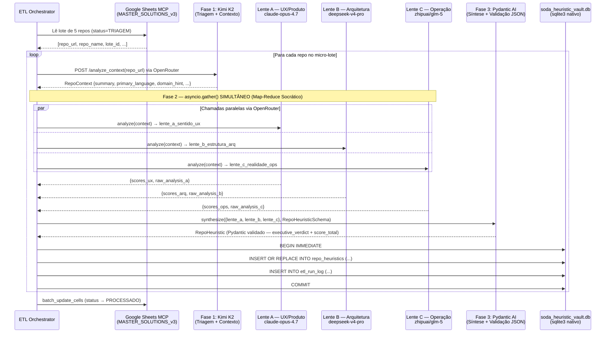

# Design: ETL Orchestrator — Pipeline Cognitivo de 3 Fases
**Status:** DRAFT v0.2.0 — Aguardando aprovação do Arquiteto  
**Versão:** 0.2.0  
**Data:** 2026-05-01  
**Escopo:** Processamento bare-metal de 370 repositórios GitHub → `soda_heuristic_vault.db`

> **Changelog v0.2.0:** Fase 2 corrigida — substituído Qwen local/Haiku por Map-Reduce Socrático com 3 Lentes SODA simultâneas via OpenRouter. Schema `repo_heuristics` expandido com colunas de visões por lente.

---

## 1. Contexto e Restrições Absolutas

O ETL Orchestrator é um script Python efêmero que processa o catálogo de 370 repositórios
armazenados na planilha `MASTER_SOLUTIONS_v3`. Ele opera **fora** do caminho crítico de
inferência do SODA e deve ser tratado como um **Sidecar Efêmero de Desenvolvimento**.

### Restrições de Hardware (Lei da Separação)
- **dGPU (RTX 2060m / 6GB VRAM):** Chamadas de inferência ao Kimi/Qwen via API externa.
  Zero tensores locais. A GPU não toca neste pipeline.
- **CPU (i9 + AVX2):** Orquestração, parsing JSON, escrita SQLite.
- **RAM:** Processamento em micro-lotes de 5 repositórios por vez. Proibido carregar
  o catálogo inteiro em memória.

### Restrições de Acesso a Dados
- **PROIBIDO:** Usar MCP (`mcp-server-sqlite`) para gravação no pipeline de produção.
  O MCP é ferramenta de auditoria passiva (IDE only).
- **OBRIGATÓRIO:** Usar a biblioteca `sqlite3` nativa do Python para toda I/O no
  `soda_heuristic_vault.db`. Zero-latency, in-process, bare-metal.

---

## 2. Visão Macro — Pipeline de 3 Fases



---

## 3. Schema do Banco Local — `soda_heuristic_vault.db`

Gerenciado exclusivamente via `sqlite3` nativo do Python. Nenhuma migration framework.
Schema declarado inline no script de inicialização.

### 3.1 Tabela: `repo_heuristics`

Armazena o resultado consolidado da análise por repositório.

```sql
CREATE TABLE IF NOT EXISTS repo_heuristics (
    -- Identificação
    repo_id          TEXT PRIMARY KEY,        -- "{owner}/{repo}" normalizado
    repo_url         TEXT NOT NULL,
    lote_id          TEXT NOT NULL,           -- ex: "LOTE_19"
    nome_projeto     TEXT NOT NULL,

    -- Metadados de Triagem (Fase 1 — Kimi via OpenRouter)
    primary_language TEXT,
    domain_hint      TEXT,                    -- ex: "web-framework", "cli-tool", "ml-lib"
    summary_kimi     TEXT,                    -- substr limitado a 500 chars
    has_rust_components INTEGER DEFAULT 0,    -- bool: 0|1
    has_wasm_targets    INTEGER DEFAULT 0,    -- bool: 0|1
    estimated_complexity TEXT,               -- LOW | MED | HIGH

    -- Visões Brutas das 3 Lentes (Fase 2 — Map-Reduce Socrático via OpenRouter)
    -- Cada coluna armazena substr(raw_analysis, 1, 800) para blindar VRAM na leitura
    lente_a_sentido_ux    TEXT,              -- claude-opus-4.7 — análise UX/Produto
    lente_b_estrutura_arq TEXT,              -- deepseek-v4-pro — análise Arquitetural
    lente_c_realidade_ops TEXT,              -- zhipuai/glm-5   — análise Operacional

    -- Scores Granulares SODA V3 (Fase 2 — síntese das 3 Lentes)
    score_total           REAL,              -- 0.0 a 10.0 (média ponderada)
    score_arquitetura     REAL,
    score_rust_potential  REAL,
    score_bare_metal      REAL,
    score_wasm_compat     REAL,
    score_latencia        REAL,
    score_manutencao      REAL,

    -- Síntese e Classificação Terminal (Fase 3 — Pydantic AI)
    executive_verdict      TEXT,             -- Veredito executivo sintetizado, max 400 chars
    classificacao_terminal TEXT NOT NULL     -- STACK_CORE | PLANO_B | RADAR | DESCARTE
        CHECK(classificacao_terminal IN ('STACK_CORE', 'PLANO_B', 'RADAR', 'DESCARTE')),
    categoria_arquitetural TEXT NOT NULL,    -- ex: "runtime-embedded", "ui-framework"
    justificativa          TEXT,             -- substr(justificativa, 1, 600)

    -- Controle de ETL
    etl_phase_completed INTEGER DEFAULT 0,  -- 1=Kimi, 2=Enxame, 3=Validado
    processado_em    TEXT,                  -- ISO 8601 UTC
    etl_run_id       TEXT,                  -- FK para etl_run_log

    FOREIGN KEY (etl_run_id) REFERENCES etl_run_log(run_id)
);
```

### 3.2 Tabela: `etl_run_log`

Event Sourcing atômico. Cada execução do orchestrator gera um registro imutável.

```sql
CREATE TABLE IF NOT EXISTS etl_run_log (
    run_id           TEXT PRIMARY KEY,        -- UUID v4
    iniciado_em      TEXT NOT NULL,           -- ISO 8601 UTC
    finalizado_em    TEXT,
    lote_processado  TEXT NOT NULL,           -- ex: "LOTE_19"
    repos_total      INTEGER DEFAULT 0,
    repos_ok         INTEGER DEFAULT 0,
    repos_erro       INTEGER DEFAULT 0,
    status           TEXT NOT NULL            -- RUNNING | COMPLETED | FAILED | PARTIAL
        CHECK(status IN ('RUNNING', 'COMPLETED', 'FAILED', 'PARTIAL')),
    erro_ultimo      TEXT                     -- substr do último traceback, 500 chars
);
```

### 3.3 Tabela: `etl_errors`

Isolamento de falhas por repositório. Nunca corrompe o lote inteiro.

```sql
CREATE TABLE IF NOT EXISTS etl_errors (
    id               INTEGER PRIMARY KEY AUTOINCREMENT,
    run_id           TEXT NOT NULL,
    repo_id          TEXT NOT NULL,
    fase             INTEGER NOT NULL,        -- 1, 2 ou 3
    erro_tipo        TEXT NOT NULL,           -- ex: "ValidationError", "HTTPTimeout"
    erro_msg         TEXT,                    -- substr(traceback, 1, 400)
    timestamp        TEXT NOT NULL,

    FOREIGN KEY (run_id) REFERENCES etl_run_log(run_id)
);
```

---

## 4. Arquitetura das 3 Fases — Detalhamento

### Fase 1: Kimi K2 — Triagem e Extração de Contexto

**Responsabilidade:** Dado o `repo_url`, produzir o contexto estruturado mínimo para
alimentar a Fase 2. Operação leve e rápida.

**Input:** `repo_url: str`  
**Output:**
```python
class RepoContext(BaseModel):
    primary_language: str
    domain_hint: str          # "web-framework" | "cli-tool" | "ml-lib" | "unknown"
    summary: str              # Max 300 chars
    has_rust_components: bool
    has_wasm_targets: bool
    estimated_complexity: Literal["LOW", "MED", "HIGH"]
```

**Regra de Fallback:** Se Kimi falhar (timeout >30s), preenche `domain_hint="unknown"` e
avança para Fase 2 com contexto parcial. Registra em `etl_errors` com `fase=1`.

---

### Fase 2: Map-Reduce Socrático — As 3 Lentes SODA (OpenRouter)

**Responsabilidade:** Despacho **simultâneo** e paralelo (`asyncio.gather`) para 3
especialistas via OpenRouter. Cada Lente interroga o repositório com uma perspectiva
radicalmente diferente — eliminando o viés de consenso falso.

**Implementação:** `asyncio.gather(*[lente_a(), lente_b(), lente_c()])` — timeout
global de 60s. Falha isolada de uma Lente registra em `etl_errors` (fase=2) mas
**não aborta** o lote — as outras 2 Lentes continuam.

| Lente | Modelo OpenRouter | Perspectiva | Coluna no DB |
|---|---|---|---|
| **A — UX/Produto** | `anthropic/claude-opus-4.7` | Valor humano, ergonomia de API, documentação | `lente_a_sentido_ux` |
| **B — Arquitetura** | `deepseek/deepseek-v4-pro` | Estrutura interna, padrões de design, Rust-readiness | `lente_b_estrutura_arq` |
| **C — Operação** | `zhipuai/glm-5` | Manutenibilidade, CI/CD, licença, dependências tóxicas | `lente_c_realidade_ops` |

**Input:** `RepoContext + repo_readme: str (substr 3000 chars)`  
**Output por Lente (Pydantic):**
```python
class LenteOutput(BaseModel):
    raw_analysis: str             # substr(análise bruta, 1, 800) — salvo no DB
    score_parcial: float          # 0.0–10.0 — contribuição desta lente
    flags: list[str]              # ex: ["has_tokio", "no_tests", "viral_license"]
```

**Síntese (input da Fase 3):**
```python
class SwarmResult(BaseModel):
    lente_a: LenteOutput
    lente_b: LenteOutput
    lente_c: LenteOutput          # None se a Lente falhou
    lentes_disponiveis: int       # 1, 2 ou 3 — informa Fase 3 sobre qualidade do dado
```

**Regra FinOps:** Todas as chamadas passam pelo OpenRouter. Zero GPU local neste pipeline.
A CPU orquestra apenas o `asyncio.gather` e o parsing JSON. VRAM intacta.

---

### Fase 3: Pydantic AI — Formatador JSON Estrito (Constrained Decoding)

**Responsabilidade:** Validar e coagir a saída bruta do Enxame para o schema canônico
final. Calcular `score_total` e determinar `classificacao_terminal`.

**Regras de Classificação:**
```
score_total >= 8.5  → STACK_CORE
score_total >= 6.5  → PLANO_B
score_total >= 4.0  → RADAR
score_total <  4.0  → DESCARTE
```

**Input:** `SwarmResult + RepoContext`  
**Output:**
```python
class RepoHeuristic(BaseModel):
    repo_id: str
    # Visões brutas das Lentes (substr 800 chars — gravadas no DB)
    lente_a_sentido_ux:    str | None
    lente_b_estrutura_arq: str | None
    lente_c_realidade_ops: str | None
    # Scores granulares (média ponderada das Lentes disponíveis)
    score_arquitetura:    float = Field(ge=0.0, le=10.0)
    score_rust_potential: float = Field(ge=0.0, le=10.0)
    score_bare_metal:     float = Field(ge=0.0, le=10.0)
    score_wasm_compat:    float = Field(ge=0.0, le=10.0)
    score_latencia:       float = Field(ge=0.0, le=10.0)
    score_manutencao:     float = Field(ge=0.0, le=10.0)
    score_total:          float = Field(ge=0.0, le=10.0)
    # Síntese executiva (gerada pelo Pydantic AI a partir das 3 Lentes)
    executive_verdict:         str = Field(max_length=400)
    classificacao_terminal:    Literal["STACK_CORE", "PLANO_B", "RADAR", "DESCARTE"]
    categoria_arquitetural:    str
    justificativa:             str = Field(max_length=600)
    etl_phase_completed:       int = 3
```

**Lei Anti-SDC:** Toda gravação usa `BEGIN IMMEDIATE` + `COMMIT` atômico via `sqlite3`.
Se o `COMMIT` falhar, faz `ROLLBACK` e registra em `etl_errors`. Nunca silencia exceções.

---

## 5. Fluxo de Controle do Orchestrator

```
main()
  ├── init_db(conn)                          # CREATE TABLE IF NOT EXISTS
  ├── create_run_log(conn) → run_id
  ├── fetch_batch_from_sheets(lote_id, n=5)  # Via mcp-google-sheets (leitura)
  └── for repo in batch:
        ├── phase1_kimi(repo_url) → RepoContext
        ├── phase2_swarm(context) → RawScores
        ├── phase3_validate(scores) → RepoHeuristic
        ├── atomic_write(conn, heuristic)    # sqlite3 nativo — BEGIN IMMEDIATE
        └── on_error: log_error(conn, run_id, repo_id, fase, exc)
  ├── finalize_run_log(conn, run_id)
  └── update_sheets_status(batch)            # batch_update_cells → status=PROCESSADO
```

---

## 6. Decisões Arquiteturais (ADRs)

| # | Decisão | Justificativa |
|---|---|---|
| ADR-01 | `sqlite3` nativo (não MCP) para gravação ETL | Zero-latency in-process. MCP adiciona ~5ms/roundtrip via stdio. Inaceitável em lote de 370 repos. |
| ADR-02 | Micro-lotes de 5 repos | Protege RAM (i9, 32GB). Permite checkpoint a cada lote sem reprocessar em caso de falha. |
| ADR-03 | `BEGIN IMMEDIATE` + `COMMIT` atômico | Previne SDC (Silent Data Corruption) em crash mid-write. |
| ADR-04 | 3 Lentes via OpenRouter em `asyncio.gather` | Map-Reduce Socrático: perspectivas radicalmente diferentes eliminam viés de consenso falso. VRAM zero. |
| ADR-05 | `etl_errors` isolada | Falha em uma Lente ou em um repo não cancela o lote inteiro. Resiliência por design. |
| ADR-06 | Status `TRIAGEM` → `PROCESSADO` na Sheets apenas após `COMMIT` SQLite | Consistência eventual garantida. A Sheets reflete o estado real do vault. |
| ADR-07 | Colunas `lente_a/b/c` armazenam `substr(raw, 1, 800)` | Blindagem de VRAM nas queries MCP de auditoria. Nunca `SELECT *` em texto longo. |
| ADR-08 | `executive_verdict` max 400 chars | Síntese executiva legível pelo Arquiteto Humano sem abrir logs detalhados. |

---

> **Aguardando aprovação do Arquiteto.**  
> Após "Aprovado" no chat, o arquivo `tasks.md` será gerado e a implementação iniciará.
