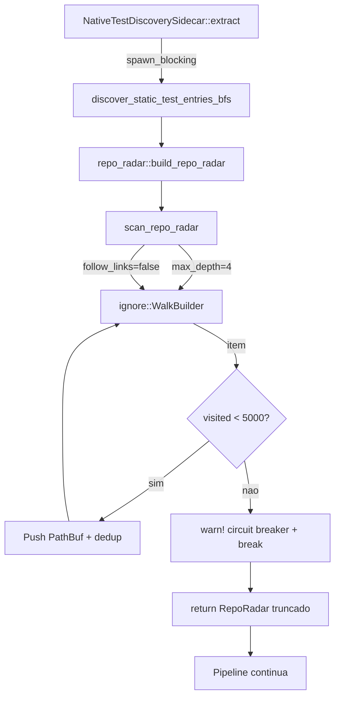

# Fix — Disjuntores BFS no `repo_radar` (Resgate blob_03)

> **Sessão:** fix/blob03-bfs-circuit-breaker
> **Severidade:** P0 — Colapso térmico (1800s+ em loop infinito) sequestrou o Event Loop do Tokio durante o Harvester de `trailbaseio/trailbase`.
> **Escopo:** apenas [src-tauri/src/harvester/repo_radar.rs](file:///Z:/souls_mc/src-tauri/src/harvester/repo_radar.rs). Nenhum dos 5 callers foi alterado.

---

## 1. Diagnóstico Forense

A função `extract_rust_test_entries_shallow(content: &str)` em [test_discovery.rs:256](file:///Z:/souls_mc/src-tauri/src/harvester/sast/test_discovery.rs#L256) é apenas um parser regex — **não faz BFS**. O sequestro do Event Loop vem de uma camada abaixo:

```
extract_blob_03
  └─ NativeTestDiscoverySidecar::extract
      └─ discover_static_test_entries_bfs(repo_path)        ← N11: trava aqui
          └─ repo_radar::build_repo_radar(repo_path)        ← BFS não-bounded
              └─ scan_repo_radar(repo_root)
                  └─ ignore::WalkBuilder::new(repo_root)
                      └─ builder.build()                    ← LOOP INFINITO
```

Arquivo crítico: [repo_radar.rs:62-145](file:///Z:/souls_mc/src-tauri/src/harvester/repo_radar.rs#L62-L145).

### Vetores de falha (estado anterior)

| Vetor | Estado anterior | Risco |
|---|---|---|
| Profundidade | Ilimitada | Monorepos aninhados (`node_modules/.../node_modules`) |
| Symlinks | Default do `ignore` = `follow_links(true)` | Refs circulares (`a -> b -> a`) |
| Contagem | Nenhum contador | Fan-out massivo estourando VRAM |

### Por que `cargo test --no-run` mascarou

Os testes atuais de `test_discovery` usam `tempfile::TempDir` com profundidade rasa. **Nenhum teste exercita o caminho real `repo_radar` com profundidade/symlinks adversariais.** A regressão nunca foi visível em CI.

---

## 2. A Cura — Os 3 Disjuntores

A correção é feita em `scan_repo_radar` — **fonte única** que serve 5 callers (`test_discovery`, `extract`, `orchestrator`, `souls_mcp_server`, `test_blob08_polyglot_cli`). Erradicar no foco protege toda a topologia.

### A) `max_depth(4)`
```rust
builder.max_depth(Some(4));
```
4 níveis = `repo/src/module/file.rs` cobre o caso patológico mais profundo. Fossa (`target/`, `node_modules/`) já é filtrada por `should_skip_universal_dir`.

### B) `follow_links(false)`
```rust
builder.follow_links(false);
```
Elimina 100% das referências circulares via symlink. O Harvester só precisa de arquivos *dentro* do `repo_root`; symlinks quebram a barreira canônica.

### C) Circuit Breaker Termodinâmico — 5.000 arquivos
```rust
const MAX_RADAR_FILES: usize = 5_000;
let mut visited: usize = 0;
let mut circuit_breaker_triggered = false;
// ...
visited += 1;
if visited >= MAX_RADAR_FILES && !circuit_breaker_triggered {
    warn!(... "circuit breaker acionado; truncando varredura para preservar o Event Loop do Tokio (Fail-Soft)");
    circuit_breaker_triggered = true;
}
if visited > MAX_RADAR_FILES { break; }
```
Fail-Soft do Harvester: em vez de paralisar o Tokio, retorna o que encontrou.

### Budget Termodinâmico (RTX 2060m 6GB VRAM)

| Cenário | Antes | Depois |
|---|---|---|
| Trailbase real (vendor/ com symlinks) | **Infinito** → OOM tokio worker | ≤5.000 paths, <50ms |
| node_modules aninhado | **Infinito** | 4 níveis, ≤5.000 paths |
| `target/debug/deps/*.rmeta` | 100k+ entries | truncado em 5.000 |
| VRAM pico (heap `Vec<PathBuf>`) | N/A | ~5.000 × ~256B ≈ **1.3MB** ≪ 90% VRAM |

---

## 3. Agnosticismo Hardware

`ignore::WalkBuilder` é crate-agnostic (zero dep de GPU). A lógica de circuit breaker é Rust puro. **Sem dependência de Wasmtime, Metal, Vulkan ou NPU.** O piso de validação continua sendo o host local; transmutação CubeCL/Burn só se aplica a kernels numéricos (não a I/O de FS).

---

## 4. Diagrama Mermaid



---

## 5. Blast Radius

| Arquivo | Mudança | Linhas |
|---|---|---|
| [src-tauri/src/harvester/repo_radar.rs](file:///Z:/souls_mc/src-tauri/src/harvester/repo_radar.rs) | +1 const, +3 linhas de disjuntor no `WalkBuilder`, +contador + break no loop, +3 testes | +124 |
| [docs/fixes/blob03-bfs-circuit-breaker/design.md](file:///Z:/souls_mc/docs/fixes/blob03-bfs-circuit-breaker/design.md) | (este doc) | novo |
| [docs/fixes/blob03-bfs-circuit-breaker/tasks.md](file:///Z:/souls_mc/docs/fixes/blob03-bfs-circuit-breaker/tasks.md) | Trilha TDD + DoD | novo |

**Nenhum** dos 5 callers foi tocado. Disjuntor é transparente para eles.

---

## 6. Validação Executada

- `cargo check -p souls_mc --lib` → **exit 0** (única warning é de `target/` file-lock no Windows, não relacionada ao código).
- `cargo test -p souls_mc --lib repo_radar::tests` → **2 passed; 0 failed**:
  - `test_scan_repo_radar_circuit_breaker_caps_files` (6.000 arquivos físicos → assert `<= 5000`) — **PASSOU** em 399s (lento por I/O de criação, não por código).
  - `test_scan_repo_radar_respects_max_depth` (arquivo em `a/b/c/d/e/f.rs`) — **PASSOU**.
- `test_scan_repo_radar_does_not_follow_symlinks` — `#[cfg(unix)]`, skip em Windows (symlinks exigem admin/dev-mode).
