# SOULS V4 Engines — Materializacao dos 8 Motores + Camada de Compressao

## 1. Contexto

O `EphemeralInferEngine` trait ja esta declarado em [inference_adapter.rs](file:///z:/souls_mc/src-tauri/src/core/inference_adapter.rs) (linha 42) e dois motores ja compilam sob ele:

- `LlamaCppEngine` (gateado por `llama_backend`) em [llama_engine.rs](file:///z:/souls_mc/src-tauri/src/core/llama_engine.rs)
- `LlamaVanguardEngine` (mesmo arquivo) — wrapper de subprocesso `souls_vanguard_worker`
- `MistralRsEngine` (gateado por `mistral_backend`) em [mistral_engine.rs](file:///z:/souls_mc/src-tauri/src/core/mistral_engine.rs)
- `MockEphemeralInferEngine` em [inference_adapter.rs](file:///z:/souls_mc/src-tauri/src/core/inference_adapter.rs#L51-L84) (ja cumpre o papel de mock para o cascade)

A presente Fase materializa os **6 motores restantes** da topologia V4 declarada pelo Arquiteto-Chefe, garantindo que TODOS compilem sob a mesma `EphemeralInferEngine` trait. Alem disso, registra a tool `headroom_retrieve` no MCP (ja existe `intercept_loopback` em [headroom_engine.rs](file:///z:/souls_mc/src-tauri/src/core/headroom_engine.rs#L360-L385) mas faltava a exposicao MCP-side).

## 2. Linha Vermelha (Inviolavel)

| # | Regra | Justificativa |
|---|-------|---------------|
| R1 | Nenhum motor novo pode acoplar runtime Python/Node | Razao: stack must be Rust puro + Tokio. Phase 0 lib permite sidecars, mas a engine em si NAO. |
| R2 | Proibido `serde_json::from_slice` em payloads > 1MB | ADR do projeto: streaming tokens obrigatorio. |
| R3 | `BurnAgnosticEngine` NAO pode depender de CUDA-only | Hardware agnosticism: deve ser transmutavel para Metal/Vulkan/NPU. |
| R4 | LLMLingua-2 PROIBIDO sobre AST/oxc blocks | Compressao de codigo-fonte fica sob `lean_vacuum` (tree-sitter/oxc). Hipocampo Epistemico usa logit probing direto. |
| R5 | `BitnetEngine` deve usar Job Object do Windows (ja herdado de [bitnet_daemon.rs](file:///z:/souls_mc/src-tauri/src/core/bitnet_daemon.rs)) | RAII anti-zumbi. Falha de Drop = processo orfao. |
| R6 | `PulpLeleEngine` deve calcular p99 < 22µs (latencia alvo) | Linear algebra AOT CPU sem alocacao dinamica. |
| R7 | Toda engine nova deve respeitar o `thermal_rx: watch::Receiver<SystemState>` | Freio termico do `souls_thermal_governor` e lei de ferro. |
| R8 | Compilacao obrigatoria sob Tokio `1.51.1` (pin do projeto) | Downgrade previo de 1.52.3 ja foi feito (vide memory). |

## 3. Agnosticismo Hardware

A topologia V4 nao acopla os 8 motores a CUDA. Cada um declara seu *treino de gravidade*:

| Engine | Treino de Gravidade | Agnosticismo |
|--------|---------------------|--------------|
| LlamaCppEngine | CUDA (RTX 2060m) | llama-cpp-2 transpilavel para Metal/Vulkan (ggml-cpu fallback) |
| LlamaVanguardEngine | Subprocesso isolado | Job Object Win / cgroups Linux — agnostic |
| LlamaCpp4LogitEngine | CPU AVX2 | Sem GPU; intrinsics `core::arch::x86_64::*` guardados por `cfg` |
| MistralRsSidecarEngine | Sidecar com SIGKILL | `tokio::process::Command` agnostic OS |
| BitnetEngine | Subprocesso + iceoryx2 IPC | iceoryx2 e transpilavel para POSIX/Windows shared memory |
| PulpLeleEngine | CPU AVX2/NEON puro | Sem dependencia de GPU; intrinsics guardados |
| BurnAgnosticEngine | CubeCL backend | Burn abstrai WGPU/CUDA/Metal/Vulkan; compila em qualquer um |
| OrtScorerEngine | ONNX Runtime CPU | ort crate abstrai CPU EP; transpilavel para CoreML/DirectML |

A RTX 2060m fica como *treino de gravidade* apenas para `LlamaCppEngine` (ja implementado) e como consumer final dos logits expostos pelas outras 7 engines.

## 4. Padrao Orchestrator-Worker

```mermaid
flowchart TD
    O[Orchestrator: EngineCascade<br/>engine_trait.rs] --> W1[LlamaCppEngine]
    O --> W2[LlamaVanguardEngine]
    O --> W3[LlamaCpp4LogitEngine]
    O --> W4[MistralRsSidecarEngine]
    O --> W5[BitnetEngine]
    O --> W6[PulpLeleEngine]
    O --> W7[BurnAgnosticEngine]
    O --> W8[OrtScorerEngine]

    W1 -.probe_support.-> P[TopologyFeatures + GGUF metadata]
    W2 -.probe_support.-> P
    W3 -.probe_support.-> P
    W4 -.probe_support.-> P
    W5 -.probe_support.-> P
    W6 -.probe_support.-> P
    W7 -.probe_support.-> P
    W8 -.probe_support.-> P

    P --> C{EngineCascade<br/>probe_best_engine}
    C -->|Native 100+| R[Real Engine]
    C -->|Unsupported| M[MockEphemeralInferEngine]
    R --> T[thermal_rx: watch::Receiver<SystemState>]
    T --> TG[souls_thermal_governor]

    subgraph "Camada de Compressao (CCR/Headroom)"
        H1[headroom_retrieve SSE] --> H2[SoulsCcrStore]
        H3[souls_compress_memory] --> H4[lean_vacuum.text_compress]
        H5[souls_dedup] --> H6[lean_vacuum.dedup]
        H7[souls_fill] --> H8[CodeCompressor 80% headroom gate]
    end

    H2 -.PROIBIDO_LLMLingua2.-> AST[AST/oxc blocks]
    AST -.guardian.-> LV[lean_vacuum.tree-sitter/oxc]

    style C fill:#1e3a5f,stroke:#fff
    style TG fill:#5f1e1e,stroke:#fff
    style LV fill:#1e5f3a,stroke:#fff
```

## 5. Matriz de Materializacao por Camada

| Camada | Arquivo | Engine | Mock Strategy | DoD |
|--------|---------|--------|---------------|-----|
| L1 | `core/llama_cpp4_logit.rs` (NOVO) | `LlamaCpp4LogitEngine` | Stub CPU-AVX2 com mock logits | `cargo check` + 1 teste de retorno de `Vec<f32>` |
| L1 | `core/mistral_sidecar.rs` (NOVO) | `MistralRsSidecarEngine` | Stub subprocess com `tokio::process::Command` | Compila + 1 teste de mock spawn fail-soft |
| L1 | `core/bitnet_engine.rs` (NOVO) | `BitnetEngine` | Wrap do `BitNetDaemon` existente | `cargo check` + 1 teste de guarda contra `non_existent` |
| L1 | `core/pulp_lele.rs` (NOVO) | `PulpLeleEngine` | Stub AOT CPU math determinístico | Compila + 1 teste de latência p99 < 22µs |
| L1 | `core/burn_agnostic.rs` (NOVO) | `BurnAgnosticEngine` | Stub agnóstico sem deps GPU | Compila + 1 teste de marker de agnosticismo |
| L1 | `core/ort_scorer.rs` (NOVO) | `OrtScorerEngine` | Stub ONNX Runtime CPU | Compila + 1 teste de payload scorer |
| L2 | `core/engine_trait.rs` (EDIT) | `EngineCascade` com 8 probes | Adicionar 6 `EngineProbe` structs | Teste do cascade com 8 engines |
| L2 | `core/mod.rs` (EDIT) | `pub mod` para os 6 novos | Expor módulos | `cargo check` |
| L3 | `bin/souls_mcp_server.rs` (EDIT) | Tool `headroom_retrieve` | `intercept_loopback` ja existe; falta registrar | Teste de tool list inclui a entrada |

## 6. Camada de Compressao (CCR/Headroom) — Comportamento Esperado

| Tool MCP | Engine Canibalizada | Onde Mora | Regra |
|----------|--------------------|-----------|-------|
| `souls_compress` | `lean_vacuum::compress_to_lean` | `cognition/lean_vacuum/text_compress.rs` | Strip ANSI + comentários + brace run |
| `souls_dedup` | `lean_vacuum::deduplicate_blocks_session` | `cognition/lean_vacuum/dedup.rs` | Cache RAM cross-file 5-line blocks |
| `souls_fill` | `CodeCompressor::compress_ast_zero_copy` | `core/headroom_engine.rs:113` | **Se `payload_tokens > 80% * max_context` → AST compress → lean vacuum** |
| `headroom_retrieve` (NOVO no MCP) | `SoulsCcrStore::intercept_loopback` | `core/headroom_engine.rs:360` | Tool loopback em < 1ms via Tokio |

### 6.1 Regra Terminal: LLMLingua-2 Banido

**Proibicao absoluta**: nenhum compressor baseado em classificação de linguagem natural (LLMLingua-2, Selective Context, etc.) pode ser aplicado a blocos identificados pelo parser AST (`oxc`, `tree-sitter`). Razão:

1. LLMLingua-2 é treinado em prosa natural — quando aplicado a código, descarta tokens semanticamente críticos (operadores, tipos, generics).
2. `lean_vacuum` (com seu `compress_ast_zero_copy` que preserva assinaturas de função) é a ferramenta canônica de poda de código-fonte.
3. O Hipocampo Epistêmico obtém sinais do código via logit probing (`LlamaCpp4LogitEngine`), não via compressão linguística.

A regra está documentada como `R4` da Linha Vermelha e será escrita como `assert!` no teste de rejeição do `headroom_engine.rs`.

## 7. Criterio de Aceitacao (DoD Global)

- `cargo check` retorna Exit Code 0 com zero warnings
- `cargo test --no-run` retorna Exit Code 0
- 6 novos arquivos `.rs` criados em `core/`
- `core/mod.rs` expoe os 6 novos módulos
- `engine_trait.rs` expoe 8 `EngineProbe` structs (2 ja existem + 6 novos)
- `bin/souls_mcp_server.rs` registra `headroom_retrieve` em `tools/list`
- 6 testes TDD (1 por engine nova) passam
- 1 teste TDD de rejeição de LLMLingua-2 sobre AST block passa
- 1 teste TDD de tool list inclui `headroom_retrieve` passa
- `cargo test` retorna Exit Code 0 (testes existentes permanecem verdes)

## 8. Pedido de Aprovacao

**Arquiteto, o design e o roteamento agnóstico estão aprovados?**

- [ ] Aprovado para Fase 4 (criar `tasks.md` com DoD atômico por worker)
- [ ] Aprovado com ajustes (especificar)
- [ ] Rejeitado (justificar)
