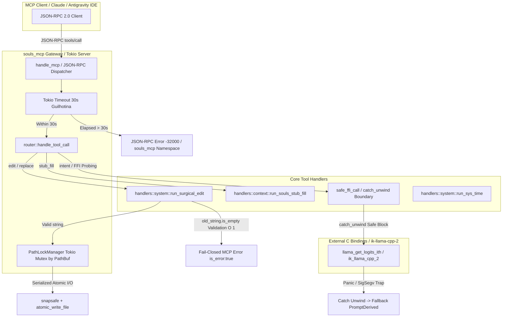

# SDD Design Document: PACOTE 1 — Resiliência e Coerção Contra Stubs

## 1. Identificação e Metadados
- **Work Unit:** `feat-core-resilience`
- **Milestone:** Marco VI (Core Sanitization & Hardening V6)
- **Status:** In Design / SDD First Draft
- **Data:** 2026-08-16
- **Autor:** Engenheiro de Sistemas Bare-Metal & Especialista Rust SOULS MC

---

## 2. Linhas Vermelhas e Conformidade com ADRs
- **[ADR-001] (Core Stack):** Exclusivamente Rust (Tokio) no backend. Sem dependências contínuas de Python ou Node.js em produção.
- **[ADR-003] (Isolamento de Stdio):** Protocolo MCP e canais assíncronos isolados de fluxos STDIO de log. Redirecionamento explícito de pipes.
- **[ADR-010] (Pipeline SDD-TDD):** Red-Green-Refactor estrito. Zero mocks/stubs simulados em produção.
- **[ADR-025] (Higiene de Warnings):** `#![deny(warnings)]`, zero warnings em compilação, 100/100 de qualidade.
- **[ADR-027] (Termodinâmica VRAM):** VRAM = 0 MB para ferramentas e parsers. Preservação de limites de memória e execução.
- **[ADR-030] (Version Pinning):** `windows-sys = "=0.61.2"`, banimento estrito de `winapi` e `core_affinity`.
- **[ADR-041] (Nomenclatura Soberana):** Servername `souls_mcp`, ferramentas com nomes canônicos e aliases transparentes.

---

## 3. Agnosticismo de Hardware e Topologia FinOps
- **Treino de Gravidade:** RTX 2060m (6GB VRAM) e CPU Host Intel i9.
- **Transmutabilidade:** O backend opera em CPU Host com otimizações AVX2 para handlers MCP, com proteção de isolamento de threads e locks assíncronos via Tokio.
- **Zero OOM / Memory Leak:** Validação O(1) com barreira de strings vazias impedindo alocação vetorial descontrolada na RAM.
- **Guilhotina Termodinâmica:** Limite rígido de 30 segundos (`tokio::time::timeout`) para execução de qualquer ferramenta MCP.

---

## 4. Arquitetura Orchestrator-Worker



---

## 5. Especificação dos Módulos Físicos

### 5.1. Módulo 1: Barreira O(1) Anti-OOM no `system.rs` e `context.rs`
- **Validação de Entrada:**
  - `old_string.is_empty()` em `run_surgical_edit` aborta imediatamente com erro JSON-RPC `-32602` e `is_error: true`.
  - `stub_marker.is_empty()` em `run_souls_stub_fill` aborta imediatamente com erro JSON-RPC `-32602` e `is_error: true`.
  - Zero chamadas a `match_indices`, zero `.collect::<Vec<_>>()`, zero alocações na RAM para strings vazias.
- **Concorrência Segura:**
  - Preservação do `acquire_file_lock(&canonical_path)` amarrado unicamente ao `PathBuf` canônico via `dunce::canonicalize`.

### 5.2. Módulo 2: Timeout Guilhotina de 30 Segundos no Despachante MCP
- **Despacho em `main.rs`:**
  - Execução assíncrona envolvida em `tokio::time::timeout(Duration::from_secs(30), router::handle_tool_call(payload))`.
  - Caso estoure, cancela o future imediatamente, liberando recursos e memória.
  - Resposta JSON-RPC de erro padronizada:
    ```json
    {
      "jsonrpc": "2.0",
      "id": "<request_id>",
      "error": {
        "code": -32000,
        "message": "Timeout de execução: ferramenta MCP excedeu o limite termodinâmico de 30 segundos no servidor souls_mcp",
        "data": {
          "server": "souls_mcp",
          "timeout_secs": 30,
          "error": "Execution timeout exceeded (30s limit)"
        }
      }
    }
    ```

### 5.3. Módulo 3: Blindagem FFI com `std::panic::catch_unwind`
- **Isolamento de Pânico:**
  - Implementação da função `safe_ffi_call<F, R>(f: F) -> Result<R, String>` com `std::panic::AssertUnwindSafe`.
  - Blindagem das fronteiras de inferência e probing FFI em `llama_logit_probing.rs` e `handlers::system::run_intent`.
  - Prevenção de propagação de panics que derrubem o reactor Tokio do daemon principal.

### 5.4. Módulo 4: Suíte de Testes TDD em `tests.rs`
- `test_match_indices_empty_string_guard`: validação de aborto instantâneo sub-milissegundo para busca vazia.
- `test_mcp_tool_execution_timeout_guilhotina`: validação do aborto com exatamente 30s usando relógio virtual Tokio.
- `test_ffi_panic_boundary_isolation`: validação de captura de panic FFI isolado sem quebrar o servidor.
