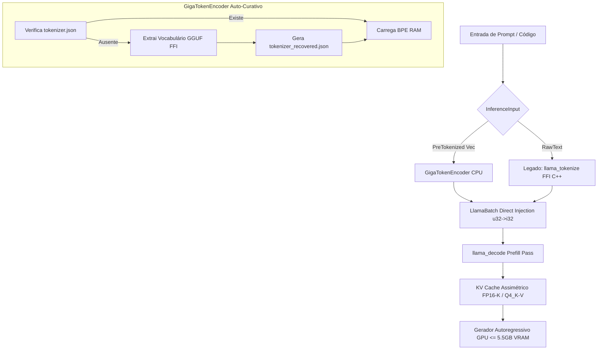

# DESIGN: MARCO 5.4.0 — Gigatoken Auto-Curativo, Prefill Bypass & Ignição do Qwen Coder na GPU

## 1. Visão Geral e Arquitetura

O Marco 5.4.0 consolida o motor **GigaTokenEncoder** com autocura dinâmica de vocabulário (Caminho 3), o bypass de prefill na C-FFI do llama.cpp e a ignição generativa do Qwen 3.5 Coder 4B na dGPU (NVIDIA RTX 2060m 6GB), sob governança FinOps (ADR-027 e ADR-030).



## 2. Padrão Orchestrator-Worker & Agnosticismo de Hardware

- **Orchestrator**: `DedicatedInferenceWorker` (thread de SO isolada do agendador Tokio com `SetThreadAffinityMask`).
- **Worker / Engine**: `LlamaCppEngine` com suporte a `InferenceInput::PreTokenized`.
- **Agnosticismo de Hardware**: A abstração `GigaTokenEncoder` opera com BPE nativo em Rust (CPU SIMD/AVX2) com extração dinâmica GGUF. A camada `LlamaCppEngine` é agnóstica a backend e preparada para exportação via Burn/CubeCL para Vulkan/Metal/NPU, utilizando a RTX 2060m como piso de validação de VRAM (5.5 GB).

## 3. Autocura Dinâmica de Vocabulário (Caminho 3)

Se `tokenizer.json` não for localizado no diretório de modelos:
1. O `GigaTokenEncoder` consulta o modelo GGUF através das funções de inspeção de vocabulário do `LlamaModel` (`n_vocab()`, `token_to_piece_bytes()`).
2. Constrói um mapeamento JSON compatível com a estrutura de BPE/WordPiece (`tokenizer_recovered.json`).
3. Instancia o tokenizer na RAM utilizando `std::sync::OnceLock`.

## 4. Estruturas de Dados e Módulos

### 4.1 `gigatoken_encoder.rs`
- Singleton `GigaTokenEncoder` via `std::sync::OnceLock`.
- Método `tokenize_to_bin(&self, text: &str) -> Result<Vec<u32>, String>`.
- Extração de fallback `recover_tokenizer_from_gguf`.

### 4.2 `llama_engine.rs` & `inference_adapter.rs`
- Enum `InferenceInput`:
  ```rust
  #[derive(Debug, Clone, Serialize, Deserialize, PartialEq, Eq)]
  pub enum InferenceInput {
      RawText(String),
      PreTokenized(Vec<u32>),
  }
  ```
- Conversão segura `u32` -> `i32` (`llama_token`) na injeção direta do `LlamaBatch`.
- Sanidade de Batch: `batch.clear()` e `batch.set_logits(last_token_idx, true)` eliminam vazamento de logits entre turnos.

### 4.3 Trava de VRAM & KV Cache Quantizado
- `n_gpu_layers = 99` (100% GPU offloading para Qwen Coder 4B).
- KV Cache: `Keys = FP16`, `Values = Q4_K`.
- Limite termodinâmico rígido: `Pesos + KV Cache <= 5.5 GB` (5632 MB).
