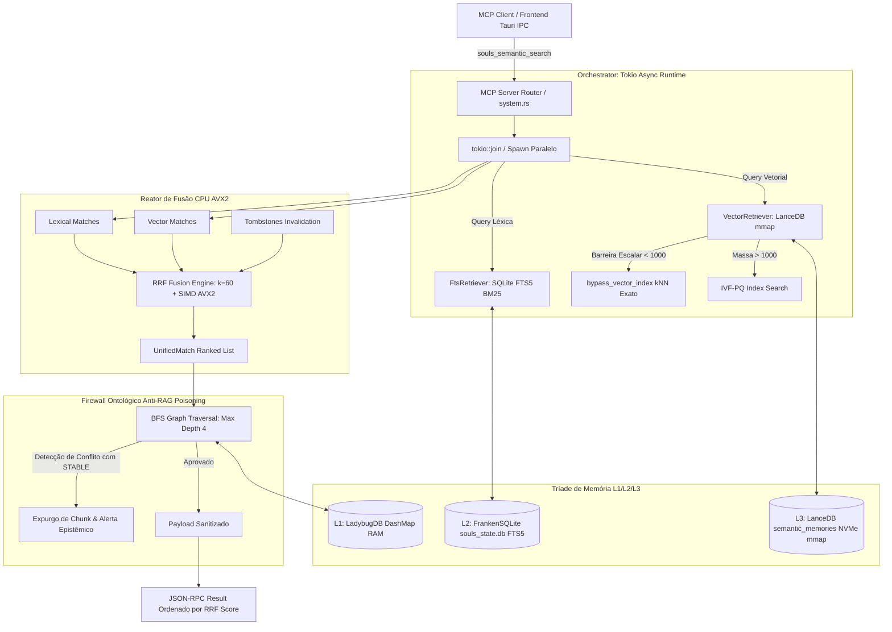

# SDD Design: MARCO VI — Operação Âncora do Hipocampo (LanceDB mmap, RRF AVX2 e LadybugDB)

## 1. Contexto & Objetivos

A presente Work Unit implanta o motor físico de busca híbrida real para a ferramenta `souls_semantic_search` e o subsistema de memória L3/L2/L1 do SOULS MC, em conformidade com:
- **ADR-001** (Core Stack: Tokio Bare-Metal Rust)
- **ADR-003** (Isolamento de Stdio / Canais Protegidos)
- **ADR-005** (RAG Temporal: Bifurcação temporal, RRF híbrido e bypass de falso negativo)
- **ADR-010** (Pipeline SDD-TDD Rigoroso)
- **ADR-025** (Qualidade 100/100, zero warnings)
- **ADR-027** (Termodinâmica de VRAM: 0 MB de oscilação na RTX 2060m)
- **ADR-030** (Higiene de Dependências: windows-sys, isolamento de crates)
- **ADR-041** (Nomenclatura Soberana `souls_mcp` e Zero-Brand)

## 2. Linhas Vermelhas (Invioláveis)

| # | Regra | Justificativa |
|---|-------|---------------|
| R1 | Zero VRAM Footprint | LanceDB opera 100% via `mmap` em NVMe e Host RAM. Delta de VRAM na RTX 2060m = 0 MB. |
| R2 | Cura do Colapso IVF-PQ | Quando o filtro escalar temporal for restritivo (< 1000 registros), força `bypass_vector_index()` com kNN exato em RAM para erradicar amnésia. |
| R3 | Fusão Híbrida RRF Sub-5ms | Reator RRF na CPU do host com vetorização SIMD AVX2 unificando candidatos léxicos (SQLite FTS5) e vetoriais (LanceDB). |
| R4 | Firewall Ontológico LadybugDB | `DashMap` em RAM Host com travessia BFS em grafo causal. Bloqueio e banimento sumário de qualquer chunk com contradição a ADRs `STABLE`. |
| R5 | Zero Tokio Event-Loop Stall | Execuções pesadas encapsuladas em workers Tokio bloqueantes e MPSC assíncronos. |

## 3. Topologia Orchestrator-Worker & Agnosticismo de Hardware

## 4. Agnosticismo de Hardware
- **Piso de Validação (Treino de Gravidade):** Intel Core i9 + NVIDIA RTX 2060m (6GB VRAM).
- **Isolamento Total:** A dGPU não é tocada durante o fluxo RAG/vetorial (0 MB VRAM).
- **Vetorização CPU:** Instruções AVX2 para soma e normalização de scores RRF. Transmutável para ARM NEON / NPU sem reescrever a arquitetura.

## 5. Especificação dos Contratos Físicos

### 5.1. LanceDB (L3 Vector Memory)
- **Path Canônico:** `Z:\souls_mc\.souls_data\semantic_memories`
- **Schema Arrow:**
  - `id`: Utf8
  - `text_content`: Utf8
  - `embedding`: FixedSizeList(384, Float32)
  - `temporal_stability`: Utf8 ("STABLE" | "EVOLVING")
  - `valid_from`: Int64 (Unix Epoch)
  - `valid_to`: Int64 (Nullable Unix Epoch)
- **Mecanismo Zero-VRAM:** Abertura serverless local com `lancedb::connect()`, leitura orientada a Arrow RecordBatches mapeados em Host RAM.

### 5.2. Reator de Fusão RRF (Reciprocal Rank Fusion)
- **Constante padrão:** $k = 60$.
- **Fórmula:**
  $$RRF(d) = \sum_{m \in \{lex, vec\}} \frac{1}{k + r_m(d)} + Bonus_{exact}$$
- **Bonus de Termo Exato:** $+10.0$ para correspondência exata com termos canônicos e palavras-chave rígidas (`ADR-xxx`, `windows-sys`, etc.).
- **Latência Alvo:** $< 5$ ms para unificar 500 candidatos.

### 5.3. Firewall Ontológico LadybugDB
- **Grafo em Memória:** `Arc<DashMap<String, OntologicalNode>>` e `Arc<DashMap<String, Vec<OntologicalEdge>>>`.
- **Validação Fail-Closed:** Travessia BFS a partir de entidades no chunk. Se colidir com nós `STABLE` com `banned_patterns`, veta o chunk e impede contaminação de contexto.
