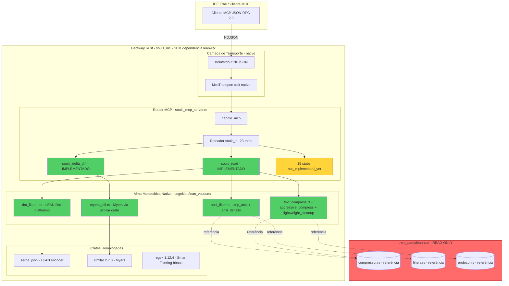
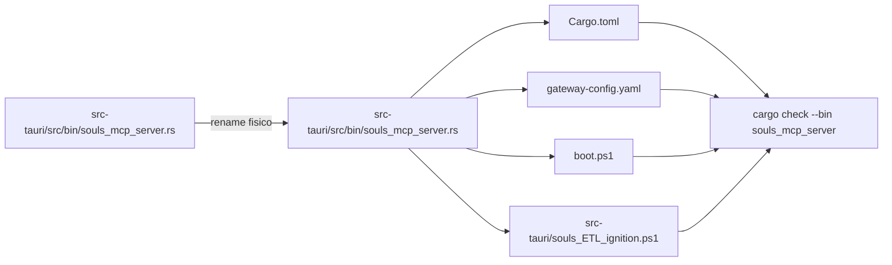

# Design — Canibalização Tipo A: Saco a Vácuo Nativo (Fase 3)

**Branch:** `feat/lean-mcp-integration`
**Escopo:** Fim da dependência do `third_party/lean-ctx/`. Transmutação da "Alma Matemática"
(LEAN Dot-Flattening, Smart Filtering ANSI, Myers Diff) em código **100% nativo** dentro do
núcleo do SOULS. A pasta `third_party/lean-ctx/` permanece apenas como cadáver READ-ONLY.
**Princípio:** "SOULS dita as regras. O cadáver é apenas estudo. Nenhum `rmcp` no nosso binário."

> **Atualização do briefing anterior:** o Arquiteto Humano VETOU a religação do `lean-ctx`
> como `path` dep — o grafo interno deles é um espaguete acoplado ao `rmcp`. Solução:
> extrair manualmente a Alma Matemática (3 funções puras) e reescrevê-las nativas no
> nosso `core/cognition/lean_vacuum/`.

---

## 1. Arquitetura Alvo (Mermaid)



---

## 2. Decisão Arquitetural: Canibalização Tipo A vs Tipo B

| Tipo | Mecanismo | Custo | Risco | Adotado? |
|---|---|---|---|---|
| **A — Reescrita Nativa** | Extrair funções puras do cadáver e reescrever do zero no `core/cognition/lean_vacuum/` | Mão de obra (escrever testes) | **Zero** (código nosso, deps nossas) | ✅ **SIM** |
| B — Path dep isolado | Manter `lean-ctx` no `Cargo.toml` com feature flags mínimas | Barato | **Alto** (37 erros no grafo interno deles, acoplamento `rmcp` profundo) | ❌ VETADO |

**Justificativa do veto ao Tipo B:** 3 iterações do Ralph Loop no Fase 2.5 mostraram que o grafo
interno do `lean-ctx` chama `crate::hooks::normalize_tool_path`, `crate::setup::*` e
`rmcp::model::Tool`. O `rmcp` está entranhado na geração de `tool_defs`. Recortar isso
exigiria um fork permanente do `lean-ctx` — dívida técnica inaceitável sob "Pessimismo da Razão".

---

## 3. Alma Matemática Transplantada (mapa de origem → destino)

| Função | Origem (cadáver) | Destino nativo | Linhas移植 |
|---|---|---|---|
| `dot_flatten(value)` | NOVO — síntese de LEAN format | `cognition/lean_vacuum/dot_flatten.rs` | ~80 |
| `strip_ansi(s)` | `lean-ctx/src/core/compressor.rs:3-23` | `cognition/lean_vacuum/ansi_filter.rs` | ~22 |
| `ansi_density(s)` | `lean-ctx/src/core/compressor.rs:25-31` | `cognition/lean_vacuum/ansi_filter.rs` | ~8 |
| `myers_diff(before, after)` | `lean-ctx/src/core/compressor.rs:178-214` | `cognition/lean_vacuum/myers_diff.rs` | ~50 |
| `aggressive_compress(content, ext)` | `lean-ctx/src/core/compressor.rs:33-101` | `cognition/lean_vacuum/text_compress.rs` | ~75 |
| `lightweight_cleanup(content)` | `lean-ctx/src/core/compressor.rs:105-150` | `cognition/lean_vacuum/text_compress.rs` | ~50 |
| `compress_to_lean(text, ext)` | NOVO — orquestrador | `cognition/lean_vacuum/mod.rs` | ~30 |

**Total:** ~315 linhas nativas移植 + ~150 linhas de testes TDD.

**Princípio de pureza:** nenhuma das funções移植adas importa `rmcp`, `axum`, `ratatui`,
`crossterm`, `lettre`, `jsonwebtoken`, `rten`, `tokio-postgres` ou qualquer outra dependência
do cadáver. Apenas crates **já homologadas** no `Cargo.toml` do `souls_mc`.

---

## 4. Contratos das 2 Ferramentas Vitais Implementadas

### 4.1 `souls_read` — Lê arquivo + Saco a Vácuo

**Input JSON-RPC:**
```json
{ "name": "souls_read", "arguments": { "path": "/abs/path/to/file.rs" } }
```

**Pipeline nativo (sem dependência externa):**
```
raw_file (String) 
  → strip_ansi()                   [ansi_filter.rs]
  → aggressive_compress(ext)       [text_compress.rs]  
  → dot_flatten(serde_json::Value) [dot_flatten.rs]    [se arquivo for JSON]
  → markdown envelope
```

**Output (resposta MCP):**
```json
{
  "content": [{ "type": "text", "text": "# file.rs (1234→456 chars, 63% saved)\n..." }],
  "structuredContent": { "path": "...", "original_chars": 1234, "compressed_chars": 456, "ratio": 0.37 }
}
```

**Erros:**
- `-32602`: path vazio / não-string
- `-32010`: arquivo não existe
- `-32011`: arquivo não é regular
- `-32012`: arquivo > limite (5 MB hard cap — proteção VRAM)

### 4.2 `souls_delta_diff` — Myers Diff estrutural

**Input JSON-RPC:**
```json
{ "name": "souls_delta_diff", "arguments": { "before": "linha 1\nlinha 2", "after": "linha 1\nlinha 3" } }
```

**Pipeline nativo:**
```
(before, after): (&str, &str)
  → similar::TextDiff::from_lines(before, after)
  → iter_all_changes() → ChangeTag::Insert/Delete/Equal
  → format: "+{line_no}: {text}" / "-{line_no}: {text}"
  → footer: "\ndiff +{adds}/-{dels} lines"
```

**Output:**
```json
{
  "content": [{ "type": "text", "text": "-1: linha 2\n+2: linha 3\n\ndiff +1/-1 lines" }],
  "structuredContent": { "additions": 1, "deletions": 1, "before_chars": 14, "after_chars": 14 }
}
```

**Erros:**
- `-32602`: `before` ou `after` ausentes
- Early-return: `before == after` → `(no changes)` sem alocar diff.

---

## 5. 15 Stubs `not_implemented_yet` (Canibalização futura)

Renomeação da string de stub de `"STUB: ..."` para `"not_implemented_yet: ..."` — semântica
mais explícita. As 15 ferramentas permanecem no router mas com resposta determinística:

```rust
fn stub_not_implemented_yet(tool_name: &str) -> Value {
    json!({
        "content": [{
            "type": "text",
            "text": format!(
                "not_implemented_yet: tool '{}' reconhecida no cânone SOULS. \
                 Aguardando Fase 4+ para transplante da lógica adicional.",
                tool_name
            )
        }],
        "is_error": true
    })
}
```

**Lista (15):** `souls_multi_read`, `souls_smart_read`, `souls_search`, `souls_semantic_search`,
`souls_tree`, `souls_outline`, `souls_symbol`, `souls_callers`, `souls_callees`,
`souls_compress`, `souls_dedup`, `souls_metrics`, `souls_intent`, `souls_execute` (sandbox),
`souls_shell` (sandbox).

---

## 6. Padrão Orchestrator-Worker (Mapeamento)

| Worker | Tarefa | Escopo | DoD |
|---|---|---|---|
| **W1** | Atualizar SDD (T0) | `docs/work-units/active/feat-lean-mcp-integration/{design,tasks}.md` | Markdown coerente com Fase 3 |
| **W2** | Criar `lean_vacuum/` (T1) | `src/cognition/lean_vacuum/{mod,dot_flatten,ansi_filter,myers_diff,text_compress}.rs` | `cargo check --lib` Exit 0 + 6 testes passando |
| **W3** | Transplante das 2 vitais (T2) | `src/bin/souls_mcp_server.rs` — `souls_read` + `souls_delta_diff` | `cargo check --bin souls_mcp_server` Exit 0 |
| **W4** | Stubs renomeados (T3) | `src/bin/souls_mcp_server.rs` — 15 stubs | `grep "STUB:" /dev/null` retorna vazio |
| **W5** | Validação (Fase 5) | `cargo check --bin souls_mcp_server` + diff atômico | Exit 0 + Blast Radius ≤ 5 arquivos novos |

**Isolamento:** 5 arquivos novos em `cognition/lean_vacuum/`, 1 arquivo modificado
(`souls_mcp_server.rs`), 1 arquivo modificado (`core/mod.rs`). Zero colisões.

---

## 7. Agnosticismo de Hardware (ACONIC)

A Alma Matemática é 100% CPU/RAM. **Zero toque de GPU**:

- `dot_flatten` opera em `serde_json::Value` (árvore em RAM, sem alocação GPU).
- `strip_ansi` / `ansi_density` são varredura de bytes (CPU scalar).
- `myers_diff` via `similar` é CPU scalar (algoritmo de Myers em O(ND) sobre slices).
- `aggressive_compress` é varredura linha-a-linha (CPU scalar).

**Agnosticismo de Backend:** nenhuma das funções移植adas usa `tokio` async. São puramente
síncronas e podem ser invocadas tanto do `souls_mcp_server` (NDJSON) quanto de um futuro
servidor HTTP, sem alteração. A RTX 2060m continua como treino de gravidade; nada aqui
muda o motor de inferência.

---

## 8. Linhas Vermelhas (Red Lines)

1. **NUNCA** reintroduzir `lean-ctx = { path = "third_party/lean-ctx" }` no nosso `Cargo.toml`.
2. **NUNCA** importar `rmcp`, `axum`, `ratatui`, `crossterm`, `lettre`, `jsonwebtoken`,
   `rten`, `tokio-postgres` no nosso código nativo.
3. **NUNCA** mutar a pasta `third_party/lean-ctx/` — ela é **READ-ONLY** (cadáver de estudo).
4. **NUNCA** usar `serde_json::from_slice` em payloads >1MB dentro do `lean_vacuum` —
   alocação O(N) proibida.
5. **NUNCA** chamar `std::process::Command` (ou similar) do `lean_vacuum` — funções puras
   síncronas apenas.
6. **SEMPRE** adicionar teste TDD (Red-Green-Refactor) para cada função移植ada.
7. **SEMPRE** preservar `serde_json::Value` para o envelope JSON-RPC 2.0 (LEAN só age
   no payload, conforme briefing anterior).
8. **SEMPRE** `cargo check --bin souls_mcp_server` Exit 0 antes do HITL.

---

## 9. Definição de Pronto Global (DoD)

- [ ] `design.md` (este arquivo) e `tasks.md` atualizados.
- [ ] 5 arquivos novos em `cognition/lean_vacuum/` + 1 em `core/mod.rs` (re-exports).
- [ ] `cargo check --lib` Exit 0.
- [ ] `cargo test --lib cognition::lean_vacuum` Exit 0 (≥ 6 testes).
- [ ] `cargo check --bin souls_mcp_server` Exit 0.
- [ ] `grep "STUB:" src/bin/souls_mcp_server.rs` retorna vazio.
- [ ] Diff atômico: ≤ 6 arquivos modificados, ≤ 6 arquivos criados.
- [ ] `git diff Cargo.toml` mostra APENAS o comentário do expurgo (sem `lean-ctx =`).
- [ ] `git status` confirma `third_party/lean-ctx/` INTOCADO.

---

**Aguardando aprovação explícita do Arquiteto:**

*"Arquiteto, o design da Canibalização Tipo A e o roteamento agnóstico estão aprovados?"*

---

## Fase 4 — Higiene Topológica e o Batismo do Souls MC

**Branch:** `chore/rename-souls-mcp`  
**Escopo:** renomeação infraestrutural do binário MCP do gateway de `souls_mcp_server` para
`souls_mcp_server`, preservando a lógica de negócio.

### Arquitetura do rename



### Orchestrator-Worker

| Worker | Ação | Arquivos |
|---|---|---|
| W1 | rastrear referências `souls_mcp_server(.exe)` | `gateway-config.yaml`, `boot.ps1`, `src-tauri/`, `Cargo.toml` |
| W2 | renomear o arquivo físico do binário | `src-tauri/src/bin/souls_mcp_server.rs` -> `src-tauri/src/bin/souls_mcp_server.rs` |
| W3 | atualizar chamadores e comentários de identidade | `Cargo.toml`, `gateway-config.yaml`, `.ps1`, `mcp_transport.rs`, logs do binário |
| W4 | validar compilador | `cargo check --bin souls_mcp_server` |

### Red lines da Fase 4

1. NUNCA alterar lógica de roteamento MCP.
2. NUNCA tocar no `third_party/lean-ctx/`.
3. NUNCA deixar referências residuais a `souls_mcp_server.exe` em YAML/PS1.
4. SEMPRE validar com `cargo check --bin souls_mcp_server`.
