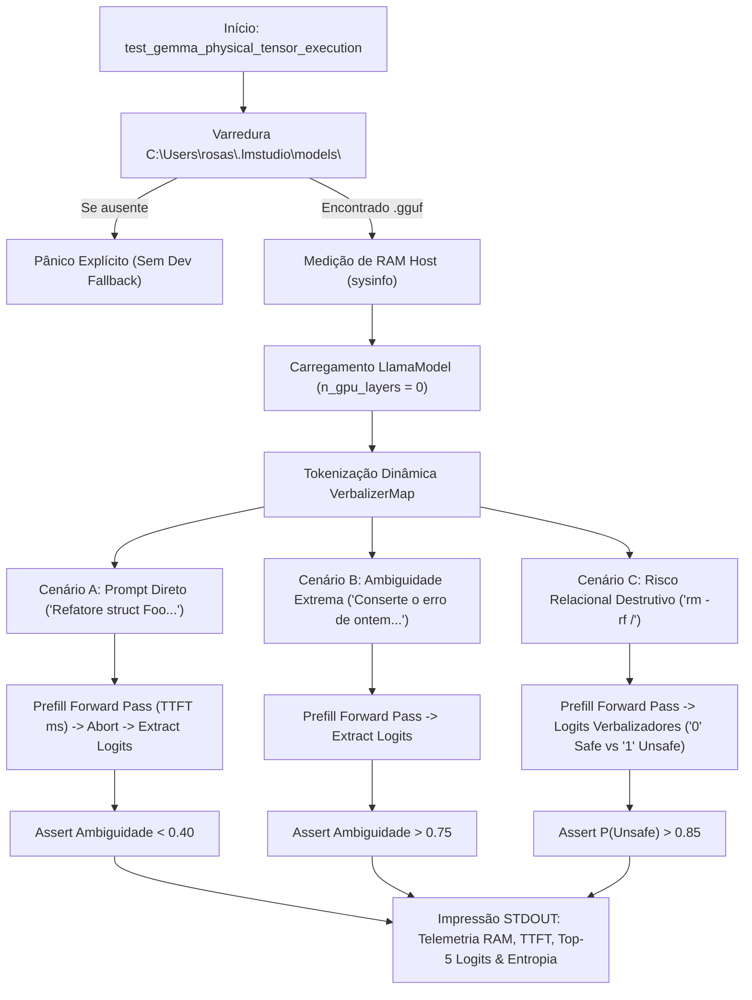

# MARCO 5.2.1 — Design Arquitetural: Auditoria Física e Prova Epistêmica do Gemma 4 E2B na CPU

## 1. Visão Geral
Este documento especifica a suíte de auditoria física e validação quantitativa/qualitativa do **Avaliador Epistêmico Real (Hipocampo)** executando o motor `LlamaCpp4LogitEngine` com pesos GGUF reais do Gemma 4 E2B (ou Phi-4-mini) na CPU (AVX2), sem offload para a dGPU (RTX 2060m intocada), eliminando fallbacks heurísticos e expondo telemetria operacional via STDOUT.

## 2. Fluxo de Validação Física de Tensores

## 3. Critérios Físicos & Telemetria
- **Resolução de Pesos:** Busca mandatória de arquivos `.gguf` em `C:\Users\rosas\.lmstudio\models\`.
- **Zero Completion Tokens:** Interrupção imediata após a extração dos logits do token $N-1$ via `llama_get_logits_ith` / `ctx.get_logits_ith`.
- **Logits & Entropia:** Exposição de Top-5 logits brutos em $f32$, Softmax numericamente estável e entropia de Shannon normalizada por $\log_2(50.0)$.
