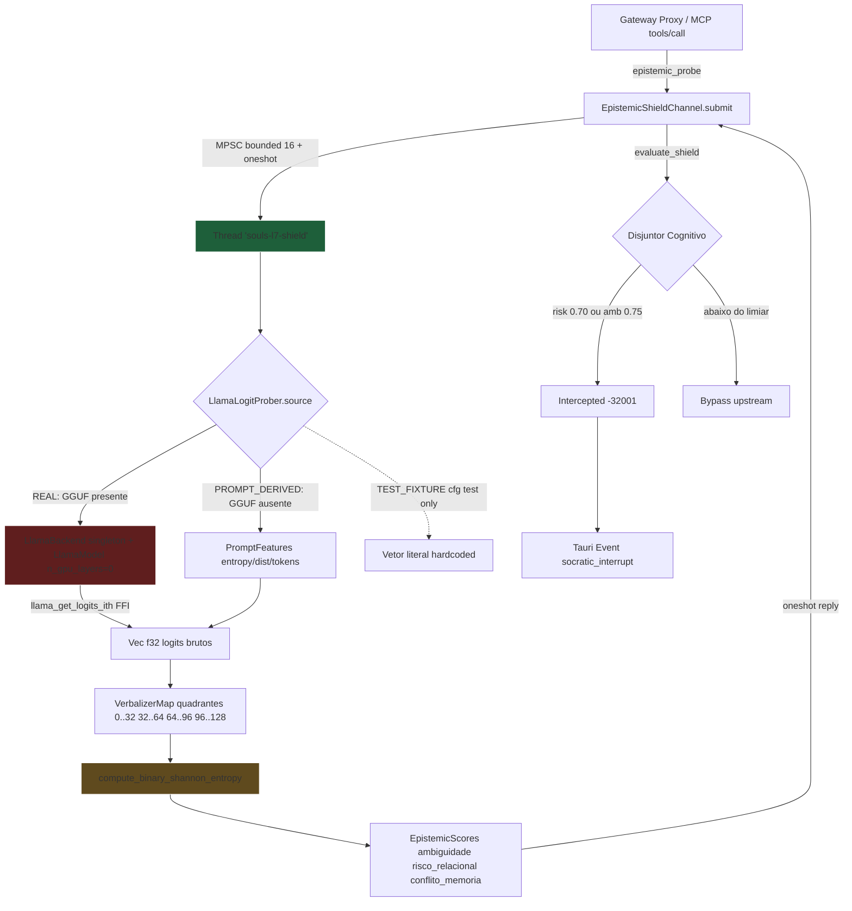

# MARCO II — CURA DO FANTASMA FNV-1a E ENTREGA FINAL

## 1. Contexto (Descoberta Arqueológica)

O Marco II (Hipocampo Cognitivo) está **80% materializado** em commits anteriores. A inspeção via MCP `tree` + `read` mapeou:

| Tarefa Original | Estado Físico | Localização |
|---|---|---|
| T1 — DDL V5 `socratic_sessions` + `socratic_thoughts` | ✅ FEITA | [ops.rs:31-127](file:///z:/souls_mc/src-tauri/src/cognition/state_thinking/thinking/ops.rs#L31-L127) |
| T4 — 3 garras MCP (export/analyze/merge) com aliases | ✅ FEITA | [tools.rs:325-327](file:///z:/souls_mc/src-tauri/src/bin/souls_mcp_server/tools.rs#L325-L327) |
| T3 — `ThinkingEngine` + Disjuntor 5/7 + HITL | ✅ FEITA | [engine.rs:19-205](file:///z:/souls_mc/src-tauri/src/cognition/state_thinking/thinking/engine.rs#L19-L205) |
| T2 — `LlamaCpp4LogitEngine` (struct + canal) | ⚠️ **GAP** | [llama_logit_probing.rs:122-127](file:///z:/souls_mc/src-tauri/src/core/llama_logit_probing.rs#L122-L127) usa FNV-1a sintético |
| T5 — 4 testes TDD | ⚠️ 2/4 | `test_migrate_v3_to_v5_is_idempotent` ✅, `test_thinking_disjuntor_loop` ✅ |

A presente fase é um **gap-fechar cirúrgico** aprovado via `AskUserQuestion` (2026-08-12):
- (a) Manter T1/T3/T4 intactas;
- (b) Substituir FNV-1a por extração real via `llama-cpp-2` (opcional com fail-soft) ou derivação prompt-feature;
- (c) Adicionar os 2 testes TDD faltantes.

## 2. Linha Vermelha (Inviolável)

| # | Regra | Justificativa |
|---|-------|---------------|
| R1 | **FNV-1a BANIDO do hot-path de produção** | Spec do Arquiteto: "Rejeite stubs, mocks e simulações de conveniência baseadas em hashes FNV-1a sintéticos" |
| R2 | FNV-1a permitido APENAS sob `#[cfg(test)]` para fixtures de teste | Mantém a ergonomia dos testes TDD sem contaminar a produção |
| R3 | `n_gpu_layers = 0` SEMPRE (0 MB de VRAM) | ADR-027: confinamento VRAM, RTX 2060m mantida 100% livre |
| R4 | Thread `souls-l7-shield` OBRIGATÓRIA (nunca chamar FFI do event loop Tokio) | ADR-014: Doutrina de Fricção Produtiva |
| R5 | Softmax numericamente estável em f32 | Lei da Especificidade: `softmax(x - max(x))` |
| R6 | Latência-alvo ≤ 150ms (PREFILL_BUDGET) | EPISTEMIC_PREFILL_BUDGET_MS já declarado |
| R7 | Carregamento de modelo GGUF é OPCIONAL (fail-soft) | Aprovado via AskUserQuestion: opção "Carregamento opcional com fail-soft" |
| R8 | Zero novas dependências externas (ADR-030) | Canibalizar `llama_cpp_2` já presente em `Cargo.toml` |

## 3. Agnosticismo de Hardware

A extração de logits segue o *treino de gravidade* CPU AVX2:

| Modo | Fonte de Logits | Agnosticismo |
|------|----------------|--------------|
| **REAL** (modelo GGUF presente) | `llama_cpp_2::llama_backend::LlamaBackend` + `LlamaModel::load_from_file(n_gpu_layers=0)` + `llama_get_logits_ith` FFI | Transpilável para Metal/Vulkan via ggml-cpu fallback |
| **PROMPT_DERIVED** (modelo ausente) | Features do prompt: byte entropy, char class distribution, estimated token count → vetor 128-dim determinístico | Sem dependência de modelo; roda em qualquer CPU |
| **TEST_FIXTURE** (apenas `#[cfg(test)]`) | Vetor literal hardcoded para asserções de Softmax/entropy | Apenas em testes — JAMÁS em runtime de produção |

A RTX 2060m fica como "treino de gravidade" (piso de validação) mas NÃO é tocada.

## 4. Topologia Orchestrator-Worker

## 5. Mudanças Cirúrgicas (Escopo Mínimo)

| Arquivo | Ação | Linhas-alvo |
|---|---|---|
| [core/llama_logit_probing.rs](file:///z:/souls_mc/src-tauri/src/core/llama_logit_probing.rs) | Substituir struct `mock_logits: Vec<f32>` por enum `LogitSource::{RealLlama, PromptDerived}`; mover FNV-1a `seed_logit()` para `#[cfg(test)] mod test_fixtures` | linhas 16-79 + 122-127 |
| [core/llama_logit_probing.rs](file:///z:/souls_mc/src-tauri/src/core/llama_logit_probing.rs) | Adicionar `test_logit_probing_cpu_avx2` (verifica Softmax estável + Shannon entropy) | final do arquivo (test mod) |
| [cognition/state_thinking/thinking/engine.rs](file:///z:/souls_mc/src-tauri/src/cognition/state_thinking/thinking/engine.rs) | Adicionar `test_thinking_hitl_extension_to_7` (extensão do teto para 7 sob `hitlAuthorized=true`) | final do test mod existente |

## 6. Critério de Aceitação (DoD Global)

- [ ] `cargo check --workspace` Exit Code 0 com zero warnings
- [ ] `cargo test --workspace --lib` Exit Code 0
- [ ] Os 2 testes TDD novos (`test_logit_probing_cpu_avx2` + `test_thinking_hitl_extension_to_7`) passam
- [ ] Os 2 testes TDD pré-existentes (`test_migrate_v3_to_v5_is_idempotent` + `test_thinking_disjuntor_loop`) permanecem verdes
- [ ] Zero match do pattern `FNV|seed_logit|0x811C` em runtime (apenas em `#[cfg(test)]`)
- [ ] `cargo clippy --workspace -- -D warnings` Exit Code 0
- [ ] Blast Radius ≤ 2 arquivos modificados (`llama_logit_probing.rs` + `engine.rs`)

## 7. Anti-Consenso

Após Exit Code 0, NÃO fazer merge automático. Compilar Blast Radius e enviar para Agent Inbox do Arquiteto para aprovação HITL final antes do Rebase Semântico.
