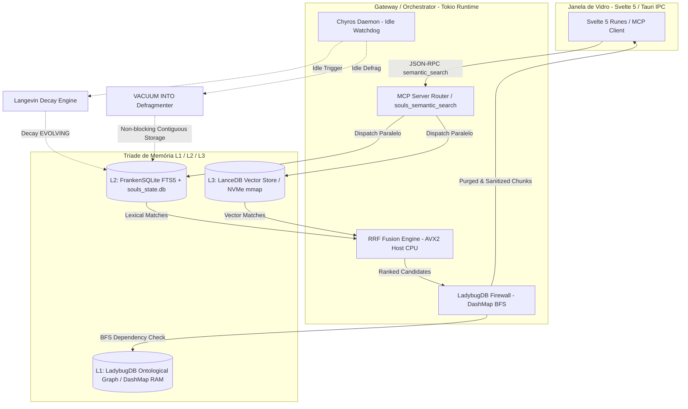

# SDD Design Document: MARCO VI — O Hipocampo Ativo, Reator Híbrido RRF e Metabolismo de Langevin

## 1. Identificação e Metadados
- **Work Unit:** `feat-marco-vi-active-hippocampus`
- **Milestone:** Marco VI (Memória Episódica & RAG Bare-Metal)
- **Status:** In Design / SDD First Draft
- **Data:** 2026-08-14
- **Autor:** Engenheiro Bare-Metal de Dados & Rust Specialist

---

## 2. Linhas Vermelhas e Conformidade com ADRs
- **[ADR-001] (Core Stack):** Exclusivamente Rust (Tokio) no backend. Sem dependências contínuas de Python ou Node.js em produção.
- **[ADR-003] (Isolamento de Stdio):** Protocolo MCP e canais assíncronos isolados de fluxos STDIO de log.
- **[ADR-005] (RAG Temporal):** Bifurcação temporal estrita, valid_from/valid_to, prevenção de Recency Bias e cura de falso-negativo (Tentativa Dupla / fallback bypass_vector_index).
- **[ADR-025] (Higiene de Warnings):** `#![deny(warnings)]`, zero warnings em compilação.
- **[ADR-027] (Termodinâmica VRAM):** VRAM = 0 MB para RAG e LanceDB. A RTX 2060m (6GB) é reservada 100% para inferência local de SLM (Qwen 3.5 Coder 4B).
- **[ADR-030] (Version Pinning):** Pinning estrito de dependências no workspace do `Cargo.toml`. `windows-sys = "=0.61.2"`. Banimento de `winapi` e `core_affinity`.

---

## 3. Agnosticismo de Hardware e Topologia FinOps
- **Treino de Gravidade:** RTX 2060m (6GB VRAM) e CPU Host Intel i9.
- **Transmutabilidade:** O backend é agnóstico a aceleradores, permitindo execução 100% CPU com AVX2 e futuro escalonamento para Burn/CubeCL (Metal, Vulkan, NPU).
- **Zero VRAM Footprint:** Mapeamento `memmap2` em NVMe para LanceDB/Arrow.

---

## 4. Arquitetura Orchestrator-Worker

---

## 5. Especificação dos Módulos

### 5.1. Módulo 1: Acoplamento LanceDB e Pré-Filtragem Escalar
- **Tabela Arrow Schema:**
  - `id`: String (UUID v4/v7)
  - `text_content`: String
  - `embedding`: FixedSizeList(384, Float32) (bge-small-en-v1.5)
  - `temporal_stability`: String ("STABLE" | "EVOLVING")
  - `valid_from`: Int64 (Epoch)
  - `valid_to`: Int64 (Nullable Epoch)
- **Pré-filtro Escalar:** `valid_from > Epoch` e filtro de temporalidade via SQL/predicate no LanceDB.
- **Fallback Automático (Bypass Vector Index):** Se o kNN vetorial com pré-filtro retornar 0 itens, aciona automaticamente busca léxica FTS5 no SQLite prevenindo colapso por falso-negativo.

### 5.2. Módulo 2: Reator Híbrido RRF (Reciprocal Rank Fusion)
- **Fórmula:**
  $$Score(d) = \sum_{m \in M} \frac{1}{k + r_m(d)} + Bonus_{exact}$$
  onde $k = 60$.
- **AVX2 Acceleration:** Operações vetorizadas em CPU i9 para unificação com latência sub-5ms.
- **Bonus de Termo Exato:** IDs, constantes rígidas (`GGML_TYPE_TQ1`, `ADR-xxx`) e caminhos recebem bônus de prioridade máxima no topo da pilha.
- **JSON-RPC Endpoint:** `souls_mcp.semantic_search` / `souls_semantic_search`.

### 5.3. Módulo 3: Firewall Ontológico LadybugDB (Anti-RAG Poisoning)
- **Estrutura:** `DashMap<String, HashSet<String>>` na RAM para arestas (`depends_on`, `replaces`, `implements`, `violates`).
- **Travessia BFS:** Verifica o caminho estrutural a partir do arquivo/entidade alvo.
- **Purga Epistêmica:** Se um chunk contradiz uma decisão `STABLE` (ex: sugere dependência banida pela ADR-030 ou viola regra de arquitetura), o chunk é expurgado e emite log de advertência epistêmica na telemetria.

### 5.4. Módulo 4: Metabolismo de Langevin e Desfragmentação (Chyros Daemon)
- **Equação de Langevin:**
  $$S_{t+1} = S_t \cdot e^{-\lambda \cdot dt} + \sigma \sqrt{dt} \cdot \eta_t$$
  - $\lambda = 0.05$ para memórias `EVOLVING`.
  - $\lambda = 0.0$ para memórias `STABLE` (âncoras invariantes imunes ao esquecimento).
  - Transformação Box-Muller para ruído gaussiano $\eta_t$.
- **Desfragmentação Segura no SSD ReFS Z:**:
  - `VACUUM INTO` periódico e idempotente para consolidar páginas físicas sem Write Amplification destrutivo.

---

## 6. Portão de Qualidade TDD
Quatro testes unitários e de integração obrigatórios:
1. `test_lancedb_mmap_zero_vram_isolation`
2. `test_hybrid_search_rrf_avx2_fusion`
3. `test_ladybug_graph_bfs_poison_prevention`
4. `test_chyros_langevin_decay_vacuum_into`
