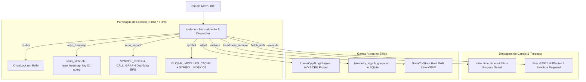

# Design: Saneamento de Performance, Timeouts Inteligentes e Extirpação de Stubs MCP

**Work Unit:** `feat-mcp-perf-hygiene`  
**Status:** ACTIVE  
**Data:** 2026-08-17  
**Alinhamento:** ADR-001, ADR-003, ADR-010, ADR-014, ADR-025, ADR-027, ADR-041, ADR-044  

## 1. Visão Geral e Arquitetura

Esta Work Unit sanea os gargalos críticos de latência, extirpa stubs inativos e implementa timeouts inteligentes no servidor `souls_mcp_server`.

## 2. Metas de Latência Física

| Garra / Ferramenta | Meta de Latência | Mecanismo Físico |
|---|---|---|
| `routes` | < 1ms | `OnceLock<RouteReport>` estático pré-compilado em RAM |
| `repo_heatmap` | < 3ms | Query atômica indexada no `souls_state.db` |
| `repo_impact` | < 3ms | Travessia BFS no `SYMBOL_INDEX` / `CALL_GRAPH` (`DashMap`) em RAM |
| `symbol` | < 1ms | `GLOBAL_MODULES_CACHE` sem recompilação de bytecode + `SYMBOL_INDEX` |
| `fetch_web` | Válvula 25s | `tokio::time::timeout(25s)` com corte gracioso e erro JSON-RPC |
| `execute` | < 1ms | Erro estruturado `-32001` (HitlDenied) |
| `intent` | < 150ms | `LlamaCpp4LogitEngine` CPU SIMD AVX2 com avaliação de incerteza |
| `metrics` | < 2ms | Agregação direta de `telemetry_logs` no `souls_state.db` |
| `headroom_retrieve`| < 1ms | `SodaCcrStore` e `ccr_cache()` em RAM Host |
| `KVCacheSwapController`| < 5ms | Buffer Host RAM `Arc<Mutex<Vec<u8>>>` sem IO síncrono de stdout |

## 3. Agnosticismo de Hardware

Todas as operações de CPU operam de forma transmutável e isolada (0 MB VRAM alocada na GPU). O `vram_scheduler` preserva a VRAM para inferências prioritárias e a gerência de buffer de swap em Host RAM evita qualquer dependência proprietária.
