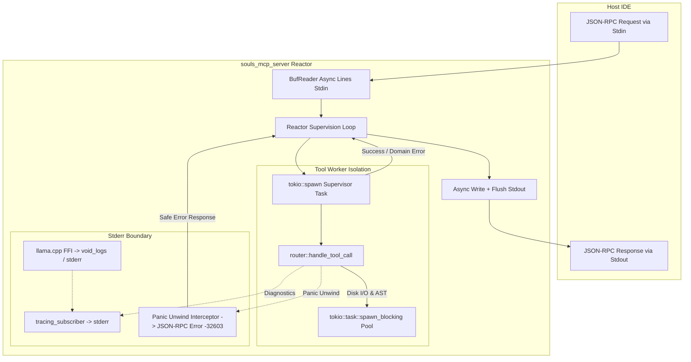

# Design Document — Operação Isolamento de Stdio (Fase 1 da Auditoria MCP)

## 1. Contexto e Objetivos

Conforme as **ADR-001** (Core Stack Tokio/Rust), **ADR-003** (Isolamento de Stdio e Cerca do Stderr), **ADR-010** (Pipeline SDD-TDD) e **ADR-041** (Nomenclatura Soberana `souls_mcp`), o servidor MCP `souls_mcp_server` comunica-se com a IDE anfitriã via protocolo JSON-RPC 2.0 transportado por `stdin`/`stdout`.

Qualquer caractere parasita emitido no `stdout` (como logs de depuração não-capturados, pânicos não interceptados ou saídas FFI de bibliotecas C++) corrompe o frame JSON-RPC, travando a IDE em estado de espera infinito ("working...").

### Metas da Work Unit:
1. **Contenção Absoluta de Logs:** Garantir que todo e qualquer log do runtime Rust (`tracing`, `eprintln!`) e de bindings FFI C++ (`llama.cpp`) seja estritamente canalizado para `stderr` ou suprimido via `void_logs`.
2. **Reactor Supervisionado e Despacho Assíncrono Isolado:** Envelopar cada execução de ferramenta (`router::handle_tool_call`) em `tokio::spawn`, capturando pânicos via `JoinHandle` e retornando deterministicamente respostas de erro JSON-RPC (`-32603`, `Internal error: Tool panicked in worker thread`, `is_error: true`).
3. **Despacho Não-Bloqueante:** Mover rotinas síncronas pesadas de parsing AST e I/O de disco (`run_souls_symbol`, `run_souls_outline`) para `tokio::task::spawn_blocking`.
4. **Garantia de Flush Imediato:** Assegurar `.flush().await` imediato em `stdout` após cada frame JSON-RPC.
5. **Suíte TDD de Saneamento:** Testes unitários para comprovação de pureza do `stdout` e resiliência a pânicos no `tests.rs`.

---

## 2. Diagrama Arquitetural Orchestrator-Worker

---

## 3. Topologia e Agnosticismo de Hardware

- **Agnosticismo de Hardware:** As rotinas de isolamento operam na camada de runtime Tokio / OS Bare-Metal sem acoplamento a arquiteturas de GPU específicas. O piso mínimo de validação permanece a RTX 2060m (6GB VRAM), operando com zero MB de alocação de VRAM durante a fase de transporte de protocolo.
- **FinOps & VRAM Guard:** Zero alocação desnecessária de tensores durante chamadas de infraestrutura MCP.
