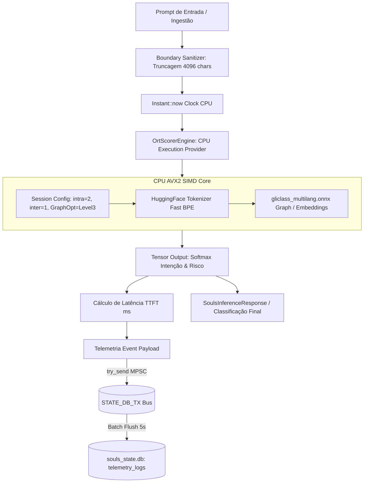

# Operação Sentinela de Borda: Implantação do Pacote 3 — Real OrtScorerEngine (ONNX Runtime CPU AVX2)

## 1. Contexto & Objetivos

A presente Work Unit implanta o motor físico de inferência de borda para o **PACOTE 3: A SENTINELA DE TRIAGEM RÁPIDA (ONNX CPU)**. Em conformidade absoluta com:
- **ADR-001** (Core Stack: Tokio Bare-Metal Rust)
- **ADR-003** (Isolamento de Stdio / Canais Protegidos)
- **ADR-010** (Pipeline SDD-TDD Rigoroso)
- **ADR-025** (Qualidade 100/100, zero warnings)
- **ADR-027** (Termodinâmica de VRAM: RTX 2060m intocada com 0 MB de alteração)
- **ADR-030** (Higiene de Crates e Pinning Rígido)
- **ADR-043** (Observabilidade e Telemetria FinOps)

Erradicamos todos os mocks e stubs simulados em `src-tauri/src/core/ort_scorer.rs` e integramos o classificador de intenções e segurança de alta fidelidade com aceleração SIMD AVX2.

## 2. Linhas Vermelhas (Invioláveis)

| # | Regra | Justificativa |
|---|-------|---------------|
| R1 | Zero dGPU Allocation | A sentinela de triagem rápida roda **estritamente na CPU do host (EP CPU)**. VRAM da RTX 2060m permanece com 0 MB de consumo adicional. |
| R2 | Thread Pool Contido | Sessão configurada com `intra_threads(2)` e `inter_threads(1)` e nível de otimização de grafo `Level3` (AVX2/SIMD). |
| R3 | Truncagem Segura (4096 chars) | Fatiamento antecipado de prompts > 4096 caracteres no boundary de segurança para prevenir DoS/exaustão. |
| R4 | Zero Tokio Event-Loop Stall | Execução encapsulada em `tokio::task::spawn_blocking` ou threads dedicadas. |
| R5 | Telemetria FinOps MPSC | Despacho não-bloqueante de latência (TTFT da sentinela), classificação de intenção e risco para `telemetry_logs` via `STATE_DB_TX`. |

## 3. Topologia Orchestrator-Worker & Agnosticismo de Hardware

## 4. Estrutura de Telemetria e FinOps

1. **Latência de Triagem (TTFT)**: Medida em microssegundos / milissegundos na CPU do host.
2. **Registro no SQLite**: Gravação assíncrona via barramento `STATE_DB_TX` na tabela `telemetry_logs`.
3. **Isolamento Térmico**: Zero ativação de CUDA / NVML VRAM delta = 0 MB.
