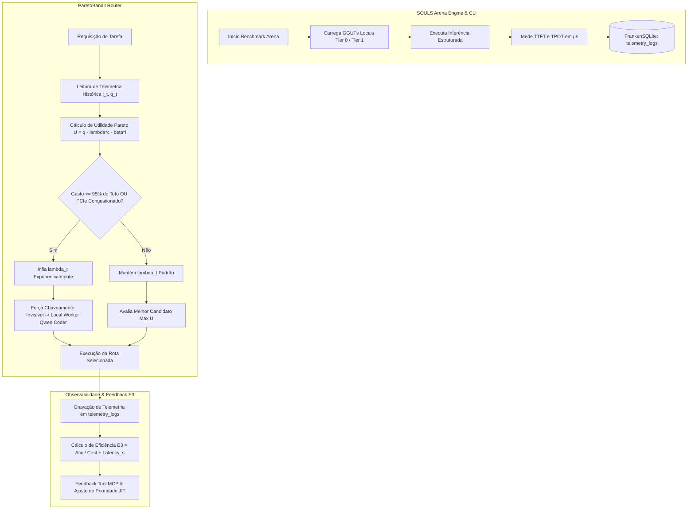

# Design Document — Feat: SOULS Arena, Telemetria Real e Roteamento ParetoBandit

## 1. Contexto e Objetivos (ADR-001, ADR-010, ADR-027, ADR-041, ADR-043, ADR-046)

O **Pacote 6: O Rito de Passagem** estabelece a ponte empírica e física entre o profiling de hardware/modelos locais e o roteador econômico-cognitivo **ParetoBandit**.

Proibido terminantemente o uso de *mocks* ou simulações matemáticas em produção:
1. **SOULS Arena (`souls_arena_cli`)**: Profiling empírico de modelos GGUF locais via `LlamaCppEngine`/`EphemeralInferEngine`, medindo TTFT (*Time to First Token*) e TPOT (*Time Per Output Token*) em microssegundos no metal.
2. **FrankenSQLite (`souls_state.db` -> `telemetry_logs`)**: Persistência atômica das medições de benchmark com timestamp UNIX.
3. **ParetoBandit Real (`pareto_bandit.rs`)**: Roteamento baseado na função de utilidade real:
   $$U_t(a \mid x) = q_t(a \mid x) - \lambda_t \cdot c(a) - \beta \cdot l_t(a)$$
   com marcapasso orçamentário dinâmico ($\lambda_t$) que eleva o multiplicador exponencialmente quando o teto diário atinge 95% ou quando o barramento PCIe satura.
4. **Métrica de Eficiência E3 (`feedback.rs`)**:
   $$E3 = \frac{\text{Acurácia\_Tarefa\_Arena}}{\text{Custo\_Financeiro\_USD} + \text{Latência\_Total\_Segundos}}$$
   penalizando overthinking e custos inflacionados de nuvem para forçar desvio JIT ao silício local de custo zero.

---

## 2. Arquitetura e Diagrama de Fluxo (Mermaid)

---

## 3. Padrão Orchestrator-Worker & Agnosticismo de Hardware

- **Agnosticismo de Hardware**: O motor de arena e o roteador operam sob abstrações de traits (`EphemeralInferEngine`, `SystemTopology`), preparados para transmutação para Metal/Vulkan/NPU sem amarras hardcoded à RTX 2060m. A RTX 2060m funciona como piso de validação de gravidade (6GB VRAM, PCIe Gen3x16).
- **Isolamento de Stdio (ADR-003)**: O binário `souls_arena_cli` e o servidor MCP comunicam-se via IPC seguro e canais MPSC, sem poluição de stdout.
- **Fail-Soft e Resiliência**: Fallback atômico para heurísticas locais caso a base SQLite não possua histórico suficiente para determinado modelo.
