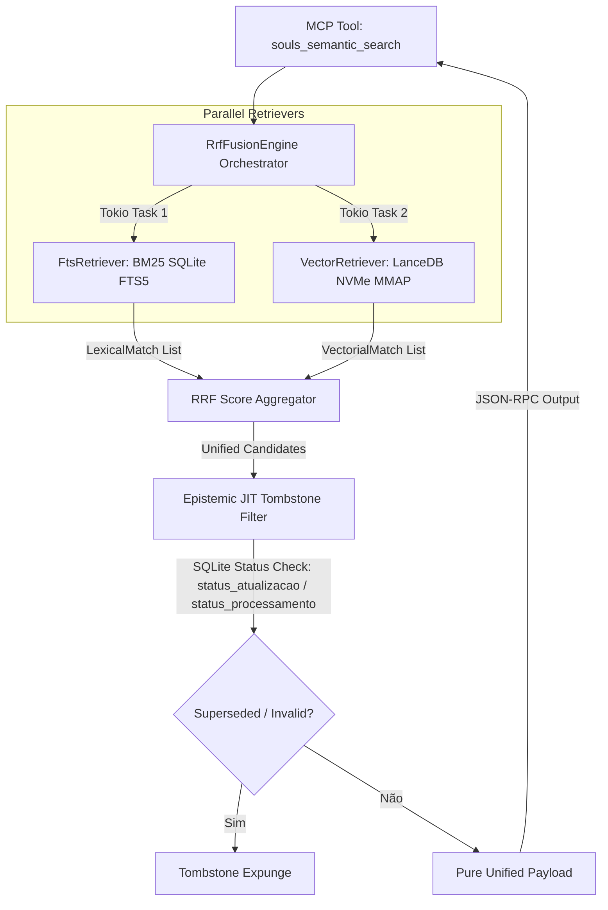

# DESIGN DE ARQUITETURA — MARCO 5.6.0: REATOR DE BUSCA HÍBRIDA RRF E INVALIDAÇÃO JIT

## 1. RESUMO EXECUTIVO & CONTEXTO
Este documento especifica a arquitetura física e formal do **Reator de Busca Híbrida RRF (Reciprocal Rank Fusion)** e do **Mecanismo de Invalidação JIT (Tombstone)** para o ecossistema SOULS Mission Control (MARCO 5.6.0). 

A solução combina:
1. **Busca Léxica Síncrona FTS5 (BM25)** sobre o SQLite (`souls_state.db` / `observations_fts`).
2. **Busca Vetorial Local MMAP (LanceDB)** sobre a base vetorial em NVMe (`soda_data/`), sob restrição estrita da RTX 2060m (0 MB VRAM alocada para vetores RAG).
3. **Motor de Fusão RRF** unificando rankings com $k = 60.0$.
4. **Filtro Epistêmico JIT (Tombstone)** descartando fatos com status `superseded` ou `invalid` diretamente em runtime.
5. **Garra MCP `souls_semantic_search`** exposta em `souls_mcp_server` sob limites ADR-041 (32/120).

## 2. ARQUITETURA TOPOLÓGICA (ORCHESTRATOR-WORKER)



## 3. AGNOSTICISMO DE HARDWARE & GARANTIA FINOPS (RTX 2060m)
* **VRAM Protection Guarantee:** A consulta vetorial LanceDB opera via `mmap` de arquivos no NVMe usando `memmap2` e o leitor de arquivos nativo do Apache Arrow/Lance. Nenhum buffer de embedding é carregado na VRAM da GPU.
* **Complexidade:**
  - FTS5 Léxico: $\mathcal{O}(\log N)$ via B-Tree / Inverted Index.
  - Fusão RRF: $\mathcal{O}(N \log N)$ em RAM.
  - Invalidação JIT: $\mathcal{O}(K)$ varredura de $K$ candidatos via query `IN (...)` no SQLite.

## 4. ESPECIFICAÇÃO DAS STRUCTS E INTERFACES

### 4.1 `FtsRetriever` (`src-tauri/src/cognition/memory/fts_retriever.rs`)
```rust
#[derive(Debug, Clone, Serialize, Deserialize, PartialEq)]
pub struct LexicalMatch {
    pub doc_id: String,
    pub content: String,
    pub file_path: String,
    pub raw_score: f64,
}

pub struct FtsRetriever {
    pub db_path: PathBuf,
}
```

### 4.2 `VectorRetriever` (`src-tauri/src/cognition/memory/vector_retriever.rs`)
```rust
#[derive(Debug, Clone, Serialize, Deserialize, PartialEq)]
pub struct VectorialMatch {
    pub doc_id: String,
    pub content: String,
    pub similarity: f32,
    pub file_path: String,
    pub metadata: serde_json::Value,
}

pub struct VectorRetriever {
    pub db_path: PathBuf,
}
```

### 4.3 `RrfFusionEngine` & JIT Invalidation (`src-tauri/src/cognition/memory/rrf_fusion.rs`)
```rust
pub const DEFAULT_RRF_K: f64 = 60.0;

#[derive(Debug, Clone, Serialize, Deserialize, PartialEq)]
pub struct UnifiedMatch {
    pub doc_id: String,
    pub content: String,
    pub file_path: String,
    pub rrf_score: f64,
    pub lexical_rank: Option<usize>,
    pub vector_rank: Option<usize>,
    pub status: String,
}

pub struct RrfFusionEngine {
    pub k: f64,
}
```

## 5. REGRAS DE GOVERNANÇA E STDIO HYGIENE
* **ADR-041 Compliance:**
  - Name: `souls_semantic_search` (21 chars $\le 32$).
  - Description: `"Executa a busca híbrida RRF combinando FTS5 (BM25) e LanceDB vetorial local com invalidação JIT."` (98 chars $\le 120$).
* **Stdio Hygiene:** `eprintln!` exclusivo para telemetria; `stdout` 100% reservado ao JSON-RPC.
