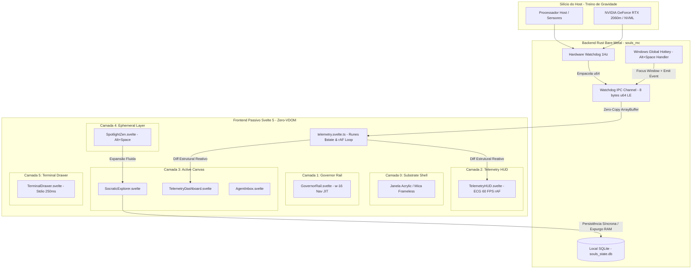

# SODA Canvas v0.1 — Cockpit Integrado (Svelte 5 / Tauri v2 Bare-Metal)

## 1. Visão Geral e Fronteiras Arquiteturais (ADR-001, ADR-005, ADR-010, ADR-013, ADR-014, ADR-041)

O SODA Canvas v0.1 é a casca de controle visual (Cockpit) soberana do ecossistema SOULS MC. Construído em arquitetura estritamente **Zero-VDOM** com Svelte 5 (Runes) e Tauri v2, o frontend opera como casca passiva de ultra-alta performance, desacoplado de qualquer lógica de negócio ou computação de dados (ADR-005).

### Linha Vermelha (SSOT)
- **Zero VDOM / Sem frameworks de animação pesados de terceiros:** Proibido uso de React, Framer Motion, GSAP ou qualquer camada de cálculo no frontend.
- **Zero-Copy IPC Stream:** Telemetria física transmitida via buffer binário empacotado (`u64` Little-Endian, 8 bytes) sem serialização JSON intermediária.
- **Micro-Batching via rAF:** Proteção de backpressure da UI mantendo taxa estável em sincronia com monitor (60 FPS).
- **Proibição de Vazamento de Proxy:** Qualquer dado reativo retornado ao Rust deve ser desempacotado obrigatoriamente com `$state.snapshot()`.
- **Agnosticismo de Hardware (Tratado ACONIC):** O pipeline de telemetria é desacoplado do silício específico da RTX 2060m, usando layouts escaláveis compatíveis com Metal, Vulkan e NPU.

---

## 2. Diagrama de Topologia FinOps e Padrão Orchestrator-Worker

---

## 3. Divisão Geométrica Planar Rígida (As 5 Camadas do SODA)

| Camada | Componente | Descrição / Restrições |
| :--- | :--- | :--- |
| **Camada 0** | Substrate Shell | Janela sem bordas nativas, cantos arredondados, fundo preto absoluto `oklch(0% 0 0)` integrado ao Windows 11. |
| **Camada 1** | `GovernorRail.svelte` | Barra vertical fixa `w-16` (64px) com ícones minimalistas (Reator, Cérebro, Gaveta) para troca JIT de visão. |
| **Camada 2** | `TelemetryHUD.svelte` | Header superior plano com ECG em tempo real: VRAM (alerta em 5000MB/6GB), RAM, CPU Temp e GPU Temp. |
| **Camada 3** | `ActiveCanvas.svelte` | Área de trabalho central que renderiza `TelemetryDashboard`, `SocraticExplorer` ou `AgentInbox`. |
| **Camada 4** | `SpotlightZen.svelte` | Spotlight flutuante central acionado por `Alt+Space` com feedback JIT ou expansão socrática. |
| **Camada 5** | `TerminalDrawer.svelte` | Gaveta de logs deslizante (250ms GPU) com tombstone virtual para descarregar o pipeline de pintura quando oculta. |

---

## 4. Tokens de Design System (@theme Tailwind v4)

- **Fundo Preto Absoluto:** `oklch(0% 0 0)` como o chassi invisível do desktop.
- **Painéis de Vidro Cibernético (Mica/Acrylic):** `backdrop-filter: blur(20px)` com opacidades semitransparentes e `will-change: backdrop-filter` nas transições.
- **Ghost Borders:** `shadow-[inset_0_0_0_1px_rgba(255,255,255,0.1)]` (GPU painting puro, zero layout shift).
- **Tipografia:** Space Grotesk (títulos), JetBrains Mono (código), Space Mono/Doto (telemetria).
- **Transições:** 50ms a 150ms com curva `cubic-bezier(0.2, 0.8, 0.2, 1)`.
