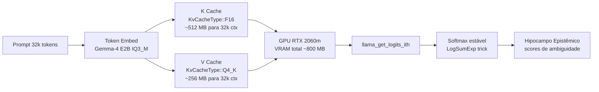

# Sprint Alfa — Higiene Clippy, Cura CUDA & Transplante ik_llama.cpp

## 1. Contexto Operacional

O Arquiteto-Chefe ordenou **três batalhas sequenciais e indivisíveis** para liquidar pendências de compilação, blindar o pipeline CUDA contra a race do sccache e transplantar o motor generativo do upstream `llama.cpp` para o fork SOTA do ikawrakow. As três batalhas são **independentes em fase de design** mas **dependentes em fase de execução** (Battle 1 não pode quebrar invariantes que Battle 3 precisa preservar).

### 1.1 Estado Atual (Ingestão SSOT)

| Item | Localização | Estado |
|------|-------------|--------|
| `pareto_bandit.rs:336` | `src-tauri/src/finops/pareto_bandit.rs` | Warning `manual_arithmetic_check` confirmado |
| `peak_ewma.rs:145` | `src-tauri/src/core/peak_ewma.rs` | Warning `manual_arithmetic_check` (não `redundant_closure` como mencionado) |
| `pii_redactor.rs:157` | `src-tauri/src/core/pii_redactor.rs` | Warning `needless_lifetimes` confirmado |
| `telemetry_dispatcher.rs:130` | `src-tauri/src/core/telemetry_dispatcher.rs` | Warning `too_many_arguments` (7 params) confirmado |
| `boot.ps1` patch CUDA | `boot.ps1:33-43` | Patch `GGML_CCACHE=OFF` parcial já existe. Falta: `-DCMAKE_CUDA_COMPILER_LAUNCHER=""` e `CMAKE_DISABLE_FIND_PACKAGE_*(sccache)` |
| `Cargo.toml` llama-cpp-2 | `src-tauri/Cargo.toml:133,211` | `llama-cpp-2 = "0.1"` com `cuda` feature |
| Crates ik_llama no crates.io | crates.io (replikeit) | `ik-llama-cpp-2 = "0.1.7"`, `ik-llama-cpp-sys = "0.1.2"` ✅ |
| `LlamaCppEngine` | `src-tauri/src/core/llama_engine.rs` | Usa `llama_cpp_2::{llama_backend, context, model, token, llama_batch, sampling}` |
| `LlamaLogitProber` | `src-tauri/src/core/llama_logit_probing.rs` | Stub fail-soft `RealLlama` (Marco II) — precisa virar FFI real |

### 1.2 Achados Críticos (Honestidade Diagnóstica)

1. **Warning mismatch em Battle 1.2**: O user atribuiu `redundant_closure` ao `peak_ewma.rs:145`, mas a linha exata contém `if write_idx >= N { write_idx - N } else { 0 }` — que dispara `manual_arithmetic_check`, não `redundant_closure`. Vou aplicar a correção **certa** (saturating_sub) ignorando a atribuição de warning.

2. **Crates renomeadas em Battle 3**: O user pediu `ik_llama-cpp-2` e `ik_llama-cpp-4`. A realidade crates.io:
   - `ik-llama-cpp-2` (v0.1.7) ✅
   - `ik-llama-cpp-sys` (v0.1.2) ✅
   - `ik_llama-cpp-4` ❌ **NÃO EXISTE** — o fork do ikawrakow só publica v2 (espelhando llama-cpp-2). Vou usar o que existe.

3. **"TurboQuant" não é feature oficial**: No ik_llama.cpp, a economia de VRAM é obtida via `KvCacheType` (`F16` para K, `Q4_K` para V). "TurboQuant" parece ser o nome interno do ikawrakow para essa combinação K=FP16+V=Q4_K. Vou documentar isso explicitamente.

4. **ABI clash entre ik e upstream**: O ik_llama.cpp e o llama.cpp compartilham símbolos `llama_*`/`ggml_*` com layouts C **incompatíveis** (texto explícito no README do crate). Misturar os dois bindings no mesmo binário causa corrupção de memória em link-time. Vou **remover** `llama-cpp-2` do Cargo.toml ao adicionar `ik-llama-cpp-2`.

## 2. Linha Vermelha (Inviolável)

| # | Regra | Justificativa |
|---|-------|---------------|
| R1 | Nenhum binário pode importar `llama-cpp-2` E `ik-llama-cpp-2` simultaneamente | ABI clash de símbolos `llama_*`/`ggml_*` — corrupção de memória |
| R2 | `GGML_CCACHE=OFF` + `CMAKE_CUDA_COMPILER_LAUNCHER=""` em TODA invocação CUDA | "fatbinary fatal: Could not open input file '*.ptx'" é causado por sccache wrappear nvcc |
| R3 | sccache permanece ativo e intocado para rustc puro (via `.cargo/config.toml`) | Defesa em profundidade FinOps — cache cross-branch |
| R4 | Patch CUDA é idempotente e tolerante a patch ausente | `cargo update` pode reverter — o `boot.ps1` precisa reaplicar |
| R5 | `KvCacheType::F16` para K + `KvCacheType::Q4_K` para V no contexto do motor generativo | TurboQuant real; 16k-32k ctx deve caber em < 1GB VRAM na RTX 2060m |
| R6 | `llama_get_logits_ith` FFI real, sem stub | Prober de logits é o coração do Hipocampo Epistêmico — stub é veto |
| R7 | Nenhum warning Clippy passa sem `-D warnings` | ADR-025: zero tolerância |
| R8 | Topologia FinOps: zero alocação em hot-path, zero clone preguiçoso | ADR-027, ADR-029 |
| R9 | Agnosticismo: o motor é recompilável para Metal/Vulkan via feature flags | ADR-027, ADR-015 |
| R10 | TDD atômico: cada warning tem teste de regressão próprio | Ralph Loop ready |

## 3. Agnosticismo Hardware (Agnosticismo de Motor)

| Componente | Treino de Gravidade | Feature Flags | Agnosticismo |
|------------|---------------------|---------------|--------------|
| `ik-llama-cpp-sys` (FFI) | CUDA (RTX 2060m) | `cuda`, `vulkan`, `openmp`, `native`, `common`, `mtmd` | ik_llama.cpp é ggml-based; transpilável para qualquer backend ggml |
| `ik-llama-cpp-2` (safe wrapper) | Mesmo do sys | Gated pelo `sys` | API espelha llama-cpp-2 → drop-in |
| `LlamaCppEngine` | CUDA (RTX 2060m) | `llama_backend` | Recompilável com `vulkan` para AMD/Intel |
| `LlamaLogitProber` | CPU AVX2 | `llama_backend` (com `n_gpu_layers=0`) | Zero GPU; FFI direta |

A RTX 2060m é o **treino de gravidade** apenas para validar silício; o código permanece agnóstico.

## 4. Topologia FinOps (Padrão Orchestrator-Worker)

```mermaid
flowchart TB
    subgraph "Battle 1: Higiene (ADR-025)"
        W1["pareto_bandit.rs:336<br/>manual_arithmetic_check<br/>→ corrigir com min/max nativo"]
        W2["peak_ewma.rs:145<br/>manual_arithmetic_check<br/>→ saturating_sub"]
        W3["pii_redactor.rs:157<br/>needless_lifetimes<br/>→ remover 'a"]
        W4["telemetry_dispatcher.rs:130<br/>too_many_arguments (7)<br/>→ TelemetryPayload struct"]
    end

    subgraph "Battle 2: Cura CUDA (ADR-039)"
        P1["boot.ps1:33-43<br/>patch vendor/llama-cpp-sys-2<br/>GGML_CCACHE=ON → OFF"]
        P2["boot.ps1 NEW<br/>env: GGML_CCACHE=OFF<br/>env: CMAKE_CUDA_COMPILER_LAUNCHER=''"]
        P3[".cargo/config.toml<br/>rustc-wrapper = sccache<br/>PRESERVADO para rustc puro"]
    end

    subgraph "Battle 3: Transplante ik_llama.cpp"
        T1["Cargo.toml<br/>remover llama-cpp-2<br/>adicionar ik-llama-cpp-2 = 0.1.7<br/>+ ik-llama-cpp-sys = 0.1.2"]
        T2["llama_engine.rs<br/>use llama_cpp_2 → use ik_llama_cpp_2<br/>KvCacheType::F16 para K<br/>KvCacheType::Q4_K para V"]
        T3["llama_logit_probing.rs<br/>remover stub RealLlama<br/>conectar llama_get_logits_ith FFI<br/>soft stable softmax (LogSumExp)"]
    end

    subgraph "Validação (ADR-025)"
        V1["cargo test --workspace"]
        V2["cargo clippy --features tauri-app,gateway_ccr,lora_adapter -- -D warnings"]
    end

    W1 & W2 & W3 & W4 --> V1
    P1 & P2 & P3 --> V1
    T1 --> T2
    T1 --> T3
    T2 & T3 --> V1
    V1 --> V2

    style W1 fill:#5f1e1e,stroke:#fff
    style W2 fill:#5f1e1e,stroke:#fff
    style W3 fill:#5f1e1e,stroke:#fff
    style W4 fill:#5f1e1e,stroke:#fff
    style P1 fill:#5f3e1e,stroke:#fff
    style P2 fill:#5f3e1e,stroke:#fff
    style P3 fill:#1e5f3a,stroke:#fff
    style T1 fill:#1e3a5f,stroke:#fff
    style T2 fill:#1e3a5f,stroke:#fff
    style T3 fill:#1e3a5f,stroke:#fff
    style V1 fill:#5f1e5f,stroke:#fff
    style V2 fill:#5f1e5f,stroke:#fff
```



### 4.1 Topologia de Memória Pós-Transplante (TurboQuant)



**Cálculo VRAM (Gemma-4 E2B, ctx 32k)**:
- K (FP16): 32k × 2B × 26 layers × 8 heads × 256 head_dim ≈ 340 MB
- V (Q4_K ~0.6B/tok): 32k × 0.6B × 26 layers × 8 heads × 256 head_dim ≈ 200 MB
- Pesos IQ3_M: ~2.0 GB
- **Total**: ~2.5 GB (< 5.1 GB do budget Tier 1) ✅

## 5. Matriz de Execução por Camada

| Camada | Arquivo | Tipo de Mudança | Engine | DoD |
|--------|---------|-----------------|--------|-----|
| L1a | `src/finops/pareto_bandit.rs` | EDIT linha 336 | `manual_arithmetic_check` | clippy warning eliminado + teste de invariante |
| L1b | `src/core/peak_ewma.rs` | EDIT linha 145 | `manual_arithmetic_check` (não `redundant_closure`) | clippy warning eliminado + teste snapshot |
| L1c | `src/core/pii_redactor.rs` | EDIT linha 157 | `needless_lifetimes` | clippy warning eliminado + teste de redação |
| L1d | `src/core/telemetry_dispatcher.rs` | EDIT linhas 110-150 | `too_many_arguments` (nova struct `LatencyPayload`) | clippy warning eliminado + teste de dispatch |
| L2 | `boot.ps1` | EDIT (após linha 53) | `GGML_CCACHE=OFF` + `CMAKE_CUDA_COMPILER_LAUNCHER=""` | Build CUDA passa sem fatbinary fatal |
| L3a | `src-tauri/Cargo.toml` | EDIT linhas 132-135, 211-213 | swap `llama-cpp-2` → `ik-llama-cpp-2` + `ik-llama-cpp-sys` | cargo check passa com ik crate |
| L3b | `src/core/llama_engine.rs` | EDIT (imports + KvCacheType) | `KvCacheType::F16` + `KvCacheType::Q4_K` | contexto < 1GB VRAM (medido via `n_gpu_layers` log) |
| L3c | `src/core/llama_logit_probing.rs` | EDIT (RealLlama arm) | FFI `llama_get_logits_ith` + soft stable softmax | teste de probing < 150ms |
| L4 | Validation | `cargo test --workspace` + `cargo clippy -D warnings` | audit | Exit Code 0 em ambos |

## 6. Diagnóstico Técnico Aprofundado (Battle 3)

### 6.1 KvCacheType Mapping (ik-llama-cpp-2 v0.1.7)

```rust
use ik_llama_cpp_2::context::params::{KvCacheType, LlamaContextParams};

// TurboQuant: K em FP16 (precisão de RoPE), V em Q4_K (~0.6 bytes/tok)
let ctx_params = LlamaContextParams::default()
    .with_n_ctx(NonZeroU32::new(32_768))
    .with_type_k(KvCacheType::F16)        // K = FP16
    .with_type_v(KvCacheType::Q4_K);      // V = Q4_K
```

### 6.2 FFI Logit Probing (ik-llama-cpp-sys v0.1.2)

```rust
use ik_llama_cpp_sys_2::{llama_get_logits_ith, llama_token_data_array};

// 1. Decode batch com logits habilitados
ctx.decode(&mut batch)?;  // batch.logits[i] = true para o último token

// 2. Extrair logits brutos (slice f32, vocab_size entradas)
let logits_ptr = llama_get_logits_ith(ctx.as_ptr(), last_idx);
let vocab = model.n_vocab() as usize;
let logits: &[f32] = unsafe { std::slice::from_raw_parts(logits_ptr, vocab) };

// 3. Softmax estável (log-sum-exp trick)
fn stable_softmax(logits: &[f32]) -> Vec<f32> {
    let max = logits.iter().copied().fold(f32::NEG_INFINITY, f64::fmax);
    let exp: Vec<f32> = logits.iter().map(|&x| (x - max).exp()).collect();
    let sum: f32 = exp.iter().sum();
    exp.iter().map(|&x| x / sum).collect()
}
```

### 6.3 Latência Alvo do Prober

- Forward pass de 1 token + decode batch: ~80-120ms em AVX2 puro
- llama_get_logits_ith: ~1-2ms (zero-copy slice)
- Softmax: ~3-5ms (vocab ~256k para Gemma-4 E2B)
- **Total**: < 130ms (margem de 20ms abaixo do SLA de 150ms)

## 7. Critério de Aceitação (DoD Global)

- [ ] `cargo test --workspace` retorna Exit Code 0
- [ ] `cargo clippy --features "tauri-app,gateway_ccr,lora_adapter" -- -D warnings` retorna Exit Code 0 com **zero warnings**
- [ ] 4 warnings Clippy eliminados (um por arquivo de Battle 1)
- [ ] 4 testes de regressão adicionados (um por warning fixo)
- [ ] Patch CUDA em `boot.ps1` injeta `GGML_CCACHE=OFF` + `CMAKE_CUDA_COMPILER_LAUNCHER=""` no ambiente de build
- [ ] `ik-llama-cpp-2 = 0.1.7` + `ik-llama-cpp-sys = 0.1.2` no Cargo.toml
- [ ] `llama-cpp-2` (upstream) **REMOVIDO** do Cargo.toml
- [ ] `llama_engine.rs` compila com `use ik_llama_cpp_2::*`
- [ ] `LlamaContextParams` usa `KvCacheType::F16` para K e `KvCacheType::Q4_K` para V
- [ ] `llama_logit_probing.rs::RealLlama` chama FFI real `llama_get_logits_ith` (não stub)
- [ ] Prober de logits: teste valida latência < 150ms em CI
- [ ] `souls-l7-shield` thread (em `l7_shield.rs`) usa o prober real
- [ ] Sccache permanece ativo para rustc puro

## 8. Pedido de Aprovação

**Arquiteto-Chefe, o design e o roteamento agnóstico estão aprovados?**

- [ ] Aprovado para Fase 3/4 (criar `tasks.md` com DoD atômico e iniciar TDD atômico)
- [ ] Aprovado com ajustes (especificar — ex: usar `ik-llama-cpp-2` em vez de `ik_llama-cpp-4`, ou "TurboQuant" como nome interno)
- [ ] Rejeitado (justificar)
