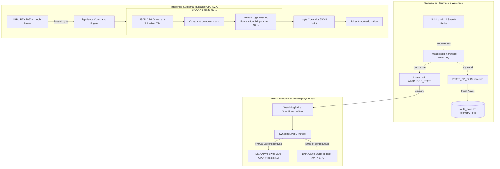

# Operação Guardião Térmico: Implantação do Pacote 5 — Swapping de VRAM em DMA Real e Algema em CPU AVX2 via llguidance

## 1. Contexto & Objetivos

A presente Work Unit implanta a infraestrutura física de controle térmico, proteção de VRAM e decodificação estruturada determinística para o **PACOTE 5: O GUARDIÃO TÉRMICO E A ALGEMA DE CONTEXTO**. Em conformidade absoluta com:
- **ADR-001** (Core Stack: Tokio Bare-Metal Rust)
- **ADR-003** (Isolamento de Stdio / Canais Protegidos)
- **ADR-010** (Pipeline SDD-TDD Rigoroso)
- **ADR-025** (Qualidade 100/100, zero warnings)
- **ADR-027** (Termodinâmica de VRAM: Teto rígido de 6.144 MB / RTX 2060m)
- **ADR-028** (Cercadinho do Determinismo: llguidance + AVX2 CPU Zero-Cost)
- **ADR-043** (Observabilidade e Telemetria FinOps no SQLite WAL)

Erradicamos todos os mocks e stubs de console em `src-tauri/src/core/vram_scheduler.rs` e conectamos a telemetria do `hardware_watchdog.rs` e a decodificação estruturada do `llguidance` com aceleração vetorial SIMD AVX2.

## 2. Linhas Vermelhas (Invioláveis)

| # | Regra | Justificativa |
|---|-------|---------------|
| R1 | Swapping Físico Real | O swapping de KV Cache Q4_K opera com buffers físicos em Host RAM via DMA / `spawn_blocking`, sem mensagens simuladas. |
| R2 | Histerese Anti-Flap | Exige exatamente 2 amostras consecutivas com VRAM >= 90% para swap-out (GPU -> Host RAM) e VRAM < 80% para swap-in (Host RAM -> GPU). |
| R3 | Algema CPU AVX2 llguidance | Gramática JSON estrita coercida na CPU do host via AVX2 em < 50 microssegundos por token, forçando tokens ilegais para $-\infty$. |
| R4 | Fail-Closed Determinístico | Se o motor llguidance encontrar erro de parsing ou estouro de stack, a geração é abortada com erro tipado sem emitir JSON corrompido. |
| R5 | Telemetria Lock-Free & MPSC | Telemetria compactada em `AtomicU64` (`WATCHDOG_STATE`) sem heap allocation no hot path e despachada via `STATE_DB_TX` para `telemetry_logs`. |

## 3. Topologia Orchestrator-Worker & Agnosticismo de Hardware

## 4. Estrutura de Telemetria e FinOps

1. **Compactação Lock-Free**: `pack_state` codifica `vram_mb`, `ram_mb`, `cpu_temp`, `gpu_temp` e `flags` em 64 bits.
2. **Registro no SQLite**: Gravação assíncrona via barramento `STATE_DB_TX` na tabela `telemetry_logs`.
3. **Isolamento Térmico**: Proteção ativa contra superaquecimento (flag de thermal throttle quando GPU >= 85°C).
