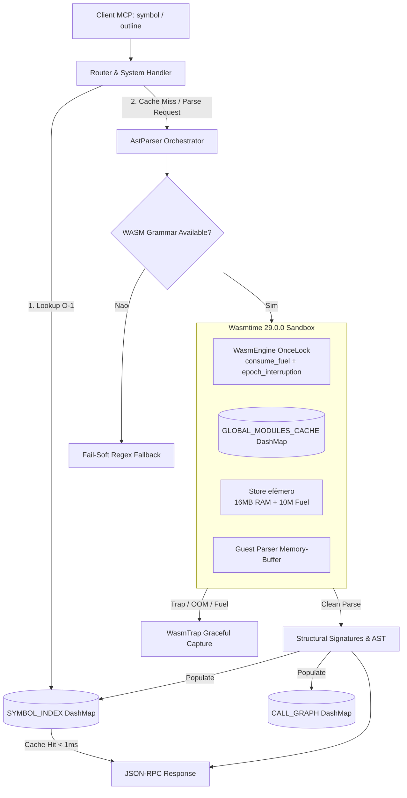

# Operação Olhos Poliglotas: Sandbox Wasmtime & AST Tree-Sitter Real

## 1. Contexto & Objetivos

A presente Work Unit implanta o motor de parsing sintático de produção para as ferramentas do SOULS MCP (`souls_symbol`, `souls_outline`, `get_ast`). Em conformidade com ADR-001, ADR-003, ADR-010, ADR-029, ADR-030 e ADR-044, eliminamos em definitivo mocks e buscas parciais de string / regex como método primário de extração estrutural, enjaulando a execução em WebAssembly Wasmtime com garantias físicas de contenção de recursos.

## 2. Linhas Vermelhas (Invioláveis)

| # | Regra | Justificativa |
|---|-------|---------------|
| R1 | Sem VFS de disco no WASI | O host lê arquivos para buffer de RAM e passa ao guest na memória linear. Nenhum diretório do host é montado no WASI. |
| R2 | Fuel Metering compulsório (10M units) | Impede loops infinitos e travamento de threads Tokio. |
| R3 | Teto estrito de RAM linear (16MB) | Previne ataques de exaustão de memória / OOM na RTX 2060m e host. |
| R4 | Zero Panic / Fail-Soft | Toda falha de guest vira `WasmTrap` estruturado. Nunca propaga panic. |
| R5 | Bytecodes reais >= 50KB | Garante gramáticas com tabelas e símbolos reais em `src-tauri/resources/wasm_grammars/`. |
| R6 | Resolução lock-free O(1) em RAM | `SYMBOL_INDEX` (`DashMap`) serve consultas sub-milissegundo (< 1ms). |

## 3. Topologia Orchestrator-Worker & Agnosticismo de Hardware

## 4. Estratégia de Quarentena e Segurança Física

- **Engine Única**: `OnceLock<wasmtime::Engine>` com `consume_fuel(true)` e `epoch_interruption(true)`.
- **Cache de Módulos**: `GLOBAL_MODULES_CACHE` armazena `Arc<wasmtime::Module>` pré-compilados a partir de `src-tauri/resources/wasm_grammars/`.
- **Memória Linear do Guest**: O buffer de código é injetado via memória linear sem I/O de disco.
- **Fail-Soft L7**: Captura graciosa de `WasmTrap::Oom`, `WasmTrap::FuelExhausted`, `WasmTrap::Unreachable`.
