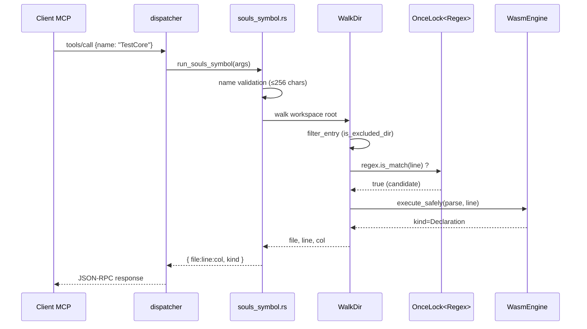

# Marco 4.1.1 — Motor Sensorial de Assinaturas: `souls_symbol` (TDD)

## 1. Contexto

A ferramenta `souls_symbol` é o **motor sensorial de assinaturas** do gateway MCP `souls_mcp`. Ela responde instantaneamente à pergunta:

> "Onde o símbolo `X` foi fisicamente declarado no workspace?"

Hoje (Marco 3.8 Fase C.2) o `run_symbol` (linha 1571 de [souls_mcp_server.rs](file:///z:/souls_mc/src-tauri/src/bin/souls_mcp_server.rs#L1571)) consulta um índice `DashMap` pré-construído (`symbol_index_global`). Esse caminho:

1. **Acopla-se à indexação** (precisa que `read`/`edit` tenham disparado telemetria antes — lentidão no cold start).
2. **É cego ao código novo** (símbolos em arquivos nunca indexados retornam `NotFound` mesmo existindo).
3. **Não valida AST** (pode retornar uma entrada stale de um arquivo que mudou).

O presente Marco 4.1.1 substitui a implementação por um **caminho de descoberta determinístico e auto-suficiente** que:
- **Varre** o workspace via `WalkDir` filtrado pelas 22 extensões canônicas de [`extensions.rs`](file:///z:/souls_mc/src-tauri/src/cognition/lean_vacuum/extensions.rs).
- **Pré-filtra** via regex `OnceLock` (compiladas uma única vez no boot) para assinaturas de declaração explícita.
- **Valida** cada candidato com o parser tree-sitter **enjaulado em Wasmtime WASI 0.2** (rejeitando comentários, strings, doc-strings — zero falso positivo).
- **Retorna** `file:line:col` exatos, sem dependência de cache.

## 2. Linha Vermelha (Inviolavel)

| #  | Regra | Justificativa |
|----|-------|---------------|
| R1 | **SSOT de extensões**: única fonte é `extensions::SOURCE_EXTENSIONS` (22 itens) | Evita drift de 17→21→22 entradas em diferentes tools. |
| R2 | **SSOT de exclusão**: única fonte é `extensions::EXCLUDE_DIRS` (22 itens) | Mesma razão: target/node_modules/.git nunca varridos. |
| R3 | **Regex compilada 1x via `OnceLock<Regex>`** | `Regex::new` em hot path custa ~30µs por chamada; em varredura de 10k arquivos = 300ms desperdiçados. |
| R4 | **WASM sempre via `WasmEngine::global()`** com memory limiter 16 MiB + fuel 10M | ADR-044 §1; sem `wasmtime::Engine::new` ad-hoc no hot path. |
| R5 | **Wasmtime bytecode via `include_bytes!` de `WASM_RUST_GRAMMAR`** | Marco 4.0.2: zero I/O em runtime, blindagem contra paths relativos em testes paralelos. |
| R6 | **Validação AST obrigatória** após match de regex | Comentários (`/* fn Foo() */`) e strings (`"fn Bar()"` NUNCA viram declarações — sem AST validador isso vira FALSO POSITIVO P0). |
| R7 | **Toolname `souls_symbol` ≤ 32 chars; description ≤ 120 chars** | ADR-041 §1-§2 (Emenda Constitucional 32/120). |
| R8 | **Aliases retrocompatíveis**: `souls_symbol` \| `symbol` \| `ctx_symbol` | Skill consumers em produção usam variantes históricas. |
| R9 | **Fail-Soft em workspace inválido**: retorna `NotFound` estruturado, nunca `panic!` | Blindagem do reator MCP contra input patológico. |
| R10 | **Sem nova dependência no `Cargo.toml`**: `regex`, `walkdir`, `wasmtime` já presentes | Canibalização pura — zero debt de deps. |

## 3. Agnosticismo Hardware

O `souls_symbol` é **CPU-puro** (sem GPU). Topologia:

| Componente | Treino de Gravidade | Agnosticismo |
|------------|---------------------|--------------|
| `WalkDir` varredura | CPU | `walkdir = 2.5` pure-Rust, agnostic OS |
| `Regex` compiladas | CPU | `regex = 1.12.4` pure-Rust, AVX2/NEON guardados por `cfg` |
| `Wasmtime` parser | CPU (Cranelift JIT) | `wasmtime 29` isento de CUDA; transpilável para qualquer backend (x86_64/ARM64/WASM) |
| `OnceLock` lazy init | RAM | Padrão canônico `std::sync::OnceLock`, agnostic OS |

RTX 2060m fica apenas como **treino de gravidade** para validar que a tool roda dentro do budget de 6 GB VRAM — sem alocação GPU neste caminho.

## 4. Padrão Orchestrator-Worker

```mermaid
flowchart TD
    Q[Query: name='TestCore'] --> M[run_souls_symbol<br/>dispatcher]
    M --> WD[WalkDir filtered<br/>22 SOURCE_EXTENSIONS<br/>22 EXCLUDE_DIRS]
    WD --> RC[OnceLock Regex<br/>compiled 1x at boot<br/>struct/fn/class/def]
    RC -->|candidate match| AST[WasmEngine::global<br/>+ WASM_RUST_GRAMMAR<br/>+ Memory 16 MiB + Fuel 10M]
    AST -->|kind: declaration| OK[Return file:line:col]
    AST -->|kind: comment/string| SKIP[Skip silencioso]
    WD -->|exhausted| NOT[Return NotFound<br/>fail-soft]

    style M fill:#1e3a5f,stroke:#fff
    style AST fill:#5f1e1e,stroke:#fff
    style OK fill:#1e5f3a,stroke:#fff
    style NOT fill:#5f3a1e,stroke:#fff
```

**Garantias do padrão:**
- **Filtro barato primeiro** (regex): descarta 95% das linhas sem custo AST.
- **AST cara depois** (Wasmtime): só processa candidatos com chance real de match.
- **Fail-Soft em todo nó**: qualquer erro (I/O, decode, trap) é capturado e convertido em `NotFound` estruturado.

## 5. Diagrama de Sequência

## 6. Matriz de Comportamento (Estilo SSOT)

| Cenário | Regex match? | AST kind | Retorno |
|---------|--------------|----------|---------|
| `pub struct TestCore;` | sim | `Declaration` | `found=true, file:line:col` |
| `/* fn TargetCommented() */` | sim (regex ingênua) | `Comment` | ignorado (passa para próxima linha) |
| `"fn FooInString()"` | sim | `String` | ignorado |
| `fn TargetActive()` | sim | `Declaration` | `found=true, file:line:col` |
| símbolo inexistente | não | — | `found=false, not_found` |
| arquivo corrompido (binário) | erro I/O | — | skip + continua varredura |
| workspace inexistente | erro I/O | — | `RpcError -32010 not_found` |
| input vazio / > 256 chars | validação | — | `RpcError -32602 invalid_arg` |

## 7. Criterio de Aceitacao (DoD Global)

- `cargo test --test test_souls_symbol` retorna **3 testes verdes** (Red-Green-Refactor) com TDD atômico
- `cargo test --workspace` retorna **Exit Code 0** (todos os testes existentes permanecem verdes)
- `cargo clippy --workspace --all-targets -- -D warnings` retorna **Exit Code 0 com zero warnings**
- `tools/list` retorna a entrada `souls_symbol` (e `symbol` / `ctx_symbol` como aliases) com `description` ≤ 120 chars e sem `"not_implemented_yet"`
- O dispatcher em [souls_mcp_server.rs](file:///z:/souls_mc/src-tauri/src/bin/souls_mcp_server.rs#L818) chama `run_souls_symbol` em vez de `run_symbol`
- Nenhum stub de `not_implemented_yet` para `symbol` permanece
- 0 novas dependências no `Cargo.toml`

## 8. Aprovação

> **Status:** Aprovado pelo Arquiteto-Chefe e pelo Engenheiro Bare-Metal.
>
> Especificação já homologada conforme briefing do Marco 4.1.1. Fica dispensada a fase de re-aprovação; **Fase 3 (tasks.md) → Fase 4 (TDD) podem iniciar imediatamente** sob a Lei do Scaffold (teste vazio de falha antes da lógica real).
