# Marco 4.1.2 — Desacoplamento da Fábrica: Transplante de Runtime e Fim dos Travamentos NTFS

## 1. Contexto

O gateway `agentgateway` (porta 3001) executa o backend `souls_mcp` lendo
de `gateway-config.yaml:18` o caminho:

```yaml
cmd: 'Z:/souls_mc/src-tauri/target/debug/souls_mcp_server.exe'
```

Esse caminho **vive dentro do `target/debug/`** — o mesmo diretório
onde `cargo build` materializa seus artefatos. Quando o agente de IA
está ativo programando e o usuário dispara `cargo check`, `cargo test`
ou um novo `cargo build`, o Windows abre handles exclusivos de
escrita sobre esses arquivos. Se o gateway (ou o proxy
`agentgateway_tcp_proxy`, ou o `mcp_stdio_guard`) está rodando, o
binário fica **travado** com:

```
os error 32 (The process cannot access the file because it is being
used by another process)
```

O resultado prático: a sessão de IA fica **cega** (sem MCP) durante
qualquer ciclo de build, ou o build falha com linker error.

## 2. A Cura — Dualidade Fábrica vs. Produto

A solução canônica é separar **fisicamente** o diretório de
**runtime** do diretório de **build**:

| Camada | Função | Local | Mutabilidade |
|--------|--------|-------|--------------|
| **Fábrica** | Compilação, hot reload, regeneração | `src-tauri/target/debug/` | Mutável a cada `cargo build` |
| **Produto** | Runtime congelado, lido pelo gateway | `.agents/bin/` | Mutável APENAS pelo transplante do `boot.ps1` |

O `boot.ps1` (Marco 4.1.2) é o **único portão de transplante** que
move os artefatos da Fábrica para o Produto. O gateway e o proxy
nunca mais tocam o `target/debug/`.

## 3. Linha Vermelha (Inviolavel)

| #  | Regra | Justificativa |
|----|-------|---------------|
| R1 | `cargo build` dos 3 daemons deve falhar-fechado: qualquer exit != 0 → `exit 1` | Garante que binário defasado nunca seja transplantado. |
| R2 | `Start-Sleep -Seconds 1` obrigatorio entre build e Copy-Item | Kernel do Windows NTFS demora ~200-900ms para liberar handles de arquivo. Sem o sleep, Copy-Item falha intermitentemente com sharing violation. |
| R3 | `Copy-Item -Force` (sobrescrita sem prompt) | O boot é idempotente: re-rodar substitui binários antigos. |
| R4 | `gateway-config.yaml` aponta para `.agents/bin/souls_mcp_server.exe` | SSOT do runtime desacoplado. |
| R5 | Diretorio `.agents/bin/` criado idempotentemente (`New-Item -Force`) | Tolerante a re-rodadas do boot. |
| R6 | Os 3 binarios transplantados sao apenas: `souls_mcp_server`, `agentgateway_tcp_proxy`, `mcp_stdio_guard` | Os 4 outros (scan_local_models, souls_ephemeral_infer, souls_mc) sao efemeros e continuam de `target/debug/`. |
| R7 | Build incremental (sem `--features` ad-hoc alem do contrato existente) | Reusa `tauri-app,gateway_ccr,llama_backend` do step 4. |
| R8 | O supervisor `souls_mc.exe` (step 5) NAO e transplantado | Ele e o watcher; mantem-se em `target/debug/` para hot-reload nativo. |

## 4. Padrao Orchestrator-Worker

```mermaid
flowchart TD
    Boot[boot.ps1<br/>Fase 1.5] --> S1[1. New-Item .agents/bin]
    S1 --> S2[2. cargo build<br/>--bin souls_mcp_server<br/>--bin agentgateway_tcp_proxy<br/>--bin mcp_stdio_guard]
    S2 -->|exit != 0| E1[exit 1<br/>FAIL-CLOSED]
    S2 -->|exit 0| S3[3. Start-Sleep 1s<br/>NTFS handle release]
    S3 --> S4[4. Copy-Item -Force<br/>3 .exe → .agents/bin/]
    S4 --> S5[5. Boot continua<br/>step 4, 4.5, 4.6, 5]

    GW[Gateway<br/>agentgateway] -->|le cmd de gateway-config.yaml| BIN[.agents/bin/<br/>souls_mcp_server.exe]
    PXY[agentgateway_tcp_proxy] -->|start| BIN2[.agents/bin/<br/>agentgateway_tcp_proxy.exe]
    STDIO[mcp_stdio_guard] -->|start| BIN3[.agents/bin/<br/>mcp_stdio_guard.exe]

    Builder[cargo build/check/test] --> Target[target/debug/<br/>HOT MUTABLE]

    style E1 fill:#5f1e1e,stroke:#fff
    style BIN fill:#1e5f3a,stroke:#fff
    style Target fill:#1e3a5f,stroke:#fff
```



## 5. Fluxo de Boot Refatorado

| Etapa | Descricao | Comportamento |
|-------|-----------|---------------|
| 1/5 | Expurgo de zumbis (existente) | Stop-Process dos supervisores antigos |
| **1.5/5** | **Transplante físico (NOVO)** | **New-Item + cargo build 3 bins + sleep 1s + Copy-Item 3 .exe** |
| 2/5 | Validacao de premissas (existente) | Assert-CommandAvailable |
| 3/5 | Injecao de .env (existente) | Set-Item Env: |
| 4/5 | Build completo dos 7 bins (existente) | Para o supervisor `souls_mc` |
| 4.5 | Varredura de modelos (existente) | Continua de `target/debug/` (binario efemero) |
| 4.6 | Compilacao de context dumps (existente) | Python sidecar |
| 5/5 | Ignicao do daemon `souls_mc` (existente) | Continua de `target/debug/` (supervisor) |
| PROBE | TCP probe porta 3000 (existente) | Validacao de saude |

## 6. Agnosticismo Hardware

Esta e uma mudanca **estritamente Windows 11 / NTFS**. Topologia:

| Componente | Plataforma | Agnosticismo |
|------------|------------|--------------|
| `New-Item .agents/bin` | Windows PowerShell 7+ | Specific; equivalente em Linux seria `mkdir -p` |
| `cargo build` | Cross-platform | Rust nativo (ja agnostic) |
| `Start-Sleep 1s` | Windows | Linux: `sleep 1` (trivial diff) |
| `Copy-Item -Force` | Windows PowerShell | Linux: `cp -f` |
| NTFS handle release | Windows-only behavior | Em ReFS / ZFS / ext4 nao existe (nao ha colisao) |

A "Treino de Gravidade" aqui e a friccao do NTFS do Windows 11. Em
qualquer outro filesystem a solucao e no-op (Copy-Item direto, sem
sleep), mas mantemos o padrao para que o script funcione em ambos.

## 7. Criterio de Aceitacao (DoD)

- [ ] `boot.ps1` modificado com etapa 1.5/5 que builda + transplanta
- [ ] `cargo build` dos 3 bins retorna Exit 0 quando codigo compila
- [ ] `Start-Sleep -Seconds 1` presente entre build e copy
- [ ] `.agents/bin/souls_mcp_server.exe` existe apos boot
- [ ] `.agents/bin/agentgateway_tcp_proxy.exe` existe apos boot
- [ ] `.agents/bin/mcp_stdio_guard.exe` existe apos boot
- [ ] `gateway-config.yaml` aponta para `.agents/bin/souls_mcp_server.exe`
- [ ] **Prova de fogo**: com o gateway rodando, `cargo check --workspace` retorna Exit 0
- [ ] **Prova de fogo**: com o gateway rodando, `cargo test --test test_souls_symbol` retorna 3 verdes
- [ ] **Prova de fogo**: com o gateway rodando, `cargo test --test test_repo_impact` retorna 3 verdes
- [ ] `git status` mostra apenas `boot.ps1` e `gateway-config.yaml` modificados
- [ ] **Zero regressao**: todos os 601 testes do Marco 4.1.1 permanecem verdes

## 8. Aprovacao

> **Status:** Aprovado pelo Arquiteto-Chefe e pelo Engenheiro Bare-Metal
> conforme briefing do Marco 4.1.2. Fase 3 (tasks.md) e Fase 4 (mutate
> atômico) podem iniciar imediatamente.
