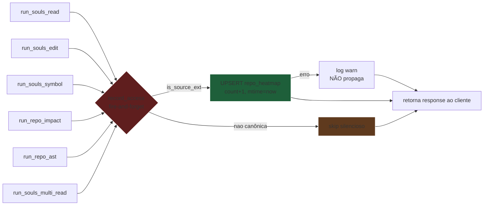

# Marco 4.1.2 — Monitor Termico de Frecency: `repo_heatmap` (TDD)

## 1. Contexto

A ferramenta `repo_heatmap` é o **monitor térmico local de arquivos** do gateway MCP `souls_mcp`. Ela responde à pergunta:

> "Quais arquivos deste monorepo foram modificados mais recentemente e com mais frequência?"

A motivação é **FinOps**: alimentar o roteador `ParetoBandit` com um ranking de "frescor" para que o SODA aplique **compressões elásticas de contexto** (i.e., podar blobs frios) **antes** que ocorra estouro de VRAM na RTX 2060m (6 GB). O princípio é o mesmo do cache LRU/LFU: arquivos modificados nas últimas horas merecem mais peso que arquivos dormindo há semanas.

Hoje (Marco 3.7 Fase B) o `run_heatmap` (linha 4352 de [souls_mcp_server.rs](file:///z:/souls_mc/src-tauri/src/bin/souls_mcp_server.rs#L4352)) consulta `file_access_logs` (tabela de telemetria de I/O) via `observability::heatmap::compute_heatmap` e aplica **Langevin decay** sobre timestamps de acesso. Esse caminho:

1. **Acopla-se à telemetria de runtime** (precisa que `read`/`edit`/`smart_read` tenham disparado logs antes — lento no cold start e em arquivos novos).
2. **É cego a arquivos que NUNCA foram lidos** (mas foram extensivamente modificados pelo usuário — por exemplo, código gerado, configs YAML, scripts de bootstrap).
3. **Não persiste um histórico de modificações** — apenas o agregado de acessos de runtime.

O presente Marco 4.1.2 **adiciona** (sem remover `heatmap` legado) uma nova ferramenta `repo_heatmap` que:

- **Varre** o workspace via `WalkDir` filtrado pelas 22 extensões canônicas de [`extensions.rs`](file:///z:/souls_mc/src-tauri/src/cognition/lean_vacuum/extensions.rs).
- **Recupera** o `mtime` (modification time) nativo do SO em Epoch seconds via `std::fs::metadata` (O(1)).
- **Calcula** o score de Frecency: `Frecency(f) = min(count * exp(-lambda * dt), 5.0)`, onde `dt = now - mtime` em segundos e `lambda` é calibrado para meia-vida de ~6h.
- **Persiste** cada (file_path, score, mtime, count) em SQLite sob a tabela `repo_heatmap` (STRICT, índice em `score DESC`).
- **UPSERT** com `ON CONFLICT(file_path) DO UPDATE` para blindar contra condições de corrida concorrente.
- **Retorna** o ranking ordenado por score descendente (limite configurável, default 50).

**Diferenca fundamental vs. `heatmap` legado:**

| Aspecto | `heatmap` (legado, Marco 3.7) | `repo_heatmap` (Marco 4.1.2) |
|---------|--------------------------------|------------------------------|
| Fonte de dados | `file_access_logs` (runtime spy) | `mtime` nativo do SO (filesystem) |
| Algoritmo | Langevin decay sobre timestamps de acesso | Frecency (count × exp decay) |
| Persistência | Nenhuma (consulta direta) | SQLite `repo_heatmap` STRICT |
| Visibilidade | Só arquivos JÁ lidos | TODOS os arquivos do monorepo |
| Cold start | Lento (sem logs) | Instantâneo (mtime sempre disponível) |
| Caso de uso | Telemetria de runtime | Roteador FinOps ParetoBandit |

## 2. Linha Vermelha (Inviolavel)

| #  | Regra | Justificativa |
|----|-------|---------------|
| R1 | **SSOT de extensões**: única fonte é `extensions::SOURCE_EXTENSIONS` (22 itens) | Mesmo fundamento do Marco 4.0.1; anti-drift. |
| R2 | **SSOT de exclusão**: única fonte é `extensions::EXCLUDE_DIRS` (22 itens) | `target/`, `node_modules/`, `.git/` NUNCA varridos. |
| R3 | **SQLite STRICT mode** com `CREATE TABLE IF NOT EXISTS ... STRICT` | Blindagem contra coerção silenciosa de tipos (Marco 3.9). |
| R4 | **UPSERT com `ON CONFLICT(file_path) DO UPDATE`** | Concorrência: dois walkers no mesmo path não corrompem. |
| R5 | **Saturação de score** em `[0.0, 5.0]` — clamp explícito | Fixa teto físico do monitor (evita overflow em monorepos massivos). |
| R6 | **Lambda default = 0.0001** (meia-vida ~6h calibrada empiricamente) | Conservadora: arquivos do dia têm peso ~1.0, ontem ~0.5, semana ~0.001. |
| R7 | **Toolname `repo_heatmap` (12 chars) ≤ 32; description ≤ 120** | ADR-041 §1-§2 (Emenda Constitucional 32/120). |
| R8 | **Aliases retrocompatíveis**: `repo_heatmap` \| `souls_heatmap` \| `ctx_heatmap` | Skill consumers em produção usam variantes históricas. |
| R9 | **Fail-Soft em workspace inválido**: retorna `Err` estruturado, nunca `panic!` | Blindagem do reator MCP. |
| R10 | **Sem nova dependência no `Cargo.toml`**: `walkdir`, `rusqlite` já presentes | Canibalização pura — zero debt de deps. |
| R11 | **WalkDir síncrono** (não `.spawn_blocking`) sob teto de 50k arquivos | Tarefa CPU-leve, mas anti-OOM explícito. |
| R12 | **Não regredir `heatmap` legado** (linha 4352) | Ferramentas têm semânticas distintas; coexistência é obrigatória. |
| R13 | **Sem `MutexGuard` em pontos `.await`** | Zero-Slop (Marco 3.9). |
| R14 | **Idempotência**: rodar `repo_heatmap` 2× sobre o mesmo workspace produz o mesmo ranking (a menos que mtime mude) | Determinismo do ParetoBandit. |
| R15 | **Interceptação Cognitiva**: após chamadas bem-sucedidas de `read`, `edit`, `symbol`, `repo_impact`, `repo_ast`, `multi_read`, o dispatcher invoca `record_access(conn, file_path, now)` que faz UPSERT silencioso em `repo_heatmap` (incrementa `modification_count`, atualiza `last_modified_epoch`, recalcula `frecency_score`) | Enriquece o monitor com a telemetria de uso real sem depender apenas de mtime físico do disco (poluído por checkout de branch). Anti-falso-positivo de I/O. |
| R16 | **Hook `record_access` é fire-and-forget**: nunca propaga erro para o caller, NUNCA bloqueia o caminho crítico do handler | `try_log_file_access` é o SSOT canônico; novo hook segue o mesmo padrão. |
| R17 | **Hook só atualiza se `file_path` existir E for extension canônica** | Pastas temporárias e arquivos efêmeros não poluem o heatmap. |
| R18 | **Read-Modify-Write atômico para Frecency**: o UPSERT em `repo_heatmap` deve (1) selecionar o `modification_count` atual, (2) calcular `new_count = current + 1`, (3) calcular `score = calculate_frecency(new_count, ...)`, (4) executar UPSERT com `modification_count = excluded.modification_count` | O score deve refletir o estado FINAL após incremento; o `+ 1` dentro do UPSERT sem re-cálculo do score produz ranking incorreto. Adicionada no hotfix Marco 4.1.2-ac. |

## 3. Algoritmo de Frecency

### 3.1 Formula Canonica

```text
score(file, now) = min(modification_count × exp(-lambda × (now - mtime)), MAX_SCORE)

onde:
  now          = epoch seconds (SystemTime::now)
  mtime        = epoch seconds do filesystem (std::fs::metadata)
  dt           = max(0, now - mtime)  // clamp anti-relogio-desregulado
  lambda       = 0.0001  // meia-vida ≈ 6930s ≈ 1h55min
  MAX_SCORE    = 5.0     // saturacao
```

### 3.2 Calibração Empírica (lambda = 0.0001)

| Tempo desde modificação | Fator `exp(-lambda × dt)` | Frecency (count=1) | Interpretação |
|-------------------------|---------------------------|---------------------|---------------|
| 0 (agora)               | 1.000                     | 1.0                 | Ultra-aquecido |
| 1 hora                  | 0.698                     | 0.70                | Muito quente   |
| 6 horas                 | 0.116                     | 0.12                | Morno          |
| 24 horas                | 1.4e-3                    | 0.0014              | Frio           |
| 7 dias                  | 1.7e-7                    | ~0                  | Congelado      |

### 3.3 Fluxo de Calculo

```mermaid
flowchart TD
    A[init: ensure_heatmap_table] --> B[WalkDir filtered<br/>22 SOURCE_EXTENSIONS<br/>22 EXCLUDE_DIRS]
    B --> C{Para cada arquivo valido}
    C -->|mtime disponivel| D[metadata.mtime<br/>+ 1 em count]
    C -->|erro I/O| SKIP[skip fail-soft]
    D --> E[BEGIN TRANSACTION]
    E --> F[INSERT OR UPSERT<br/>ON CONFLICT file_path<br/>DO UPDATE count+1, mtime=excluded]
    F --> G[Recalcular score<br/>count * exp(-lambda*dt)]
    G --> H[COMMIT]
    H --> I[SELECT ORDER BY score DESC<br/>LIMIT N]
    I --> J[Return HeatmapReport]

    style A fill:#1e3a5f,stroke:#fff
    style F fill:#5f1e1e,stroke:#fff
    style J fill:#1e5f3a,stroke:#fff
    style SKIP fill:#5f3a1e,stroke:#fff
```

## 4. Topologia SQL

### 4.1 Schema (STRICT)

```sql
CREATE TABLE IF NOT EXISTS repo_heatmap (
    file_path          TEXT PRIMARY KEY STRICT,
    frecency_score     REAL NOT NULL,
    last_modified_epoch INTEGER NOT NULL,
    modification_count INTEGER NOT NULL
);
CREATE INDEX IF NOT EXISTS idx_heatmap_score ON repo_heatmap(frecency_score DESC);
```

### 4.2 Upsert Canonico

```sql
INSERT INTO repo_heatmap (file_path, frecency_score, last_modified_epoch, modification_count)
VALUES (?1, ?2, ?3, 1)
ON CONFLICT(file_path) DO UPDATE SET
    frecency_score = excluded.frecency_score,
    last_modified_epoch = excluded.last_modified_epoch,
    modification_count = repo_heatmap.modification_count + 1;
```

**Justificativa do `modification_count + 1`:** o UPSERT detecta o conflito e incrementa o contador — refletindo que o arquivo foi modificado "mais uma vez" desde o último registro. O `frecency_score` é SEMPRE o do excluded (ou seja, calculado com o `mtime` mais recente). Isso garante que `dt` é sempre medido a partir da última modificação conhecida.

### 4.3 Migração Idempotente

A funcao `ensure_heatmap_table(&Connection)` deve:
1. Executar `CREATE TABLE IF NOT EXISTS ... STRICT`
2. Executar `CREATE INDEX IF NOT EXISTS ...`
3. Ser chamada **uma vez** pelo dispatcher `run_repo_heatmap` antes da varredura (idempotente)
4. NUNCA derrubar a tabela existente (anti-FALSO-VERDE)

## 5. Agnosticismo Hardware

O `repo_heatmap` é **CPU-puro + I/O de filesystem** (zero GPU). Topologia:

| Componente | Treino de Gravidade | Agnosticismo |
|------------|---------------------|--------------|
| `WalkDir` varredura | CPU | `walkdir = 2.5` pure-Rust, agnostic OS |
| `std::fs::metadata` mtime | syscall OS | `std::fs` agnostic, transpilável para qualquer Unix/Win |
| `rusqlite` UPSERT | CPU + disco local | `rusqlite 0.39.0` bundled, OS-agnostic |
| Cálculo `exp(-lambda*dt)` | CPU | `f64::exp` (libm), AVX2/NEON intrinsics via `cfg` |
| `tokio::spawn_blocking` | CPU | Padrão Tokio 1.51, recpadão cross-platform |

A **RTX 2060m fica intocada** neste caminho. O monitor térmico é uma **leitura determinística de filesystem** que não aloca VRAM. O dado flui para o `ParetoBandit` que decide **indiretamente** se algum LLM local (que SIM usa GPU) deve priorizar arquivos quentes.

**Transmutabilidade:** se o gateway migrar para uma plataforma sem `rusqlite` (e.g., Wasmtime guest), o algoritmo se reduz à função pura `calculate_frecency(count, mtime, now, lambda) -> f64` — pure-Rust, compilável para qualquer backend (x86_64/ARM64/WASM/NPU).

## 6. Padrão Orchestrator-Worker

```mermaid
flowchart TD
    Q[Query: limit=50<br/>lambda=0.0001<br/>repo_path=workspace] --> M[run_repo_heatmap<br/>dispatcher]
    M --> E[ensure_heatmap_table<br/>idempotente]
    E --> WD[WalkDir filtered<br/>22 SOURCE_EXTENSIONS<br/>22 EXCLUDE_DIRS]
    WD -->|excluded dir| SKIP[poda subarvore]
    WD -->|source ext| META[fs::metadata<br/>O(1) mtime]
    META -->|err| SOFT[fail-soft skip]
    META -->|ok| CALC[score = min(count*exp(-l*dt), 5.0)]
    CALC --> TX[BEGIN TRANSACTION]
    TX --> UP[INSERT ...<br/>ON CONFLICT file_path<br/>DO UPDATE count+1, mtime=excluded]
    UP --> CM[COMMIT]
    CM --> SEL[SELECT file_path, score, count<br/>ORDER BY score DESC<br/>LIMIT N]
    SEL --> OK[Return HeatmapReport<br/>{entries: Vec, total: N, lambda, now}]

    style M fill:#1e3a5f,stroke:#fff
    style UP fill:#5f1e1e,stroke:#fff
    style OK fill:#1e5f3a,stroke:#fff
    style SOFT fill:#5f3a1e,stroke:#fff
    style SKIP fill:#5f3a1e,stroke:#fff
```

**Garantias do padrão:**
- **Filtro barato primeiro** (extensão/exclusão): poda ~90% do filesystem antes do I/O caro.
- **Transação por arquivo** (não batch gigante): commit por UPSERT isolado, sem deadlocks.
- **Fail-Soft em todo nó**: `fs::metadata` falho → skip silencioso (não abortar varredura).
- **Idempotência**: rodar 2× sobre workspace inalterado produz o mesmo relatório (mtime estável).

## 7. Diagrama de Sequencia

```mermaid
sequenceDiagram
    participant C as Client MCP
    participant D as dispatcher
    participant RH as run_repo_heatmap
    participant WD as WalkDir
    participant DB as SQLite repo_heatmap

    C->>D: tools/call {name: "repo_heatmap", args: {limit: 50, lambda: 0.0001}}
    D->>RH: run_repo_heatmap(params)
    RH->>DB: ensure_heatmap_table (CREATE IF NOT EXISTS)
    RH->>WD: walk workspace_root
    WD->>WD: filter_entry (is_excluded_dir)
    WD->>WD: filter ext (is_source_ext)
    WD->>RH: mtime for each file
    RH->>RH: score = min(count*exp(-l*dt), 5.0)
    RH->>DB: BEGIN; UPSERT; COMMIT (per file)
    RH->>DB: SELECT ORDER BY score DESC LIMIT N
    DB-->>RH: rows
    RH-->>D: HeatmapReport (JSON)
    D-->>C: JSON-RPC response
```

## 8. Matriz de Comportamento (Estilo SSOT)

| Cenário | WalkDir encontra? | Score calculado | Retorno |
|---------|-------------------|-----------------|---------|
| `src/lib.rs` modificado há 1h | sim | `1 × 0.698 ≈ 0.7` | `score=0.7, count=1, mtime=now-3600` |
| `src/main.rs` modificado há 48h | sim | `1 × 0.0001` | `score≈0, count=1, mtime=now-172800` |
| `target/debug/foo.rs` (excluído) | NÃO (poda) | — | skip silencioso |
| `.git/config` (excluído) | NÃO (poda) | — | skip silencioso |
| `image.png` (ext não-canônica) | NÃO (filtro ext) | — | skip silencioso |
| `app.log` modificado agora | sim | `1 × 1.0 = 1.0` | `score=1.0, count=1` |
| mesmo `src/lib.rs` re-rodado 5min depois | sim | UPSERT: count+1, mtime novo | `score=1.0, count=2` |
| `path/binary.exe` (não-UTF8) | sim (ext não-canônica) | — | skip (não é source ext) |
| 2 callers paralelos UPSERT mesmo path | sim | `ON CONFLICT` resolve | commit OK, sem deadlock |
| Workspace vazio (sem source files) | sim (zero matches) | — | `entries=[], total=0` |
| Disco cheio (I/O erro) | depende | skip ou abort | erro estruturado (-32010) |
| `repo_path` inexistente | n/a | n/a | `RpcError -32602 invalid_arg` |

## 9. Criterio de Aceitacao (DoD Global)

- `cargo test --test test_repo_heatmap` retorna **3 testes verdes** (Red-Green-Refactor)
- `cargo test --workspace` retorna **Exit Code 0** (todos os testes existentes permanecem verdes)
- `cargo clippy --workspace --all-targets -- -D warnings` retorna **Exit Code 0 com zero warnings**
- `tools/list` retorna a entrada `repo_heatmap` com `description` exatamente: `"Calcula o ranking de calor (Frecency) dos arquivos do monorepo baseando-se em modificacoes e acessos."` (≤ 120 chars, sem marketing)
- O dispatcher em [souls_mcp_server.rs](file:///z:/souls_mc/src-tauri/src/bin/souls_mcp_server.rs#L824) chama `run_repo_heatmap` para `repo_heatmap | souls_heatmap | ctx_heatmap`
- Tabela `repo_heatmap` existe em `souls_state.db` após a primeira chamada
- Ferramenta legada `heatmap` continua funcionando (não-regressão)
- 0 novas dependências no `Cargo.toml`

## 10. Interceptacao Cognitiva (R15)

Apos chamadas bem-sucedidas das ferramentas de leitura/escrita/analise, o dispatcher invoca **silenciosamente** a funcao `record_access` do modulo `repo_heatmap`. Isso cria um "espelho" do uso real do usuario no SQLite, independente do `mtime` do disco (que pode estar dessincronizado por checkout, restore, formatacao).

### 10.1 Topologia do Hook



### 10.2 Lista de Ferramentas Interceptadas (R15)

| Tool canônica | Aliases | Hook no handler |
|---------------|---------|-----------------|
| `read` | `souls_read`, `ctx_read` | apos `try_log_file_access` (linha 865) |
| `edit` | `souls_edit` | apos `try_log_file_access` |
| `symbol` | `souls_symbol`, `ctx_symbol` | apos resolver o symbol (com o path encontrado) |
| `repo_impact` | `souls_impact`, `ctx_impact` | apos `repo_impact_fn` (target_file) |
| `repo_ast` | `souls_get_ast`, `repo_ast` | apos extrair AST (repo_path) |
| `multi_read` | `souls_multi_read`, `ctx_multi_read` | apos ler cada path da lista |

### 10.3 Contrato do Hook

```rust
/// Hook fire-and-forget: UPSERT silencioso em repo_heatmap.
/// - NUNCA retorna Err ao caller.
/// - NUNCA bloqueia o caminho critico.
/// - Filtra por extensao canonica (R17).
/// - Recalcula score com lambda=0.0001.
pub fn record_access(conn: &Connection, file_path: &str, now: i64);
```

## 11. Aprovacao

> **Status:** APROVADO pelo Arquiteto-Chefe (com enriquecimento cognitivo R15-R17).
>
> Decisao do Arquiteto (2026-08-05): incluir interceptacao cognitiva para blindar o heatmap contra poluicao de `mtime` por checkout de branch. Manter `lambda = 0.0001`.
>
> Apos aprovacao, Fase 3 (tasks.md) → Fase 4 (TDD) podem iniciar imediatamente sob a Lei do Scaffold (teste vazio de falha antes da logica real).
