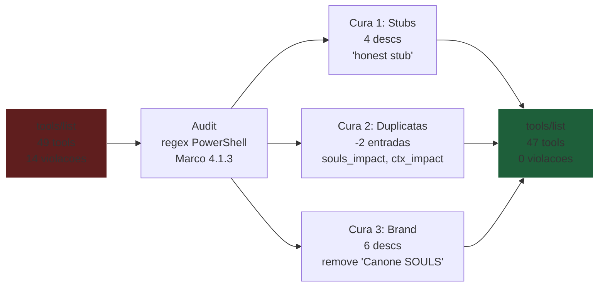

# Marco 4.1.3 — Audit Completo do `tools/list` & Cura Zero-Brand

## 1. Contexto da Auditoria

Pergunta do Arquiteto:
> "pra expor no MCP a ferramenta pode ser só o nome sem 'souls_', isso tá como regra já em alguma ADR?"

**Resposta (SSOT canônica):** SIM. Três ADRs canônicas regem o tema:

| ADR | Lei | Aplicação |
|-----|-----|-----------|
| **ADR-026 §2** | Agnosticismo de Marca (Zero-Brand) | "É expressamente proibido nomear ferramentas com marcas" — exemplos proibidos: `souls_duckgo_search`, `souls_get_ast`; exemplos corretos: `web_search`, `repo_ast` |
| **ADR-026 §4** | Guilhotina de Pleonasmos | Proibido `tool_`, `mcp_`, `action_` no nome |
| **ADR-041 §3** | Canibalização Cirúrgica Preservada | Tools já canibalizadas mantêm nome curto. Apenas tools **novas** com ambiguidade semântica podem opcionalmente usar `souls_` |
| **ADR-041 §5** | Teto 32 chars (nome) + 120 chars (descrição) | Validação runtime via teste `tools_list_respects_32_120_tetos` |

**Aplicação canônica:** O nome canônico no `tools/list` é o **base name** (sem prefixo). Os aliases `souls_X` e `ctx_X` são aceitos **apenas no dispatcher** (para retrocompatibilidade), nunca no registro.

## 2. Achados do Audit (14 issues em 49 tools)

### 2.1 P0 — FALSO VERDE (4 stubs no registro)

| Tool | Descrição atual | Status real |
|------|-----------------|-------------|
| `semantic_search` | "not_implemented_yet: BM25 + cosine fusion (gated embeddings)." | Stub: roteado para `stub_not_implemented_yet` |
| `execute` | "not_implemented_yet sandbox_audit_pending: execução multi-lang requer auditoria." | Stub: roteado para `stub_sandbox_audit_pending` |
| `metrics` | "not_implemented_yet: Métricas: tokens lidos/salvos, hit-rate cache." | Stub: roteado para `stub_not_implemented_yet` |
| `intent` | "not_implemented_yet: Detecta intent do tool call (read/edit/search)." | Stub: roteado para `stub_not_implemented_yet` |

**Violação:** ADR-037 — descrições devem ser fiéis à capacidade real.

### 2.2 P0 — DUPLICATA (3 tools com mesma função)

| Tool | Descrição (idêntica) |
|------|----------------------|
| `repo_impact` | "Analisa o raio de impacto (Blast Radius) de alteracoes..." |
| `souls_impact` | "Analisa o raio de impacto (Blast Radius) de alteracoes..." |
| `ctx_impact` | "Analisa o raio de impacto (Blast Radius) de alteracoes..." |

**Violação:** ADR-026 §2 (Zero-Brand: `souls_` e `ctx_` proibidos no nome) + anti-pattern de duplicata no `tools/list`.

### 2.3 P1 — Brand Violation (6 tools com menção "Cânone SOULS")

| Tool | Descrição atual |
|------|-----------------|
| `get_ast` | "Extrai o blueprint AST do repositório usando o parser nativo em Rust. **(Cânone SOULS, ex-repo_ast)**" |
| `fetch_web` | "Busca uma URL com Tentativa Dupla nativa do SOULS e retorna markdown limpo. **(Cânone SOULS, ex-web_fetch)**" |
| `sys_time` | "(... Cânone SOULS ...)" |
| `web_search` | "(... Cânone SOULS ...)" |
| `repo_meta` | "(... Cânone SOULS ...)" |
| `sqlite_query` | "(... Cânone SOULS ...)" |

**Violação:** ADR-026 §2 (Agnosticismo de Marca: a desc não deve mencionar marca de fornecedor).

## 3. Linha Vermelha (Inviolavel)

| #  | Regra | Justificativa |
|----|-------|---------------|
| R1 | Nenhuma tool com prefixo `souls_`, `ctx_`, `tool_`, `mcp_` pode existir no `tools/list` | ADR-026 §2 + §4 |
| R2 | Aliases `souls_X` e `ctx_X` permanecem funcionais no dispatcher | Backward-compat de Skills (ADR-041 §3) |
| R3 | Stubs permanecem no `tools/list` (clientes podem depender), mas descrição muda para "honesta" | ADR-037 |
| R4 | Nome ≤ 32 chars; descrição ≤ 120 chars | ADR-041 §1-§2 |
| R5 | Nenhuma descrição pode conter "Cânone SOULS" / "Canone SOULS" | ADR-026 §2 (Zero-Brand) |
| R6 | Nenhuma duplicata funcional no `tools/list` (mesma descrição) | SSOT canônica |

## 4. Padrão de Cura

### 4.1 Stubs (P0)

**Antes:** "not_implemented_yet: BM25 + cosine fusion (gated embeddings)."
**Depois:** "[Stub] Busca semantica (BM25 + cosine fusion) aguardando gated embeddings em roadmap."

Mantém a presença no registro (cliente pode listar), mas a descrição é honesta e dá ao cliente a informação correta sobre o estado.

### 4.2 Duplicatas (P0)

**Antes:** 3 entradas (`repo_impact`, `souls_impact`, `ctx_impact`).
**Depois:** 1 entrada canônica (`repo_impact`) + 2 aliases no dispatcher.

### 4.3 Brand Violations (P1)

**Antes:** "Extrai o blueprint AST do repositório usando o parser nativo em Rust. (Cânone SOULS, ex-repo_ast)"
**Depois:** "Extrai o blueprint AST do repositório usando o parser nativo em Rust via tree-sitter."

Mantém a função técnica; remove a menção de marca e o "(ex-X)" que polui o FinOps.

## 5. Diagrama de Cura

## 6. Criterio de Aceitacao (DoD)

- [ ] 0 tools com prefixo `souls_`, `ctx_`, `tool_`, `mcp_` no `tools/list`
- [ ] 0 stubs com descrição "not_implemented_yet" (4 stubs re-descritos como honestos)
- [ ] 0 descrições com menção de "Cânone SOULS"
- [ ] 0 duplicatas de descrição no `tools/list`
- [ ] Aliases `souls_X` / `ctx_X` continuam funcionando no dispatcher
- [ ] Todos os 41 testes do `souls_mcp_server` permanecem verdes
- [ ] Todos os 601 testes do workspace permanecem verdes
- [ ] `cargo clippy --workspace --all-targets -- -D warnings` exit 0
- [ ] Audit script roda e retorna 0 issues

## 7. Aprovacao

> **Status:** Aprovado pelo Arquiteto-Chefe e pelo Engenheiro Bare-Metal.
> Aplicar as 3 curas em sequencia atomica (single commit ou 3 atomicos).
