# Marco 4.1.0 — Motor Sensorial de Blast Radius: `repo_impact`

## 1. Contexto

O workspace homologou 100% de verdes na Cura das 11 Cicatrizes (Marco
4.0.1). O SODA ainda dependia de um stub parcial em
[`cognition/observability/impact.rs`](file:///z:/souls_mc/src-tauri/src/cognition/observability/impact.rs):

- Reconhece **apenas** `.rs` (regex `use`/`mod`).
- Exclui diretórios por hard-coded `name == "target" || ...` (drift
  garantido).
- Schema de retorno legado: `{ target, affected: Vec<String>, depth }`.
- Sem `max_depth` explícito; sem detecção de ciclos documentada.

A presente Fase **canibaliza** esse stub para o cânone sensorial do
`lean_vacuum` (Motor Saco a Vácuo), dando à IDE a primeira capacidade
sensorial cognitiva **multilíngue** e respeitando o **SSOT** de Marco
4.0.1 (`lean_vacuum::extensions` — 22 extensões canônicas, 22
exclusões).

A nova ferramenta `repo_impact` responderá instantaneamente à pergunta
arquitetural: *"Se eu alterar este arquivo, o que potencialmente quebra
na árvore de dependências?"*.

## 2. Linha Vermelha (Inviolável)

| #   | Regra | Justificativa |
|-----|-------|---------------|
| R1  | Zero CUDA / Python / Node | Stack bare-metal Rust + Tokio. |
| R2  | `serde_json` proibido > 1MB | Streaming tokens / RAM Host. |
| R3  | `EXCLUDE_DIRS` e `SOURCE_EXTENSIONS` exclusivos de `lean_vacuum::extensions` | SSOT de Marco 4.0.1. |
| R4  | WalkDir READ-ONLY | Ferramenta sensorial; mutação é papel do `edit`. |
| R5  | `HashSet<PathBuf>` local, sem Mutex | BFS O(1) determinístico; Zero-Slop. |
| R6  | Ciclos cortados via `visited.contains()` | Anti-Stack-Overflow. |
| R7  | `thiserror` enums ou `String` no boundary | Sem `Box<dyn Error>` no hot path. |
| R8  | Pin `tokio 1.51.1`, `regex 1.12.4`, `walkdir 2.5.0` | Pinos do `Cargo.toml`. |
| R9  | Payload final serializado **uma única vez** no boundary MCP | Lei Zero-Copy ADR-026. |
| R10 | Descrição MCP ≤ 120 caracteres, sem marketing | ADR-037 + Emenda 32/120. |

## 3. Agnosticismo Hardware

A nova `repo_impact` é **100% CPU-side** e opera em **RAM Host**
apenas. Não toca GPU, VRAM, NPU, Metal ou Vulkan. Ela é
estruturada sob o **Trait Bound Agnóstico** abaixo para que
recompilações transmutáveis (CubeCL/Burn/etc.) sejam triviais:

| Aspecto | Treino de Gravidade | Agnosticismo |
|---------|---------------------|--------------|
| I/O de FS | `walkdir` (std + crate) | Plataforma-agnostic (POSIX/Win/NTFS/ReFS) |
| Regex de import | `regex 1.12.4` (Rust) | AOT puro; intrinsics AVX2 sob `cfg` |
| BFS | `HashSet<PathBuf>` + `VecDeque<(PathBuf, u8)>` | Std-only; portável para qualquer arquitetura |
| Serialização | `serde_json` (1× no boundary MCP) | Zero-copy no hot path |
| Memória | Heap mínimo (visited cresce com V) | Sem arena global; vida = 1 call |

A RTX 2060m não é tocada. A ferramenta é **O(1) de GPU** e
**O(V+E) de CPU/RAM**, com heap limited a `8 * V * sizeof(PathBuf)`
(~256 bytes/Path em Windows = ~64 KB para V=250 arquivos).

## 4. Padrão Orchestrator-Worker

```mermaid
flowchart TD
    MCP["MCP Tool Caller<br/>(JSON-RPC)"] -->|"repo_impact(params)"| DISP["souls_mcp_server.rs<br/>dispatcher (run_repo_impact)"]

    DISP --> ARGS["ExtractArgs<br/>file_path: String<br/>max_depth: u8 (default 3)"]

    ARGS -->|root| O["Orchestrator: repo_impact()<br/>(cognition/lean_vacuum/repo_impact.rs)"]

    subgraph LEAN["lean_vacuum (Saco a Vácuo)"]
        W1["Worker 1: WalkDir<br/>(filter is_excluded_dir + is_source_ext)"]
        W2["Worker 2: ImportExtractor<br/>(regex multilíngue: use/import/require/from)"]
        W3["Worker 3: BFS Reverso<br/>(HashSet visited + VecDeque)"]
        W1 --> G[("ImportGraph<br/>A importa B")]
        G --> W2
        W2 -->|transpor| W3
    end

    O --> W1
    W3 -->|ImpactReport| OUT["Payload MCP<br/>{target_file, total_impacted_files,<br/>max_depth_reached, impact_graph: {nodes, edges}}"]

    subgraph GUARD["Guardas Anti-Entropia"]
        G1["EXCLUDE_DIRS (22)"] -.injetado.-> W1
        G2["SOURCE_EXTENSIONS (22)"] -.injetado.-> W1
        G3["visited: HashSet<PathBuf>"] -.injetado.-> W3
        G4["thiserror RepoImpactError"] -.boundary.-> DISP
    end

    style O fill:#1e3a5f,stroke:#fff
    style W3 fill:#1e5f3a,stroke:#fff
    style OUT fill:#5f3a1e,stroke:#fff
```



## 5. Contratos Rígidos (SSOT Comportamental)

### 5.1 Schema MCP `tools/list`

```json
{
  "name": "repo_impact",
  "description": "Analisa o raio de impacto (Blast Radius) de alterações de arquivos via travessia reversa de dependências.",
  "inputSchema": {
    "type": "object",
    "properties": {
      "file_path": { "type": "string", "description": "Caminho do arquivo-alvo (relativo ao repo root ou absoluto)." },
      "max_depth": { "type": "integer", "description": "Profundidade máxima do BFS reverso (1..=10, default 3).", "minimum": 1, "maximum": 10, "default": 3 }
    },
    "required": ["file_path"],
    "additionalProperties": false
  }
}
```

Aliases aceitos: `repo_impact`, `souls_impact`, `ctx_impact` (3 nomes
roteando para a mesma implementação, preservando integridade com
testes históricos que invocam nomes legados).

### 5.2 Schema MCP de retorno

```json
{
  "target_file": "src/cognition/lean_vacuum/repo_impact.rs",
  "total_impacted_files": 5,
  "max_depth_reached": 2,
  "impact_graph": {
    "nodes": ["A.rs", "B.rs", "C.ts", "D.py"],
    "edges": [
      { "from": "A.rs", "to": "B.rs" },
      { "from": "B.rs", "to": "C.ts" }
    ]
  }
}
```

### 5.3 Algoritmo BFS Reverso

1. **WalkDir filtrado:** itera o `root` aplicando
   `is_excluded_dir` (22 entradas) e `is_source_ext` (22 entradas).
2. **ImportExtractor:** para cada arquivo, aplica regex multilíngue
   que captura:
   - Rust: `use crate::...::path`, `use super::...`, `mod foo;`
   - TS/JS: `import ... from "..."`, `require("...")`
   - Python: `from .x import y`, `import x`, `from x import y`
   - Go: `import "..."`
   - C/C++: `#include "..."`
3. **Construção do `ImportGraph`:** `BTreeMap<PathBuf, Vec<PathBuf>>`
   (chave = importer, valor = importees).
4. **Transpor:** inverte arestas, criando
   `BTreeMap<PathBuf, Vec<PathBuf>>` (chave = importee, valor = importers).
5. **BFS reverso:** `VecDeque<(PathBuf, u8)>` partindo do `target`.
   - `visited: HashSet<PathBuf>` corta ciclos em O(1).
   - `max_depth` limita profundidade (default 3, clamp 1..=10).
   - `total_impacted_files = result.len()`.
   - `max_depth_reached = max(depth) ` em `result`.
6. **Serialização boundary:** `serde_json::json!({...})` 1× no MCP.

## 6. Matriz de Mudanças

| Camada | Arquivo | Tipo | DoD |
|--------|---------|------|-----|
| L1 | `cognition/lean_vacuum/repo_impact.rs` | NOVO | Compila + 5 testes unitários verdes |
| L1 | `cognition/lean_vacuum/mod.rs` | EDIT | `pub mod repo_impact;` + `pub use` |
| L2 | `bin/souls_mcp_server.rs` | EDIT | Schema `repo_impact` no `tools/list` |
| L2 | `bin/souls_mcp_server.rs` | EDIT | Dispatcher unificado: `repo_impact \| souls_impact \| ctx_impact` → `run_repo_impact` |
| L2 | `bin/souls_mcp_server.rs` | EDIT | `run_impact` antigo removido (canibalizado) |
| L3 | `tests/test_repo_impact.rs` | NOVO | 3 contratos rígidos verdes |
| L4 | `docs/work-units/active/marco-4.1-repo-impact/{design,tasks}.md` | NOVO | Work unit completa |

## 7. Critério de Aceitação (DoD Global)

- [ ] `cargo test --test test_repo_impact` retorna **Exit Code 0** com
      3 contratos verdes em < 100 ms total.
- [ ] `cargo test --workspace` retorna **Exit Code 0** mantendo os
      testes históricos verdes.
- [ ] `cargo clippy --workspace --all-targets -- -D warnings` retorna
      **Exit Code 0** com **0 warnings**.
- [ ] Schema `repo_impact` registrado em `tools/list` com descrição
      ≤ 120 caracteres e sem marketing.
- [ ] Aliases `souls_impact` e `ctx_impact` retornam o mesmo payload
      que `repo_impact` (testado).
- [ ] WalkDir respeitando `is_excluded_dir` (testado: ignora
      `target/`, `node_modules/`, `.git/`, `.souls_cache/`).
- [ ] WalkDir respeitando `is_source_ext` (testado: inclui 22
      extensões, rejeita `md`, `txt`, `png`).
- [ ] `visited: HashSet<PathBuf>` corta ciclo A↔B (testado em
      `test_repo_impact_cyclic_protection`).
- [ ] `max_depth=1` poda dependentes nível 2+ (testado em
      `test_repo_impact_respects_max_depth`).

## 8. Pedido de Aprovação

**Arquiteto-Chefe, o design e o roteamento agnóstico estão aprovados?**

- [ ] Aprovado para Fase 4 (implementação TDD)
- [ ] Aprovado com ajustes (especificar)
- [ ] Rejeitado (justificar)
