# SOULS MARCO 4.10.0 — Saneamento de Dívidas e Acoplamento Cognitivo (DoD)

## 1. Contexto

Auditoria Forense 360° identificou **5 pontos de dívida técnica** que mantêm
o Hipocampo Epistêmico (`epistemic_prober.rs`) e o Escudo L7
(`agentgateway_tcp_proxy.rs`) em estado de **stub acoplado**:

1. **Verbalizadores estáticos** — `verbalizer_ratio` usa ranges contíguos
   (`0..32`, `32..64`, ...) hard-coded no vocabulário mock de 128 tokens. Se
   o modelo for real, esses slices não correspondem aos IDs físicos de
   `"true"`, `"false"`, `"yes"`, `"no"`, `"0"`, `"1"`.
2. **Cohomologia ausente** — `conflito_memoria` é puramente uma razão de
   massas de probabilidade. Não há detecção de contradições lógicas no grafo
   de fatos STABLE.
3. **Disjuntor sem IPC** — `disjuntor_ativo: true` é retornado no payload MCP,
   mas o frontend Svelte não tem canal estruturado para renderizar o
   micro-sidecar de clarificação socrática.
4. **Escudo L7 ausente** — o proxy intercepta `/v1/chat/completions` para
   compressão CCR, mas **não** tria o tool-calling (`execute`, mutação de
   arquivos) contra o disjuntor socrático.
5. **Testes de DoD faltantes** — não há prova de que contradições no grafo
   SQLite elevam `conflito_memoria`, nem que o proxy bloqueia tool-calls
   perigosos.

Este marco **congela a expansão de novas milestones** e foca exclusivamente
em transformar os 5 stubs em fiações reais de produção, mantendo
**zero warnings** (ADR-025) e **268+ testes existentes verdes**.

## 2. Linha Vermelha (Inviolável)

| # | Regra | Justificativa |
|---|-------|---------------|
| R1 | Verbalizadores DEVEM ser resolvidos em runtime via tokenizador real | Slice estático = alucinação de produção |
| R2 | Motor de cohomologia opera em **stack/VLA** (≤1024 fatos) | Zero-Heap, Zero-Slop, latência < 1ms |
| R3 | Disjuntor socrático via IPC Zero-Copy (Tauri event) | Sem polling, sem locks globais |
| R4 | Escudo L7 aplica-se **apenas** a tool-calls com `risk_class ≥ 0.70` | Read-only tools não tocam o disjuntor |
| R5 | Os 12 testes existentes de `epistemic_prober.rs` permanecem verdes | Backward-compat do contrato MCP |
| R6 | Sem dependências transitivas novas além de `rusqlite` (já em uso) | Higiene de crates |
| R7 | Compilação sob Tokio `1.51.1` + rustc `1.94.1` | Toolchain host fixado |
| R8 | `cargo clippy --workspace -- -D warnings` Exit 0 | ADR-025 100/100 |

## 3. Agnosticismo Hardware

| Componente | Treino de Gravidade | Agnosticismo |
|------------|---------------------|--------------|
| `VerbalizerMap` (token IDs) | CPU genérico (FNV-1a fallback) | Quando real: `llama-cpp-2` abstrai ggml-cpu/metal/cuda |
| `CohomologyEngine` (H¹) | CPU AVX2 (matrix rank via Gaussian elimination parcial) | Sem GPU; intrinsics guardados por `cfg(target_arch)` |
| `DisjuntorSocratico` (IPC) | Tauri v2 event (zero-copy binário) | Agnóstico de backend; Svelte 5 + Rust spawn |
| `L7 Shield` (proxy) | Tokio + httparse | Idêntico em todas as plataformas |
| `SqliteFactGraph` (cohomologia) | rusqlite WAL | ReFS no Windows, ext4 em Linux — agnostic |

A **RTX 2060m** é tocada apenas pelo `llama_tokenize` (que delega ao
backend ggml já configurado). Cohomologia, IPC, e Escudo L7 são
**100% CPU/AVX2**.

## 4. Padrão Orchestrator-Worker

```mermaid
flowchart TD
    subgraph "Camada 1: Hipocampo Epistêmico (CPU/AVX2)"
        V[VerbalizerMap::resolve]
        V -->|MOCK: FNV-1a| M1[MockTokenResolver]
        V -->|REAL: llama_tokenize| M2[LlamaTokenResolver]
        M1 --> W1[LlamaCppEpistemicProber.probe]
        M2 --> W1
        W1 --> S1[Scores: amb, risco, conflito]
    end

    subgraph "Camada 2: Cohomologia de Feixes Celulares"
        G[SqliteFactGraph::load_stable]
        G --> I[Build incidence matrix d0]
        I --> R[Compute rank via Gaussian elimination]
        R --> H1{H¹ ≠ 0?}
        H1 -->|Sim| BOOST[Boost conflito_memoria > 0.85]
        H1 -->|Não| PASS[conflito_memoria = prober score]
        BOOST --> S1
        PASS --> S1
    end

    subgraph "Camada 3: Disjuntor Socrático (IPC Zero-Copy)"
        S1 --> D{disjuntor_ativo?}
        D -->|true| T1[Tauri emit: socratic_interrupt]
        T1 --> S5[Svelte 5: sidecar inline]
        S5 --> S6[HITL: usuario clarifica]
        S6 --> R2[Re-rodar probe]
        R2 --> S1
        D -->|false| N1[Pipeline continua]
    end

    subgraph "Camada 4: Escudo L7 (proxy TCP)"
        P1[incoming RPC: execute/edit/delete]
        P1 --> P2{Tool name mutating?}
        P2 -->|Não| P3[pass-through]
        P2 -->|Sim| P4[LlamaCppEpistemicProber.probe]
        P4 -->|risk_class < 0.70| P5[forward to terminal]
        P4 -->|risk_class ≥ 0.70| P6[redirect to Agent Inbox]
        P6 --> P7[notify Tauri: hitl_required]
    end

    style V fill:#1e3a5f,stroke:#fff
    style G fill:#1e5f3a,stroke:#fff
    style D fill:#5f1e1e,stroke:#fff
    style P4 fill:#5f1e5f,stroke:#fff
```



## 5. Matriz de Materialização por Camada

| Camada | Arquivo | Tipo de Mutação | DoD |
|--------|---------|-----------------|-----|
| L1 | `core/epistemic_prober.rs` (EDIT) | Adicionar `VerbalizerMap` (mock/real) + refatorar `verbalizer_ratio` | 4 testes TDD (mock determinístico + real via `tokenize` + edge cases) |
| L2 | `core/cohomology.rs` (NOVO) | `SqliteFactGraph` + `d0` + `rank` + `boost_score` | 3 testes TDD (grafo acíclico, grafo com ciclo, fato isolado) |
| L2 | `core/mod.rs` (EDIT) | `pub mod cohomology;` | `cargo check` Exit 0 |
| L3 | `bin/souls_mcp_server.rs` (EDIT) | `run_intent` invoca `CohomologyEngine` antes do disjuntor | 1 teste TDD (boost dispara H¹ ≠ 0) |
| L3 | `bin/souls_mcp_server.rs` (EDIT) | Emite `socratic_interrupt` via Tauri event quando disjuntor_ativo | 1 teste TDD (payload IPC contém `suspend: true`) |
| L4 | `bin/agentgateway_tcp_proxy.rs` (EDIT) | `epistemic_shield(payload)` antes do `mutate_json_payload` | 2 testes TDD (read-only passa, mutating bloqueado em risk≥0.70) |
| L5 | `core/epistemic_prober.rs` (TEST) | `test_verbalizer_map_*` + `test_cohomology_*` | DoD Global |
| L5 | `core/cohomology.rs` (TEST) | `test_*` para cada invariante | DoD Global |

## 6. Comportamento Esperado por Camada

### 6.1 VerbalizerMap (ETAPA 1)

```rust
// Modo MOCK (sem modelo real carregado)
let map = VerbalizerMap::for_mock_vocab(128);
assert_eq!(map.resolve("true"), Some(3));   // FNV-1a("true") % 128
assert_eq!(map.resolve("false"), Some(7));

// Modo REAL (tokenizer carregado)
let map = VerbalizerMap::from_tokenizer(&llama_ctx);
assert!(map.resolve("true").is_some());
assert!(map.resolve("yes").is_some());
```

### 6.2 Cohomologia (ETAPA 2)

```rust
// Grafo acíclico: A -> B -> C
// dim H¹ = m - n + c = 0 (1 componente conectada, sem ciclos)
let graph = SqliteFactGraph::from_stable(&conn);
assert_eq!(graph.first_betti_number(), 0);

// Grafo com ciclo: A -> B -> C -> A
// dim H¹ = 1
let cyclic = SqliteFactGraph::with_cycle(&conn);
assert_eq!(cyclic.first_betti_number(), 1);
assert!(cyclic.boost_conflito_memoria(0.5) > 0.85);
```

### 6.3 Disjuntor Socrático (ETAPA 3)

```rust
let scores = prober.probe(&req)?;
if scores.disjuntor_ativo {
    app_handle.emit("socratic_interrupt", &DisjuntorSocratico {
        suspend: true,
        ambiguidade: scores.ambiguidade,
        prompt_meta: extract_prompt_meta(&req),
    })?;
    return Err(RpcError::SocraticClarificationRequired);
}
```

### 6.4 Escudo L7 (ETAPA 4)

```rust
// Em handle_l7_proxy, antes de mutate_json_payload:
if is_mutating_tool_call(&body) {
    let risk = probe_payload_risk(&body);
    if risk >= 0.70 {
        redirect_to_agent_inbox(&body);
        notify_hitl_required(&body);
        return Ok(());
    }
}
```

## 7. Critério de Aceitação (DoD Global)

- `cargo check --workspace` Exit Code 0 com **zero warnings** (ADR-025)
- `cargo clippy --workspace --all-targets -- -D warnings` Exit Code 0
- `cargo test --workspace` Exit Code 0 com **268+ testes verdes** (preservar)
- Mínimo **+10 testes TDD** novos:
  - 4x `test_verbalizer_map_*` (mock determinístico, real tokenize, edge cases, fallback)
  - 3x `test_cohomology_*` (grafo acíclico, cíclico, isolado, boost threshold)
  - 1x `test_intent_disjuntor_emits_socratic_signal` (IPC payload)
  - 2x `test_l7_shield_*` (read-only passa, mutating bloqueado)
- `boot.ps1` transplanta os 3 binários sem regressão de handles NTFS
- `gateway-config.yaml` continua apontando para `souls_mcp` (sem novo server)

## 8. Pedido de Aprovação

**Arquiteto, o design e o roteamento agnóstico estão aprovados?**

- [ ] Aprovado para Fase 4 (criar `tasks.md` com DoD atômico por worker)
- [ ] Aprovado com ajustes (especificar)
- [ ] Rejeitado (justificar)
