# SOULS MARCO 4.9.2 — Cura Sintática Contextual e Blindagem de Compressão

## 1. Contexto

Auditoria Forense 360° do SODA identificou **dois pontos críticos** de *code slop* e SDC (Corrupção Silenciosa de Dados) na esteira ativa:

1. **`response_healing.rs`** ([src-tauri/src/core/response_healing.rs](file:///z:/souls_mc/src-tauri/src/core/response_healing.rs#L120-L125)) — O bloco de normalização de primitivos (`out.replace(": True", ": true")`, etc.) é cego: substitui qualquer ocorrência de `": True"` mesmo dentro de **strings literais válidas** do payload JSON do usuário. Cenário de teste: `{"query": "Answer: True"}` → o parser atual corromperia a string para `{"query": "Answer: true"}` se o LLM upstream enviasse a string contendo a substring `": True"` (improvável mas constitucionalmente possível — Defesa Bayesiana: tratar como adversarial).

2. **`souls_read.rs`** ([src-tauri/src/cognition/context/souls_read.rs](file:///z:/souls_mc/src-tauri/src/cognition/context/souls_read.rs#L56-L64)) — O stripping de `//` e `/* */` é **incondicional** (não depende de `ext`), o que viola a cerca perimétrica de prosa. Para `ext = Some("md")` ou `None`, a função não está sob whitelist invertida, expondo bullet points Markdown iniciados com `//` (raros mas constitucionais) e blocos de fenced code iniciados com `/*` a stripping silencioso.

3. **SSE frame truncation** ([src-tauri/src/bin/agentgateway_tcp_proxy.rs](file:///z:/souls_mc/src-tauri/src/bin/agentgateway_tcp_proxy.rs#L182-L215)) — O `SseFrameAccumulator` empurra frames brutos ao consumidor sem cura sintática. Quando o upstream LLM trunca o stream abruptamente (fim de VRAM, limite de tokens), o JSON entregue vem sem fechamento de `}`/`]`, causando `serde_json::from_str` error no consumer (Tauri IPC, MCP, headroom loopback).

## 2. Linha Vermelha (Inviolável)

| # | Regra | Justificativa |
|---|-------|---------------|
| R1 | Substituições cegas `.replace(": True", ": true")` **PROIBIDAS** | Corrompem strings literais válidas do payload do usuário (SDC adversarial) |
| R2 | Normalização de primitivos True/False/None **estrutural apenas** | Parser recursivo do `jsonrepair` opera dentro do tokenizer JSON, sem tocar em strings |
| R3 | `jsonrepair` deve usar pin rígido `=0.1.0` (operador `=`) | ADR-030 Módulo 4 — version pinning forçado |
| R4 | `aggressive_compress` com `ext = Some("md" | "markdown")` ou `None` **NUNCA** strippa `#`, `//`, `/* */`, `--` | Cerca perimétrica de prosa; preserva cabeçalhos Markdown |
| R5 | `SseFrameAccumulator` deve fechar delimitadores truncados em < 1ms antes de entregar | Latência obrigatória do pipeline L7 (DoD proxy) |
| R6 | Zero dependências transitivas novas além de `memchr` (já transitiva de `regex`) | `jsonrepair` declara `memchr ^2` como única dep obrigatória |
| R7 | Compilação obrigatória sob Tokio `1.51.1` + rustc `1.94.1` (toolchain host) | Edition 2024 do jsonrepair exige rustc ≥ 1.85 |
| R8 | Toolchain externo proibido: `jsonrepair` já está no ecossistema crates.io; sem git/path deps | Higiene de crates — fontes canônicas apenas |

## 3. Agnosticismo Hardware

A cura sintática e o cercadinho de prosa são **100% agnósticos de hardware**. Não há intrinsics AVX2, não há GPU, não há dependência de plataforma:

| Componente | Treino de Gravidade | Agnosticismo |
|------------|---------------------|--------------|
| `response_healing::heal_malformed_json` | CPU genérico (Rust + jsonrepair) | Zero-arquitetura, byte-puro |
| `response_healing::StreamRepairer` (SSE) | CPU genérico | Transpilável para qualquer backend (zero-Copy IPC preservado) |
| `aggressive_compress` (md fence) | CPU genérico (parser manual stdlib) | Sem features `cfg(target_arch)` |
| `jsonrepair` crate | memchr (CPU SIMD opcional) | Compila em x86_64, aarch64, riscv64 sem flags |

A **RTX 2060m** não é tocada. Nenhum dos 3 arquivos contém intrinsics CUDA, Metal ou Vulkan. A cura opera em strings puras (Rust `&str` → `String`), o que garante **transmutabilidade** total entre backends (`CubeCL`/`Burn`/`candle`) caso a inferência migre para GPU dedicada.

## 4. Padrão Orchestrator-Worker

```mermaid
flowchart TD
    subgraph "Camada 1: Response Healing (sync < 1ms)"
        H1[heal_malformed_json]
        H2[jsonrepair::repair_json]
        H3[jsonrepair::StreamRepairer]
        H1 -->|Cow::Borrowed fast-path| H2
        H1 -->|Cow::Owned full parse| H2
        H3 -->|frame chunk| H1
    end

    subgraph "Camada 2: SSE Frame Accumulator (agentgateway_tcp_proxy)"
        S1[TcpStream upstream] -->|raw bytes| S2[SseFrameAccumulator.push_chunk]
        S2 -->|frame delimitado| S3{heal_malformed_json<br/>< 1ms}
        S3 -->|Cow::Borrowed| S4[downstream write_all]
        S3 -->|Cow::Owned| S5[jsonrepair::StreamRepairer.flush]
        S5 --> S4
        S4 --> S6[intercept_loopback CCR]
    end

    subgraph "Camada 3: Compressor Cerda (souls_read)"
        C1[aggressive_compress]
        C2{ext whitelist<br/>invertida}
        C2 -->|md/markdown/None| C3[BYPASS: no stripping]
        C2 -->|rs/py/ts/js/cpp/ex/exs/c/h/go/java/rb/sh/bash/zsh/yaml/toml/sql/html/htm/xml/svg| C4[Strip comments estrutural]
        C3 --> C5[lightweight_cleanup]
        C4 --> C5
    end

    H2 -.parser recursivo.-> J[jsonrepair 0.1.0<br/>pin = 0.1.0]
    J -.PRIMARY.-> SR[Repair to String + Repair Streaming]
    SR -.ADVERSARIAL.-> SB[String literal preservation]
    SB -.CONTRACT.-> T[test_response_healing_with_user_strings]

    style H1 fill:#1e3a5f,stroke:#fff
    style S3 fill:#5f1e1e,stroke:#fff
    style C2 fill:#1e5f3a,stroke:#fff
    style J fill:#5f3a1e,stroke:#fff
    style T fill:#5f1e5f,stroke:#fff
```



**Fluxo de controle (Orquestrador):**

1. **Orquestrador SSE** (`agentgateway_tcp_proxy::handle_upstream_response`): ao receber um frame bruto do upstream, injeta o `heal_malformed_json` como **gate síncrono** antes do `write_all` para downstream. Latência alvo: < 1ms por frame (micro-serviço loopback).

2. **Worker Compressor** (`souls_read::aggressive_compress`): consulta a cerca perimétrica (`ext`) e decide se strippa ou bypassa. Markdown e prosa caem no `BYPASS` path — nenhuma mutação textual.

3. **Worker Parser** (`jsonrepair::repair_json`): recebe string malformada, devolve string estritamente RFC 8259. **Strings literais do payload são imutáveis** — apenas primitivas soltas (`True` → `true`, `None` → `null`) são normalizadas no nível do tokenizer.

## 5. Matriz de Materialização por Camada

| Camada | Arquivo | Tipo de Mutação | DoD |
|--------|---------|-----------------|-----|
| L1 | `src-tauri/Cargo.toml` (EDIT) | Adicionar `jsonrepair = "=0.1.0"` | Pin rígido + `cargo tree` confirma resolução única |
| L1 | `src-tauri/src/core/response_healing.rs` (REWRITE) | `heal_malformed_json` usa `jsonrepair::repair_json`; `repair_json_buffer` delega | `cargo check` + 4 testes TDD (1ms + Cow + user strings + primitive norm) |
| L1 | `src-tauri/src/bin/agentgateway_tcp_proxy.rs` (EDIT) | Acoplar `heal_malformed_json` no `handle_upstream_response` para cada frame | `cargo check` + 1 teste TDD (frame truncado é curado) |
| L1 | `src-tauri/src/cognition/context/souls_read.rs` (EDIT) | Whitelist invertida: `is_prose` gate antes de qualquer stripping | `cargo check` + 3 testes TDD (md preserva, None preserva, code strippa) |
| L2 | `src-tauri/src/cognition/context/souls_read.rs` (EDIT — imports) | Manter stdlib puro (sem novas deps) | Nenhum warning de `unused_imports` |
| L3 | (sem alteração) | — | — |

## 6. Comportamento Esperado por Camada

### 6.1 Response Healing

```rust
// Cenário adversarial: string do usuário contém a substring ': True'
let input = r#"{"query": "Answer: True", "data": [1, 2, 3, }"#;
let healed = heal_malformed_json(input);
// Esperado: {"query":"Answer: True","data":[1,2,3]}
//                          ^^^^^^^^^^^^ string preservada
//                                         ^^^^^^^^^^ array curado
```

```rust
// Cenário normal: primitivos Python/JS soltos são normalizados estruturalmente
let input = r#"{status: True, count: None, ok: False}"#;
let healed = heal_malformed_json(input);
// Esperado: {"status":true,"count":null,"ok":false}
```

### 6.2 SSE Stream Truncation Cure

```rust
// Cenário: stream upstream trunca abruptamente (limite de VRAM)
let partial_frame = r#"data: {"choices":[{"delta":{"content":"Hel"#;
// jsonrepair::StreamRepairer fecha delimitadores e injeta aspas finais
let cured = jsonrepair::StreamRepairer::new(opts).push(partial_frame)?.unwrap();
// Esperado: data: {"choices":[{"delta":{"content":"Hel"}"}]}
```

### 6.3 Compressor Fence

```rust
// Cenário: arquivo .md com cabeçalhos e bullet points
let md = "# Título\n## Subtítulo\n- item 1\n- item 2";
let out = aggressive_compress(md, Some("md"));
// Esperado: # Título\n## Subtítulo\n- item 1\n- item 2 (intacto)
```

```rust
// Cenário: arquivo .rs com comentários legítimos
let rs = "// debug print\nfn main() {}";
let out = aggressive_compress(rs, Some("rs"));
// Esperado: fn main() {} (// removido, código preservado)
```

## 7. Critério de Aceitação (DoD Global)

- `cargo check --workspace` retorna Exit Code 0 com **zero warnings** (ADR-025)
- `cargo clippy --workspace --all-targets -- -D warnings` retorna Exit Code 0
- `cargo test --workspace` retorna Exit Code 0 com **268+ testes verdes** (preservar contagem atual)
- Mínimo **+4 testes TDD** novos:
  - `test_response_healing_with_user_strings` (proteger `{"query": "Answer: True"}`)
  - `test_response_healing_normalizes_python_primitives_structurally` (True/False/None soltos)
  - `test_sse_accumulator_cures_truncated_frame` (fechamento de delimitadores em < 1ms)
  - `test_aggressive_compress_preserves_markdown_headers` (`# Título` intacto em `.md`)
  - `test_aggressive_compress_preserves_prose_with_none_ext` (cercadinho `None` bypassa tudo)
- `Cargo.lock` regenerado, `jsonrepair 0.1.0` declarado como dep obrigatória
- `cargo tree -p jsonrepair` mostra apenas `memchr ^2` como dependência transitiva obrigatória

## 8. Pedido de Aprovação

**Arquiteto, o design e o roteamento agnóstico estão aprovados?**

- [ ] Aprovado para Fase 3 (criar `tasks.md` com DoD atômico)
- [ ] Aprovado com ajustes (especificar)
- [ ] Rejeitado (justificar)
