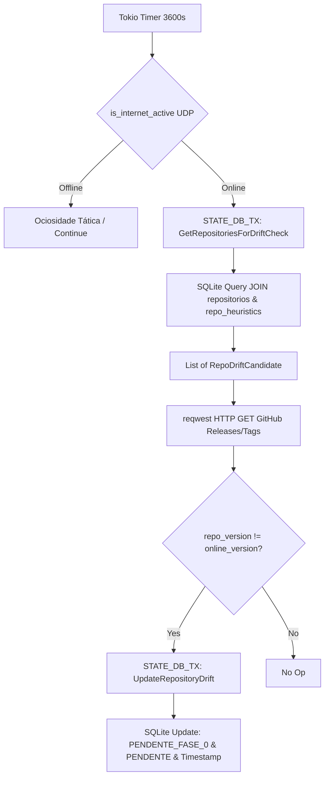

# Design Specification — MARCO 5.14.0 (Drift Sentinel)

## Hardware-Agnostic Statement
Solution operates asynchronously in host network stack without consuming GPU/VRAM resources, adhering strictly to FinOps and local-first architecture.
