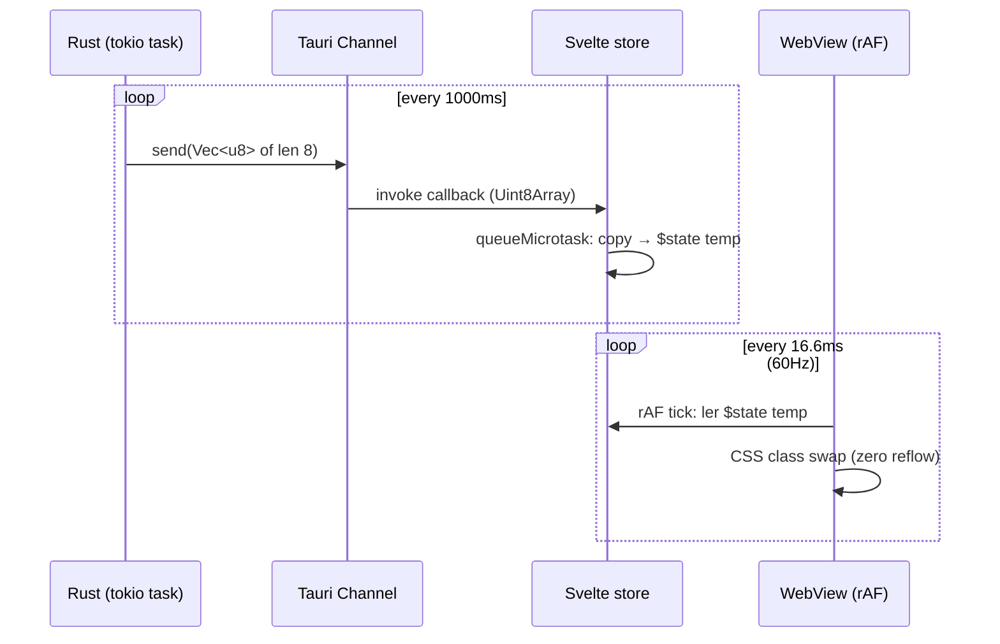

# Marco V — SODA Canvas v0.1 & Tauri IPC Zero-Copy Telemetry Bridge

## 1. Contexto

O repositório já possui:
- O **Watchdog Térmico** publicando um `AtomicU64` de 64 bits lock-free a 1Hz (`core/hardware_watchdog.rs`).
- O **Motor Sensorial de Blast Radius** gerando `ImpactReport` canônico via BFS reverso multilíngue (`cognition/ast/repo_impact.rs`).
- O **Myers Diff** já canibalizado para render de diferenças (`cognition/context/myers_diff.rs`).
- O **Tauri v2.11.5** (Channels maduros desde 2.0) e **Svelte 5.0** já instalados.

O que **NÃO existe** é a casca de controle passivo em Svelte 5 + o canal binário de telemetria que entrega o estado atômico do watchdog diretamente à Webview como `Uint8Array` (sem desserialização JSON, sem alocação no Heap da UI, sem pausas de GC do V8).

Esta Fase V materializa os 4 entregáveis pedidos pelo Arquiteto sob leis inegociáveis (ADR-003, ADR-014, ADR-025, ADR-030, ADR-040 + project_rules.md §3).

## 2. Linha Vermelha (Inviolável)

| #   | Regra (resumo)                                                                       | ADR            |
| --- | ------------------------------------------------------------------------------------ | -------------- |
| R1  | Zero JSON no Data Plane — apenas `Uint8Array` (8 bytes packed u64)                  | ADR-003 §37-38 |
| R2  | Poll do watchdog em `tokio::spawn` + `select!` com cancelamento cooperativo          | ADR-003 §8     |
| R3  | Nenhuma crate nova (Rust ou Node) sem aprovação                                     | ADR-030 §39    |
| R4  | Svelte 5 Runes + zero-VDOM — nada de `each` reativo nem stores legados               | project_rules §3 |
| R5  | Sem spinner / flash / cor vermelha intrusiva                                        | ADR-014 §35    |
| R6  | `serde_json::from_slice` proibido em payload > 1MB                                  | ADR-003 §37    |
| R7  | Hardware-agnosticismo: `HardwareWatchdog` continua a usar `sysinfo` (já agnóstico)   | ADR-027        |
| R8  | `cargo check` + `vite build` limpos antes do HITL Gate                              | ADR-025        |

## 3. Agnosticismo Hardware

A RTM de gravidade é a RTX 2060m, mas o design é **agnóstico** por construção:

| Componente               | Dependência Específica? | Justificativa                                                    |
| ------------------------ | ----------------------- | ---------------------------------------------------------------- |
| `WATCHDOG_STATE` payload | Nenhuma (8 bytes)       | Bit-mask puro; funciona em qualquer GPU/CPU.                      |
| `tauri::ipc::Channel`    | Tauri SDK (agnóstico)   | Funciona em Windows, macOS, Linux.                                |
| `requestAnimationFrame`  | Browser API (agnóstico) | 60Hz/120Hz nativo.                                               |
| `repo_impact`            | 100% CPU + std          | Já agnóstico (vide header do módulo).                            |
| `Myers diff`             | 100% CPU + std          | Já agnóstico.                                                    |
| Fonte mono / Inter       | Web font                | Substituível por qualquer fonte mono/sans local.                  |

A RTX 2060m é apenas o **treino de gravidade** (validar 60 FPS no hardware host). O mesmo payload binário roda em MacBook M-series, Linux + iGPU, ou desktop com dGPU AMD.

## 4. Padrão Orchestrator-Worker

```mermaid
flowchart LR
  subgraph RUST ["RUST TOKIO RUNTIME (Tauri v2.11.5)"]
    WD["HardwareWatchdog<br/>std::thread poll 1Hz<br/>OnceLock&lt;Arc&lt;AtomicU64&gt;&gt;"]
    DEC{"pack_state()<br/>8 bytes packed"}
    TOK["tokio::spawn task<br/>Channel::send(&u8 × 8)<br/>select! com cancelamento"}
    RIMP["repo_impact worker<br/>ImpactReport (JSON estático, ≤ 50KB)<br/>(NÃO passa no Data Plane binário)"]
    EVT["tauri::AppHandle::emit<br/>'blast_radius_pending' (1×)"]
  end

  subgraph BUS ["TAURI v2 IPC BUS (lock-free)"]
    CH["Channel&lt;Vec&lt;u8&gt;&gt;<br/>streaming binário contínuo"]
    EE["Event&lt;ImpactReport&gt;<br/>discreto, sob demanda"]
  end

  subgraph WEB ["WEBVIEW (SVELTE 5 RUNES)"]
    HOOK["onMount(() => invoke)<br/>retorna Channel sink"]
    RAF["requestAnimationFrame loop<br/>lê Uint8Array via DataView<br/>u64 little-endian → $state"]
    STORE["telemetry.svelte.ts<br/>$state ram/vram/temp<br/>$derived thermal_status"]
    BOX["AgentInbox.svelte<br/>escuta 'blast_radius_pending'<br/>renderiza heatmap + diff<br/>Glow Slider HITL"]
  end

  WD --> DEC --> TOK --> CH --> HOOK --> RAF --> STORE
  RIMP --> EVT --> EE --> BOX
  STORE -.css class.-> CSS[".ghost-border--{thinking,compiling,idle}"]
  RIMP -.state-> CSS

  style WD fill:#1e3a5f,stroke:#fff
  style RIMP fill:#3a1e5f,stroke:#fff
  style RAF fill:#1e5f3a,stroke:#fff
  style CSS fill:#5f3a1e,stroke:#fff
```

## 5. Decomposição em Camadas (Topologia V0.1)

| Camada | Arquivo                                                        | Tipo       | DoD resumido                                        |
| ------ | -------------------------------------------------------------- | ---------- | --------------------------------------------------- |
| L1     | `src-tauri/src/telemetry/watchdog_ipc.rs` (NOVO)               | Módulo     | `pub fn spawn_watchdog_channel(app, ch)` em < 60 linhas |
| L1     | `src-tauri/src/telemetry/blast_bridge.rs` (NOVO)               | Módulo     | Re-emite `ImpactReport` sob evento Tauri            |
| L2     | `src-tauri/src/lib.rs` (EDIT)                                  | Tauri setup | Registra `watchdog_ipc::stream` command + handler  |
| L2     | `src-tauri/capabilities/default.json` (EDIT)                   | Capability | Permite `core:event:default` + channel custom       |
| L3     | `src/lib/stores/telemetry.svelte.ts` (NOVO)                    | Runes      | `$state` + `$derived` + decoder DataView            |
| L3     | `src/lib/stores/blast.svelte.ts` (NOVO)                        | Runes      | `$state` para `pendingBlast`                       |
| L4     | `src/lib/components/AgentInbox.svelte` (NOVO)                  | Componente | Heatmap CSS-grid + Slider + Dispatch HITL           |
| L4     | `src/lib/components/HeatmapCell.svelte` (NOVO)                 | Componente | 1 célula com gradiente `oklch` por severidade       |
| L5     | `src/App.svelte` (EDIT)                                        | Mount      | Importa AgentInbox em gaveta lateral; theme OKLCH   |
| L5     | `src/index.css` (EDIT)                                         | Tema       | `--background: oklch(0.12 0 0)` + `.ghost-border`   |
| L6     | `src/main.ts` (EDIT)                                          | Bootstrap  | Importa `./index.css` canônico                     |
| L7     | Teste Rust: `src-tauri/src/telemetry/watchdog_ipc_test.rs`     | DoD Gate   | `pack_state` roundtrip + canal envia 8 bytes       |
| L7     | Teste Svelte: `src/lib/stores/telemetry.test.ts`                | DoD Gate   | DataView decoder devolve `{vram, ram, cpu_t, gpu_t}` |

## 6. Definição do Protocolo Binário (Data Plane)

O canal emite **exatamente 8 bytes** por tick de 1000ms, codificados em **little-endian** (compatibilidade com `DataView` no WebView):

| Offset | Bytes | Campo              | Tipo    | Decode                                |
| ------ | ----- | ------------------ | ------- | ------------------------------------- |
| 0      | 8     | `state_u64_packed` | `u64`   | `view.getBigUint64(0, true /* LE */)` |

Decodificação idêntica ao `unpack` Rust existente (`decode_vram_mb`, `decode_ram_mb`, `decode_cpu_temp`, `decode_gpu_temp`).

**Sem versionamento no header** — sob `cargo build --features llama_backend` o layout bate byte-a-byte. Evolução do layout será feita por feature flag, não por header mágico (KISS).

## 7. Estratégia de Render (Frontend Svelte 5)



Decoupling temporal: o **Rust** pulsa a 1Hz, o **rAF** pulsa a 60Hz, mas a **UI só repinta quando o $state muda**. Como Svelte 5 Runes faz diffing estrutural de `$state` automaticamente, **nenhum repaint é disparado se o bytepacked idêntico ao anterior** — alinhamento com a filosofia "Zero Layout Shift".

## 8. Padrão Ghost Border (CSS Puro)

Conforme ADR-014 (Fricção Produtiva) e project_rules.md §4 (Estética do Silêncio):

```css
:root {
  --background: oklch(0.12 0 0);        /* preto absoluto */
  --foreground: oklch(0.985 0 0);
  --font-mono: ui-monospace, "JetBrains Mono", monospace;
  --font-sans: "Space Grotesk", "Inter", system-ui, sans-serif;
}

.ghost-border {
  position: relative;
  border: 1px solid transparent;
  background:
    linear-gradient(var(--background), var(--background)) padding-box,
    var(--ghost-gradient) border-box;
  border-radius: 0.5rem;
  animation: ghost-breathe 250ms cubic-bezier(0.4, 0, 0.2, 1) infinite alternate;
}

.ghost-border--thinking  { --ghost-gradient: linear-gradient(135deg, oklch(0.65 0.28 296), oklch(0.45 0.22 296)); }
.ghost-border--compiling { --ghost-gradient: linear-gradient(135deg, oklch(0.70 0.18 50),  oklch(0.50 0.14 50)); }
.ghost-border--idle      { --ghost-gradient: linear-gradient(135deg, oklch(0.25 0 0),    oklch(0.20 0 0)); }

@keyframes ghost-breathe {
  0%   { opacity: 0.85; }
  100% { opacity: 1.00; }
}
```

## 9. Padrão Glow Slider (HITL Tátil)

```svelte
<input
  type="range"
  min="0"
  max="100"
  bind:value={approvalGauge}
  on:change={dispatchBlastDecision}
  class="glow-slider"
  aria-label="Glow Slider — arraste para aprovar lote"
/>
```

- `0` → rejeição (lote descartado, libera `file_locker` no SQLite).
- `100` → aprovação total (HITL Gate, executa `repo_impact.apply`).
- `1..99` → aprovação parcial (executa apenas os arquivos com severidade ≤ X).
- Glow controlado por CSS `box-shadow: 0 0 12px oklch(0.85 0.18 X)` proporcional ao `value`.

## 10. Critérios de Aceitação Globais (DoD)

- [ ] `cd src-tauri && cargo check --features llama_backend` → **Exit Code 0**, **zero warnings** (-D warnings).
- [ ] `pnpm run build` → **Exit Code 0**, **zero erros TS**, **zero erros Vite**.
- [ ] `cargo test --features llama_backend telemetry::` → **Exit Code 0** (roundtrip binário).
- [ ] `pnpm vitest run src/lib/stores` → **Exit Code 0** (decoder DataView).
- [ ] Tailwind v4 theme aplicado: `body { background: oklch(0.12 0 0); }` confirmado no DevTools.
- [ ] FPS no DevTools Performance tab: ≥ 58 FPS médios em aba inativa com watchdog ativo.
- [ ] Heap alocações no DevTools Memory tab: **zero** alocação por tick de telemetria (validado por allocation sampling).

## 11. Plano de Rollback (sem mesclagem git)

- Branch isolada: `feat/marco-v-soda-canvas-v0.1`.
- Nenhum merge até HITL Gate explícito.
- `git diff --stat` capturado no final e enviado para a **Agent Inbox** do chat como pedido de aprovação.
- Se reprovado: `git branch -D` (sem perda; nenhum commit em `main`).

## 12. Pedido de Aprovação

**Arquiteto, o design e o roteamento agnóstico estão aprovados?**

- [ ] Aprovado para Fase 4 (criar `tasks.md` e iniciar TDD atômico)
- [ ] Aprovado com ajustes (especificar)
- [ ] Rejeitado (justificar)
