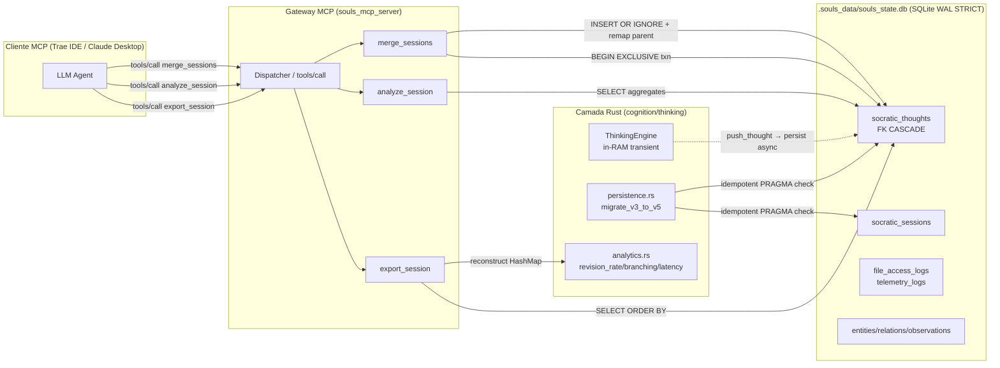

# Design — Marco 3.9 Fase E: Persistência Socrática (Souls State V5)

> Documento de design arquitetural para o Marco 3.9 Fase E.
> Referência normativa: [ADR-045](docs/decisions/adrs/ADR-045-Persistencia-da-Alma-Socratica.md).

## 1. Topologia FinOps

## 2. Padrão Orchestrator-Worker

- **Orchestrator (Tokio runtime).** O `Dispatcher` MCP recebe as 3 tools. Caminho de cache hit (sessão em RAM): O(1) HashMap lookup. Cold start (sessão só em SQLite): O(n) query + reconstruction.
- **Worker (std::thread StateDbWorker).** Já existente desde Marco 3.5; agora também consome `SocraticThoughtOp` (vai para o MPSC, fila 100).
- **Tabela de decisão.**
  - `export_session`: lê de SQLite, reconstrói em RAM, devolve JSON/Markdown.
  - `analyze_session`: lê de SQLite, computa métricas em RAM, devolve struct.
  - `merge_sessions`: BEGIN EXCLUSIVE → INSERT OR IGNORE → COMMIT.

## 3. Agnosticismo de Hardware

- **Piso de Validação:** RTX 2060m (6GB VRAM, AVX2, 16GB RAM). Schema 100% em disco; zero dependência de GPU.
- **Teto Agnóstico:** SQLite WAL STRICT é portável para Apple Silicon (aarch64) e Linux/Windows sem recompilação. Schema é declarativo; nenhum `#cfg(target_arch)` necessário.
- **Sandbox Tripartite:** O SQLite roda sob o mesmo `Landlock`/`AppContainer` que o resto do gateway.

## 4. Estado e Transações

| Tabela | Tipo | Garantia | Lock |
|--------|------|----------|------|
| `socratic_sessions` | Aggregate root | CASCADE purge | row-level (WAL) |
| `socratic_thoughts` | Filha | ON DELETE SET NULL em parent | row-level (WAL) |
| `merge_sessions` | Operação | BEGIN EXCLUSIVE | global write lock |

**Lei do IDEMPOTENT:** `migrate_v3_to_v5` testa `PRAGMA user_version` antes de qualquer operação. Idempotente em cold start.

## 5. Custos e Hot Paths

| Operação | Custo | Observação |
|----------|-------|------------|
| `export_session` cold (SELECT) | ~200µs | Query única, ≤ 7 linhas |
| `export_session` JSON render | ~50µs | serde_json |
| `export_session` Markdown render | ~30µs | string concat |
| `analyze_session` (aggregate) | ~150µs | 1 query, 3 reductions |
| `merge_sessions` (EXCLUSIVE) | ~500µs | Lock + INSERT × N + COMMIT |
| `migrate_v3_to_v5` cold | ~3ms | 2 CREATE TABLE + 4 INDEX |

## 6. Lei do Scaffold (DoD Pré-Codificação)

Cada tarefa em [tasks.md](tasks-marco-3.9-e.md) tem teste vermelho antes da lógica real. Esta é a cerca contra Vibe Coding.

## 7. Riscos e Mitigações (Pessimismo da Razão)

| Risco | Mitigação |
|-------|-----------|
| Migração corrompe banco em produção | `IF NOT EXISTS` em todas as DDLs; PRAGMA test antes de transação |
| Loop infinito em reconstruction | Disjuntor `n > 1024` aborta com `OverthinkingThresholdBreached` |
| Merge perde dados | BEGIN EXCLUSIVE + ROLLBACK automático via `Drop` |
| FK rejeita insert válido | `parent_thought_id` é NULLABLE (raiz sem pai); validação no app layer antes de INSERT |
| Race entre sessions | `STATE_DB_TX` MPSC (já existente) serializa writes |

## 8. Justificativa do Teto 32/120 nas Descrições

| Tool | Descrição | Chars |
|------|-----------|-------|
| `export_session` | "Exporta a árvore relacional de pensamentos socráticos de uma sessão em formato estruturado (JSON/Markdown)." | 110 |
| `analyze_session` | "Processa as métricas comportamentais e de revisão de hipóteses socráticas de uma sessão na RAM." | 100 |
| `merge_sessions` | "Executa a fusão atômica de ramificações e fluxos de raciocínio concorrentes sob consistência eventual." | 106 |

Todas ≤ 120 chars; nomes `export_session` (14), `analyze_session` (15), `merge_sessions` (14) todos ≤ 32 chars.
